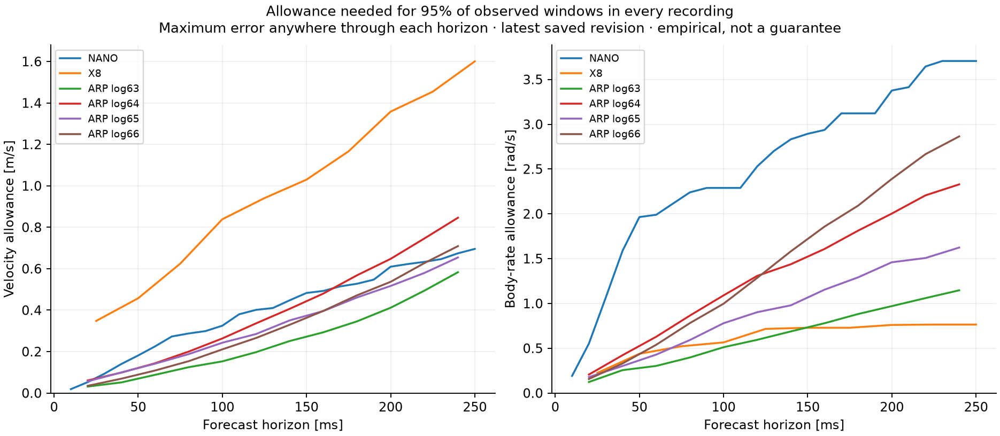

# How accurate does Glassbox need to be?

Model accuracy is sufficient when its errors leave enough margin for the
declared task, over the conditions and prediction horizon that the consumer
actually uses. There is no universal velocity RMSE or percentage-fit threshold
that establishes this. Control-oriented identification evaluates model error
through its effect on the achieved control behavior, rather than treating all
prediction discrepancies as equally consequential. See
[Gevers, Identification for Control](https://perso.uclouvain.be/michel.gevers/PublisMig/C128.pdf),
especially the control-performance formulation and closed-loop error relation.

This iteration quantifies the **forecast allowances the current models need**
and works out how a task could supply an accuracy requirement. It adds no
training knobs and performs no new fit or vehicle-control trial. Actual
closed-loop sufficiency of the generic learner was unmeasured at this stage. The
[evidence bundle](investigations/accuracy-requirements/README.md) preserves
the protocol, all results, source hashes, tests, and independent replay.

The subsequent [Cascade tracking experiment](cascade-accuracy.md) now measures
that gap with one fixed controller and 33 ordinary simulated tracking trials.
It records both a generic-model failure and conditional tolerances for
prescribed forecast errors; it does not establish a universal RMSE threshold.

## Work backward from the task

For ordinary tracking, define the tracked output and its permitted error,
required duration, disturbance conditions, and acceptable trial failure rate.
Those are application requirements. Observation cadence, estimator quality,
command latency, and actuator limits are facts about the application. They
should not become a menu of learner settings.

A useful conditional budget is:

```text
nominal tracking error
+ state-estimation / timing / other error allowances
+ model-error amplification × model error allowance
≤ permitted task error
```

When all terms refer to the same task-output norm, and the amplification is a
valid bound, this gives a sufficient model-error requirement. It is conservative
because it adds error magnitudes. Adding variances instead would require
assumptions about bias, dependence, and covariance that we have not established.
In a nonlinear system, the amplification generally depends on the operating
conditions, controller, horizon, constraints, and timing. It must be bounded or
measured for the declared use; Glassbox cannot infer it from an RMSE table.

The relevant error is also not necessarily the full state-vector error. A task
may be insensitive to some output directions and sensitive to others. This is
application knowledge about required behavior, not an airframe equation that
must be built into the generic learner. A consumer can evaluate its own output
error while retaining one shared fit/predict/update recipe.

### Quantified example: the same error magnitude can matter very differently

The evidence includes an explicitly synthetic scalar tracking-error recurrence:

```text
e[k+1] = rho × e[k] + d[k],   e[0] = 0,   0 ≤ rho < 1
```

Here `rho` is stipulated error contraction under feedback; `d` is an additive
per-step disturbance in the same arbitrary output units. It is not identified
from the flight data, and `d` is not the models' 250 ms forecast error.

Every sequence below has disturbance RMS **0.01**. The recurrence is run for
500 steps, with its final 100-step RMS checked against the analytic limit:

| Feedback contraction rho | Constant bias: tracking RMS | Alternating sign: tracking RMS |
| --- | ---: | ---: |
| 0.2 | 0.01250 | 0.00833 |
| 0.8 | 0.05000 | 0.00556 |

At rho = 0.8, the same disturbance RMS produces a **ninefold** difference in
steady tracking error. Thus the sign and temporal structure matter, even in a
scalar example with no platform-specific physics.

If the disturbance is uniformly bounded by D, the recurrence gives
`|e[k]| ≤ D × (1 − rho**k) / (1 − rho)`. For a tracking tolerance of **0.02**
and zero initial error, a sufficient disturbance bound is **0.016** at rho = 0.2
and **0.004** at rho = 0.8. That is a fourfold difference in required disturbance
accuracy caused by feedback contraction alone. This does not assign either
bound to a quadrotor or fixed wing. A forecast RMSE is not a uniform disturbance
bound, and initial error or other disturbances would consume additional margin.

## What the current generic forecasts can support empirically

We replayed the seven cases from the
[fixed generic recipe](default-recipe.md): 27 forecast arms including initial,
updated where available, affine initialization, and hold-current references.
No model was refitted or selected. The original evaluation predictions and
source identities were checked against the earlier artifact hashes.

For each forecast window, metric, and horizon, the new readout takes the largest
physical vector error at **any sampled step through that horizon**. It then
finds the nearest-rank 95th percentile separately in each evaluation recording.
The largest recording percentile is the smallest common allowance that covers
at least 95% of these observed windows in every recording, for that metric.
This avoids hiding a poor short recording in a pooled average, or hiding an
intermediate failure with a good endpoint.

These are descriptive percentiles, not 95% confidence bounds or calibrated
coverage on a future flight. All recordings were previously inspected, and
their forecast windows overlap. Separate metric percentiles do not imply that
95% of windows satisfy both metrics together; simultaneous counts are computed
directly whenever limits are supplied.

The table uses the latest saved revision: updated for Nano, X8 and ARP, initial
for the sensor case. Each allowance concerns the entire sampled forecast prefix.

| Evaluation | Horizon | Velocity allowance (m/s) | Body-rate allowance (rad/s) |
| --- | ---: | ---: | ---: |
| Nano, worst of 3 recordings | 250 ms | 0.696 | 3.706 |
| X8, worst of 4 recordings | 250 ms | 1.601 | 0.764 |
| ARP log63 | 240 ms | 0.583 | 1.147 |
| ARP log64 | 240 ms | 0.846 | 2.329 |
| ARP log65 | 240 ms | 0.654 | 1.624 |
| ARP log66 | 240 ms | 0.709 | 2.864 |

For Crazyflie log16, the analogous accelerometer/gyro allowances are
**0.535 g / 4.355 rad/s**, based on just 29 overlapping windows from one retained
sensor interval. These are sensor errors, not physical velocity/pose errors.
No free-flight state-accuracy claim follows from them.



Each panel is a separate marginal allowance. Lines join the measured sample
horizons for readability; the evaluator does not interpolate or extrapolate.
Rotation-matrix entry errors remain in the underlying reports, separately from
these two metrics. Those unconstrained Euclidean outputs do not supply valid
angular-attitude errors or an SO(3) guarantee.

This changes the interpretation of the earlier averages. X8's updated velocity
RMSE was 0.410 m/s, but its allowance above is 1.601 m/s. That difference combines
three changes of question: pooled versus per-recording scoring, RMS versus a
95th percentile, and final-step versus whole-prefix error. It is not an estimate
of a single tail multiplier. The worst X8 record is `lateral_121_4`; Nano's
worst record is `square_20251017_run4` for both metrics.

An update need not improve every accuracy criterion. On ARP log63, final
velocity RMSE improves from 0.336 to 0.295 m/s while the required whole-prefix
95% velocity allowance worsens from 0.541 to 0.583 m/s. On log64, the same
allowance worsens from 0.760 to 0.846 m/s despite improved final velocity RMSE.
On X8 it is essentially unchanged, 1.600 to 1.601 m/s, despite improved RMS.
Thus a lower average error cannot by itself justify accepting an update for a
tail-sensitive requirement.

### Example requirement, explicitly not a flight limit

Before this replay, we fixed illustrative forecast allowances of **0.5 m/s**
velocity error and **1 rad/s** body-rate error, jointly at all steps. These
numbers demonstrate the readout; they are not derived tracking requirements,
recommended operating limits, or a claim that such errors are acceptable.

| Evaluation | Latest model: observed 95% horizon | Hold current: observed 95% horizon | Latest model: observed joint fraction at full horizon, worst recording |
| --- | ---: | ---: | ---: |
| Nano | 20 ms | 10 ms | 42.8% |
| X8 | 50 ms | None on measured grid | 79.3% |
| ARP log63 | 180 ms | 60 ms | 90.0% |
| ARP log64 | 80 ms | 40 ms | 58.4% |
| ARP log65 | 120 ms | 40 ms | 78.7% |
| ARP log66 | 80 ms | 120 ms | 67.5% |

The observed horizon is the largest measured duration for which at least 95%
of windows in every evaluation recording satisfy both limits through that
duration. It is not a recommended replan interval: feedback changes future
commands, and these predictions are conditioned on the recorded inputs.
The sensor example uses 0.2 g and 2 rad/s; its learned model qualifies at no
measured horizon, versus 60 ms for hold. Its full-horizon joint fraction is
48.3%, versus hold's 72.4%.

## Small interface, separate requirements

The new experimental readout takes already computed errors and caller-declared
allowances. There is no new model family or fitting option:

```python
from glassbox.experimental.forecast_accuracy import assess_forecasts

accuracy = assess_forecasts(
    {"velocity_m_s": velocity_errors, "body_rate_rad_s": rate_errors},
    recording_ids,
    times_s=future_times_s,
    limits={"velocity_m_s": 0.5, "body_rate_rad_s": 1.0},  # illustrative
)
```

Each error array has shape `[window, future_step]`, excludes the shared initial
state, and contains a nonnegative error in the named units. The consumer or
adapter defines the metric; the evaluator does not guess units or task meaning.
Results include per-recording RMS, endpoint and prefix empirical percentiles,
observed maxima, simultaneous counts, and the observed horizon above. Failed
or unavailable forecasts represented by NaN/+infinity consume the denominator
and fail the affected prefix. They are never dropped to improve the score.
The readout makes no model selection or controller-adoption decision.

## What remains to establish actual task sufficiency

The existing structured Cascade experiment illustrates why the distinction
matters: its reported 0.4-second position forecast RMSE was about 0.027 m, while
ordinary closed-loop tracking RMSE was about 0.48–0.50 m. These are different
conditions and scoring windows, so their ratio is not an identified error
amplification. The results demonstrate neither a 0.1 m tracking capability nor
that reducing forecast RMSE would achieve one. See the retained
[Cascade experiment](cascade-refinement.md).

For the generic default, the next decisive measurement is a matched ordinary
tracking test with a fixed reference, controller, estimator, timing, limits,
and disturbance distribution. Compare the learned model with a simulator-truth
prediction model under the same consumer. A gap when the latter succeeds
isolates a model/controller interaction that prediction tables cannot quantify.
If both fail, better model accuracy alone has not been shown sufficient.
If both meet the declared requirement, further RMSE improvement may have little
value for that capability. These outcomes still require repeated evaluation in
the relevant conditions; one matched trial is not a general guarantee.

Such a test needs a valid command-input interface and task-output definition.
Some current datasets expose measured actuation, and the generic observation
model does not yet enforce rotation geometry. Treating those forecasts as
arbitrary-command physical state predictions would invalidate the comparison.
The learner can stay generic while adapters and consumers supply these facts.

Reliability also needs enough independent task trials. For a fixed Bernoulli
trial definition, n successes and zero failures give a one-sided exact 95%
lower confidence bound of `0.05**(1/n)`. At least **59**, **299**, or **2,995**
independent identically distributed zero-failure trials are needed for that
bound to reach success probabilities of 95%, 99%, or 99.9%, respectively.
This follows from inversion of the binomial probability of zero failures; see
[NIST's exact binomial limits](https://www.itl.nist.gov/div898/software/dataplot/refman2/auxillar/exacbino.htm).
We have not applied that calculation to correlated forecast windows or claimed
these trial counts exist. Simulation trials would establish evidence only for
their simulator and sampled conditions; repeated model selection also needs an
evaluation protocol that preserves independent final evidence.

## Verification

The new readout and related API tests pass **53 tests from source and from an
isolated wheel**; the package's 81 Python files match source. Independent replay
checks 7 cases, 27 forecast arms, 14,999 window/arm pairs, 782 numerical
comparisons, all source hashes, the scalar recurrence via convolution, and the
binomial sample-count calculations. Maximum numerical difference is 2.09e−17.
This checks implementation arithmetic, not independent physical truth. Full
records are in the [evidence bundle](investigations/accuracy-requirements/README.md).
