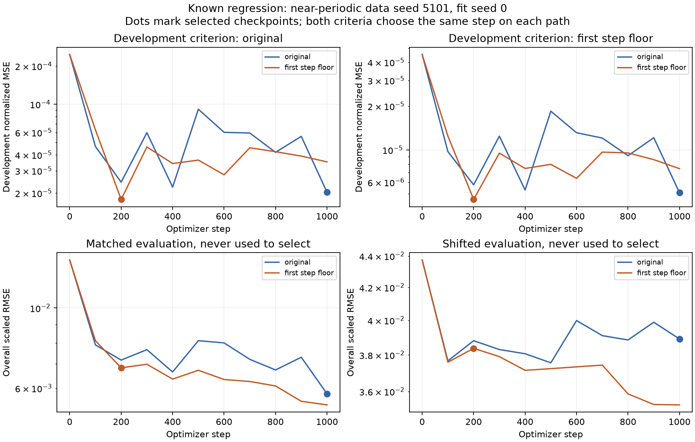

# Optimization paths, checkpoint selection, and development coverage

The earlier normalization regression has a more precise explanation. Changing
the selection criterion alone does not reproduce or remove it: **both criteria
choose the same checkpoint on each optimizer path**. Changing the loss changes
that path. Separately, the original development recordings prefer a checkpoint
that is worse on evaluation data. New selection recordings resolve this case,
but broader recording coverage does not reliably resolve other cases.

Neither changing the criterion nor requiring more recordings earns a default
recipe change. This extends the [horizon-normalization study](horizon-generalization.md)
with platform-neutral synthetic evidence. Work ran on 14 September 2026 on
`experiment/generic-transition-support`; the
[bundle](investigations/checkpoint-attribution/README.md) preserves plans, exact
sources, all checkpoints' scores, and audits. All 82 library Python files and
the consumer interface remain unchanged.

## Separate optimization from selection

The baseline uses horizon-specific hold-current RMS to scale errors. The
candidate raises each later scale to at least its channel's first-step scale,
capping later squared-error weights. Both keep the affine-plus-tanh model,
training/development windows, initialization, optimizer settings, and 100-step
checkpoint schedule. The new research runner archives every checkpoint from
step zero through 1,000 instead of retaining only the selected model.

For each pair, train once under each objective and select from each path using
both development criteria. Selections are fixed before generating evaluation
arrays. Also retain the fixed final checkpoint as a comparator. Evaluation
never chooses a checkpoint. Scaled RMSE divides each observation error by its
common baseline training state standard deviation; overall scores average
squared errors across windows, channels, and five horizons before taking the
square root. These scores differ from the fitted loss; both are examined below.

The instrumented Adam loop matches the library fitter on two separate small
fixtures. The three known cases with fit seed zero reproduce the six previously
saved selected-model fingerprints and complete own-objective traces. Thus the
observed regression is reproduced, not inferred from a different fitting run.

For the original failure, near-periodic data seed 5101 and fit seed zero:

| Optimization loss | Checkpoint criterion | Selected step | Matched overall scaled RMSE |
| --- | --- | ---: | ---: |
| Original | Original | 1,000 | 0.005790 |
| Original | First-step floor | 1,000 | 0.005790 |
| First-step floor | Original | 200 | 0.006832 |
| First-step floor | First-step floor | 200 | 0.006832 |

At a fixed criterion, the optimization intervention therefore accounts for the
entire observed +18.00% overall RMSE change in this crossed comparison. That
does **not** mean the modified objective cannot learn a better model, or that
checkpoint selection is reliable. Its step-1,000 checkpoint scores 0.005394,
21.1% below its selected step-200 error and 6.8% below the selected baseline.
Both development recordings individually prefer step 200 under both criteria.
Agreement between two recordings is not sufficient evidence of a reliable choice.

The top panels show different selection losses; the bottom panels show the
common evaluation metric. A post-hoc consistency check also evaluates the
*unchanged candidate selection loss* on evaluation recordings: step 200 has
56.4% higher matched MSE and 17.4% higher shifted MSE than step 1,000. This
failure is not explained merely by evaluating a different metric. That check
does not select a new model or turn the final checkpoint into a default rule.

## Repetition and fresh data preserve the tradeoffs

The first plan froze nine known comparisons: the three previously examined
near-periodic data seeds, each with fit seeds 0, 17, and 29. Fit seed changes
initial neural weights and minibatch draws together; it does not isolate them.
On the problematic data seed 5101, candidate matched overall changes are
**+18.00%, +2.48%, and −27.11%** across those three fit seeds. Across all nine
known comparisons, matched first-step error improves in eight and worsens in
one; overall error improves in seven and worsens in two. Shifted overall error
also has one regression. Selecting the final checkpoint is not uniformly better:
for data seed 5303, fit seed 29, it raises candidate matched overall error 25.0%
relative to its development-selected checkpoint.

The same frozen comparison then uses data seeds 6101, 6202, and 6303 across all
eight synthetic families from the earlier study, with fit seed zero. Twenty-one
of 24 objectives are unchanged and reuse their exact optimizer paths. Only the
three near-periodic cases change:

| Fresh data seed | Matched first-step change | Matched overall change | Shifted first-step change | Shifted overall change |
| --- | ---: | ---: | ---: | ---: |
| 6101 | −21.37% | −21.58% | −8.57% | −12.53% |
| 6202 | −32.00% | −33.70% | −23.53% | −15.31% |
| 6303 | −33.84% | −35.96% | −4.18% | **+4.42%** |

The last shifted overall error rises from 0.015783 to 0.016480. No case crosses
the earlier descriptive screen requiring both a 10% relative and 0.01 absolute
scaled RMSE increase. That screen is not an accuracy tolerance; smaller
regressions remain in the results.

On all nine known and 24 fresh comparisons, the two criteria select the same
checkpoint on the candidate path. On four original paths they select different
checkpoints, with mixed evaluation effects. Both orders of the paired contrasts
and their interaction are retained, rather than assigning a universal causal
fraction to optimization or selection.

## Broader development coverage at the same scoring budget

After those results, a second plan froze a selection-only experiment. It reuses
the 12 near-periodic optimizer pairs above, then adds three untouched data seeds
7101, 7202, and 7303 with fit seed zero for confirmation. Both the new-path plan
and coverage plan preceded all pool scoring and confirmation fitting. The six
new optimizer runs retain the same objectives and checkpoint schedule.

For each data/fit-seed case, three independent pools supply 16 new recordings
from the calibration input and initial-state distributions. They are separate
from fitting and evaluation recordings. Compare nested prefixes of 2, 4, 8,
and 16 recordings, always scoring **256 windows**: respectively 128, 64, 32,
or 16 windows per recording. Hash-ranked window prefixes are nested within each
recording. Each fixed optimizer path keeps its own selection criterion; only
selection data changes. All pool sizes and seeds are reported, without choosing
a winner from evaluation scores.

More recordings mean more collection: 16 recordings contain 128 seconds of
sampled intervals versus 16 seconds for two, before setup overhead. The total
scored-window budget is fixed, not the observation collection budget. More
recordings also mean fewer windows from each recording. These comparisons
cannot establish an optimal number of recordings or a cheap universal fix.

For the original failing candidate, **all three new pools at every size select
step 1,000**, including the two-recording variants. Replacing the particular
development sample is enough to resolve that case; it does not require 16
recordings. Other cases retain regressions.

Here is the direct nested comparison, expanding a given pool from two to 16
recordings while keeping 256 scored windows. Counts concern overall RMSE on
the candidate optimizer path:

| Cases | Evaluation | Improved / worse / unchanged |
| --- | --- | --- |
| Known: 12 optimizer pairs × 3 pools | Matched | 7 / 2 / 27 |
| Known: 12 optimizer pairs × 3 pools | Shifted | 7 / 2 / 27 |
| Confirmation: 3 optimizer pairs × 3 pools | Matched | 2 / 0 / 7 |
| Confirmation: 3 optimizer pairs × 3 pools | Shifted | 1 / 1 / 7 |

These are dependent model/pool comparisons, not independent trials. Relative
changes for known matched cases range from −33.61% to +3.71%; known shifted
changes range from −18.55% to +9.47%. The original-objective paths also show
mixed effects. Broader coverage helps some cases but is not sufficient.

Comparing the 16-recording variants with the **original development-selected
candidate**, confirmation has zero improvements, two regressions, and seven
unchanged results under each evaluation regime. The two regressions are the
same data seed 7303 under different selection-pool seeds: step 600 replaces
step 1,000. Matched overall scaled RMSE rises from 0.009686 to 0.010732
(+10.80%); shifted error rises from 0.021071 to 0.022159 (+5.16%). A post-hoc
same-criterion check also finds 22.0% higher matched and 10.3% higher shifted
selection-loss MSE at step 600. This is not solely a metric mismatch.

The new optimizer-path confirmation also limits the earlier attribution:
seed 7303's candidate path selects step 600 under the original criterion and
step 1,000 under the capped criterion. Here changing the criterion does improve
evaluation scores. The criteria agree on the other two new candidate paths.
The original failure's explanation should not be generalized to every dataset.

## What this changes about the diagnosis

We can now distinguish a loss-induced change in the optimization path, a
criterion-induced change along a fixed path, and variation caused by which
recordings select the checkpoint. The original failure involves the first and
third mechanisms. It does not establish missing state, insufficient model
capacity, or irreducible error. Conversely, more development recordings do not
guarantee correct ranking, even when two recordings previously agreed.

Keep the recipe and interface fixed. The evidence does not justify changing
the criterion, always using the final checkpoint, or requiring 16 recordings.
The retained checkpoint paths provide a reproducible test set for future
optimization and selection work without requiring users to configure those
choices. This is an error-attribution result, not a universal replacement learner.

Across the path studies there are **51 optimizer runs**, 36 paired cases, and
21 exact path reuses. Audits check 792 saved checkpoint artifacts, including
reuses, and 8,928 evaluation windows. Coverage adds 45 model/pool cases and 720
selected-model/regime comparisons; it does not refit models. The four audits
make 35,640 numerical comparisons with maximum absolute difference 1.22e-15.
They independently reconstruct indices, losses, choices, and scores while
sharing frozen generators and artifact loaders. They do not independently
repeat all optimization. The focused suite passes **76 tests**; lint, format,
source hashes, and document links are checked. No wheel or full repository suite
was repeated for these research-only additions.
