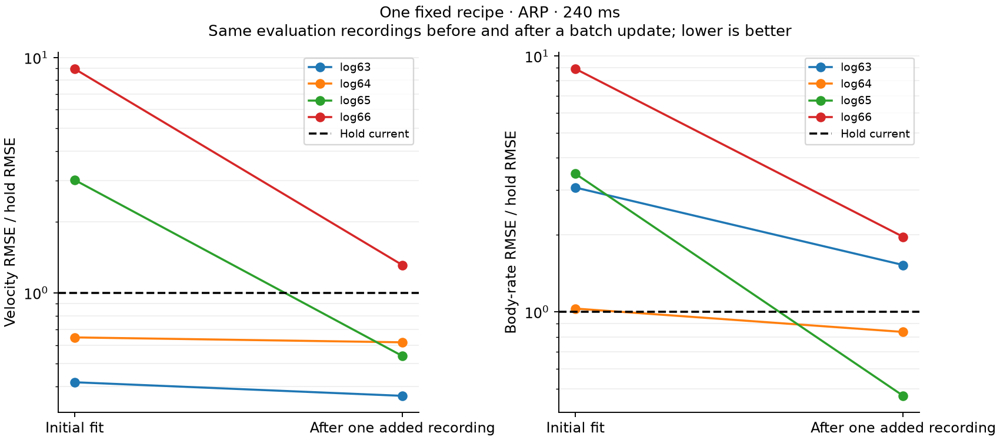

# One opinionated generic learner

> **Update, 16 September 2026.** The maintained default is now
> `generic-memory-v2-prototype`, which adds a causal memory over a 500 ms
> in-recording context to the recipe described here; see the
> [M2 record](generic-engineering.md#m2-one-causal-memory-contract-for-demonstrated-history-limitations).
> Everything below describes `generic-history-v1-prototype`, which is retained:
> its saved artifacts still load, predict, and update with their own recipe, and
> the consumer workflow is unchanged apart from needing eleven observations of
> history instead of three.

The experimental generic workflow now accepts recordings through one fixed
`fit → predict → update` path. It owns window sampling, scaling, model structure,
optimization, and checkpoint selection. Callers supply signal facts; they do
not choose a representation, model family, regularizer, or selection policy.

The same recipe completed seven existing-data cases and six batch updates.
That establishes a working interface, **not a dependable default yet**. Two
initial ARP forecasts were very poor. Adding a recording substantially improved
them, but some updated forecasts and the Crazyflie sensor case still lost to
holding the current observation. This candidate remains experimental and does
not replace the structured root-level `glassbox.fit`.

Work ran on 14 September 2026 on `experiment/generic-transition-support`.
The [evidence bundle](investigations/default-recipe/README.md) preserves the
plan written before these fits, exact recipe, source archives, results, and
independent numerical replay. No per-dataset tuning followed the results.

## Consumer workflow

```python
from glassbox.experimental.default_model import LearnedDynamics, fit

model = fit(recordings)
prediction = model.predict(past_states, past_inputs, future_inputs)
evidence = model.report

revised = model.update(fresh_recordings)
revised.save("learned-model.npz")
restored = LearnedDynamics.load("learned-model.npz")
```

Optional offline evidence is available through
`diagnostics = model.diagnose(diagnostic_recordings)`. This requires at least
three recordings outside fit/development data and reports input predictability
and whether older history helps explain one-step errors. It does not update the
model or establish independent excitation. See the
[diagnostic contract and synthetic controls](sequence-diagnostics.md).

`recordings` is a
[`SequenceCollection`](../src/glassbox/experimental/sequence_collection.py) of
contiguous, uniformly sampled segments. Its adapter declares configuration
identity, recording and segment identities, sample period, and ordered state
and input channel identities, including units, frames, and whether inputs are
commands or measurements. Arrays contain N observations and N−1 intervening
inputs. At least two distinct recordings are required so development data can
be separated by recording. Retained segments must be finite and cannot overlap
within a recording; windows never bridge gaps.

These declarations are data metadata, not training settings. Channel meanings
currently live in strings: the prototype checks their presence, uniqueness,
dimensions, and exact agreement during updates. It does not verify units from
the numerical values, infer hardware identity, or perform clock alignment.
The generic collection supports arbitrary observation dimensions; the existing
structured `TrajectorySpec` remains the richer rigid-body signal contract.

`predict` accepts single or batched JAX arrays. It uses the most recent required
history and returns future observation means, excluding the initial state.
`history_steps` and `horizon_steps` tell consumers what is required. Missing
history and requests beyond the fitted horizon raise errors. Shorter forecasts
are prefixes of the same recursive dynamics; later inputs cannot affect earlier
outputs. JIT and input Jacobians are tested.

`update` requires fresh whole recordings, checks their contract, and rejects
reused recording IDs or exact previously seen content. Renaming a recording
does not make an exact duplicate new evidence. Partial overlap under new names
is not generally detectable. The original development observations stay fixed;
fresh observations join the training cache. Refitting produces a separate
revision and preserves the prior model. Saved artifacts carry model parameters,
recipe version, provenance, error evidence, and update caches together.

The retained arrays are capped at 384 training and 256 development windows;
the recording identity ledger grows. This is a batch refit from a sampled cache,
not real-time assimilation of overlapping telemetry chunks. A fixed cache also
limits coverage as the number of recordings grows; when recording count exceeds
the window budget, not every recording can retain a sample.

## The fixed recipe

[`default_model.py`](../src/glassbox/experimental/default_model.py) maintains
`generic-history-v1-prototype` as one recursive affine-plus-tanh model with a
32-unit hidden layer. The affine initialization and learned nonlinear correction
are components of that one model. Keeping the initialization at checkpoint zero
leaves the neural correction zero; it does not switch to another model family.

History is 0.1 seconds and training forecast length is 0.25 seconds, rounded to
the nearest positive integer sample count. The actual horizon is 250 ms for
Nano/X8 and 240 ms for ARP/Crazyflie. Training uses 1,000 Adam steps, batch size
64, learning rate 0.002, gradient clipping at 5, and seed 0. The affine mean-loss
ridge fraction is 0.01. These are versioned implementation constants, not
consumer options.

The library reserves a quarter of recording IDs, rounded up, for development,
retaining at least one training recording. IDs are ordered by SHA256 of their
JSON encoding. Windows are ranked by a hash of recording ID, segment ID, and
source origin, then drawn in round-robin recording order up to each cache cap.
Data ordering does not change the selected windows. Different recording names
can change the split; names are stable provenance, not a tuning mechanism.

Every 100 steps, including step zero, checkpoint selection measures full
recursive development MSE across all forecast steps and channels. Each channel
and horizon is scaled by training hold-current RMSE, floored at 1% of the
training state scale. Normalizers use training data only. Updates resample old
training windows plus sampled fresh windows, recompute training scales, and
refit the same recipe against the pinned development cache.

The report retains selection traces, per-recording row coverage, per-horizon
and per-channel physical RMSE versus hold-current, and constant input channels.
`worse_than_hold` marks development errors exceeding hold by 5%; it is a
diagnostic, not an uncertainty probability or an automatic acceptance rule.
Development observations select checkpoints and cannot independently calibrate
their accuracy. Because update scales change, before/after scalar normalized
losses are not directly comparable; compare physical errors on common data.

## Recorded results

The experiment used the existing Nano corpus, X8 maneuver recordings, four ARP
outer recording folds, and three Crazyflie sensor recordings. Each case used
the same recipe and seed. Where at least three calibration recordings existed,
the last sorted calibration ID was withheld for one later update. Automatic
training/development splitting operated on the remaining calibration records.
Evaluation recordings entered neither fit nor update. All had been inspected
in earlier work; this is not an untouched platform generalization test.

For ARP, withholding one recording for the update leaves only one initial
training recording and one development recording. Nano starts with six training
and two development recordings; X8 starts with nine and three. Crazyflie starts
with log10 for training and log15 for development, evaluating log16, with no
update. X8 files are maneuver segments from one campaign, not independent
platforms or necessarily independent sorties. ARP and Crazyflie configuration
labels identify experimental cohorts, not independently verified hardware
revisions.

Cells below are **velocity vector RMSE in m/s / body-rate vector RMSE in rad/s**
at the final forecast step, pooled over evaluation windows. Origins occur every
100 ms, so overlapping windows are not independent observations. All channels
and intermediate horizons are retained in the bundle; the third group measures
Euclidean rotation-matrix entry error, not angular attitude error.

| Evaluation | Initial fit | After one added recording | Hold current |
| --- | ---: | ---: | ---: |
| Nano, 250 ms | 0.200 / 0.885 | 0.187 / 0.944 | 0.710 / 1.573 |
| X8, 250 ms | 0.440 / 0.246 | 0.410 / 0.239 | 1.005 / 1.113 |
| ARP log63, 240 ms | 0.336 / 1.139 | 0.295 / 0.567 | 0.806 / 0.372 |
| ARP log64, 240 ms | 0.432 / 1.393 | 0.412 / 1.129 | 0.668 / 1.351 |
| ARP log65, 240 ms | 1.765 / 5.249 | 0.315 / 0.712 | 0.584 / 1.513 |
| ARP log66, 240 ms | 2.381 / 5.778 | 0.349 / 1.274 | 0.266 / 0.648 |

Crazyflie log16 has sensor outputs rather than physical velocity/pose truth.
At 240 ms, accelerometer/gyro vector RMSE is **0.205 g / 2.255 rad/s**, versus
hold-current's **0.153 g / 1.895 rad/s**. This is only 29 overlapping forecast
origins from a 162-row, 3.22-second retained interval. It does not establish
free-flight dynamics accuracy or generalization across sensor logs.



Adding data through the fixed update improves both ARP metrics in all four
cases, dramatically on log65/log66. But log63 rate and both log66 metrics remain
worse than hold. The update changes recording coverage, training scales, and
fitted parameters together; its gain does not isolate one physical cause of
the original error. Constant window count does not mean constant observation
coverage, which is recorded separately.

Nonlinear fitting is not uniformly helpful. Nano keeps checkpoint zero before
and after its update; its updated velocity improves while rate worsens. X8
selects step 200, but initial velocity error is worse than the same affine
initialization's 0.387 m/s. ARP log65/log66 also initially select checkpoint zero.
The seven initial fits and six updates produce 13 archived revisions, not 13
independent platform tests; two ARP initial fits use identical data.

Automatic splitting and sampling changed the training evidence relative to
earlier research comparisons. Differences from those tables cannot be attributed
to model architecture alone. These forecasts also condition on future recorded
inputs, including measured actuation in some datasets. They do not establish
the response to a freely chosen command, closed-loop performance, or reliable
extrapolation. Euclidean rotation forecasts need not lie on SO(3), and this
prototype does not supply calibrated uncertainty or query-specific support.

## Decision and verification

Keep this as the single end-to-end generic candidate to improve. Its interface
removes learner choices from onboarding, but its cross-recording failures block
promotion to the supported default. Further research should improve the whole
versioned recipe and its evidence under the same consumer calls, rather than
exposing per-platform fixes as configuration. New untouched recordings and
declared capability tests remain necessary before making a broader claim.

The focused suite passed **168 tests from source with float64 and 168 from an
isolated wheel with float32**. Package contents match source. Independent NumPy
replay checked all 13 revisions, 8,256 automatic training/development windows,
evaluation extraction and sampling, selected-checkpoint losses, and seven
affine normal equations: 461 numerical comparisons, maximum absolute difference
4.58e−14. It checks trace minima and the saved selected model; it does not
independently retrain every optimizer step. The full repository test suite was
not rerun. Detailed records and replay commands are in the
[validation bundle](investigations/default-recipe/README.md).
