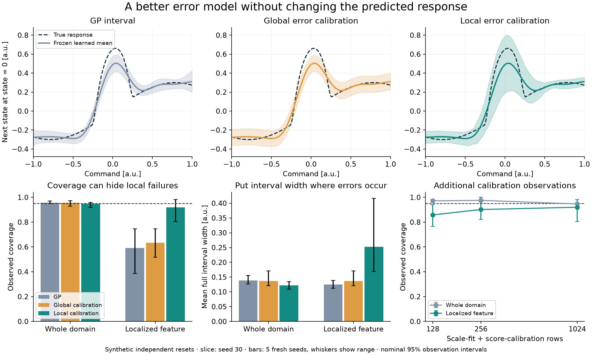
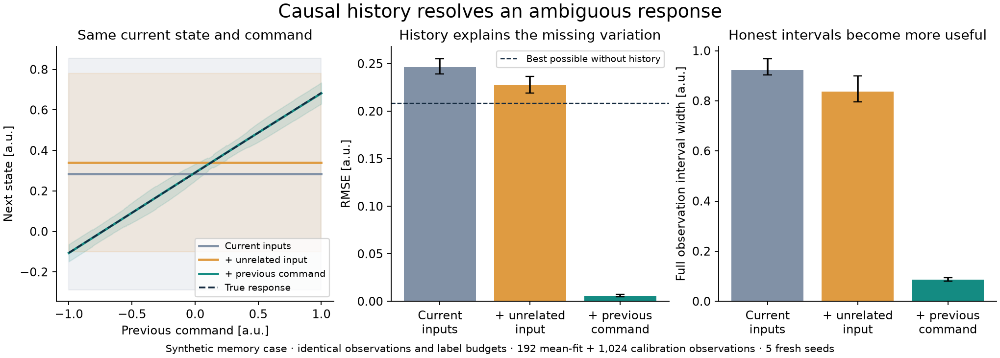

# Calibrated error and causally available history

The [shape-learning experiment](shape-learning.md) showed that a general learner
can recover a dead zone without being given its equation. Its conditional GP
intervals still missed many observations around a localized feature. This
iteration separates two responses to error: learning where the prediction is
unreliable, and supplying information that makes the prediction more accurate.

**Local residual calibration improves difficult-region coverage from 59.3% to
92.0% without changing the mean.** In a separate memory experiment, providing
the previous command reduces next-state RMSE from **0.2461 to 0.0055**. Neither
learner receives a platform equation. These are synthetic independent-reset
results, not physical telemetry or a platform-onboarding demonstration.

## Interface changes

The new experimental [error calibration module](../src/glassbox/experimental/error_calibration.py)
accepts arbitrary Euclidean input features and vector prediction residuals. It
does not depend on the GP implementation, a vehicle family, or a noise equation.
The caller provides observations minus predictions from a frozen model.

- `PredictionContract` identifies the exact model revision, ordered input and
  output channels including units, and transition interval.
- `ResidualSamples` carries reserved input/error observations and sample IDs.
- `fit_error_calibration` fits an error scale from one reserved dataset, then
  calibrates its score on a separate dataset. Declared mean-fit, scale-fit and
  score-calibration IDs must be disjoint.
- `ErrorCalibration.interval` requires the current prediction contract. A
  changed revision, channel contract or timing rejects the old evidence.
- `GaussianTransition.fingerprint()` supplies a content identity covering the
  predictive arrays, dtype, dimensions, kernel and timing. Human channel names
  and units remain explicit in the consumer's contract.

This remains on `experiment/generic-transition-support`, outside stable public
exports. The GP mean, existing physical model families, and controller behavior
are unchanged. The only GP addition is the fingerprint method.

For a frozen scalar transition GP with no context:

```python
from glassbox.experimental.error_calibration import (
    PredictionContract,
    ResidualSamples,
    fit_error_calibration,
)

contract = PredictionContract(
    model_id=model.fingerprint(),
    input_names=("state [m]", "command [normalized]"),
    output_names=("next state [m]",),
    dt_s=model.dt_s,
)


# Each reserved dataset has features [state, command], observed next states,
# and stable observation IDs. Neither dataset was used to fit/select the mean.
def residual_batch(features, observed, ids):
    mean = model.predict(features[:, :1], features[:, 1:2]).mean
    return ResidualSamples(contract, features, observed - mean, tuple(ids))


evidence = fit_error_calibration(
    residual_batch(scale_features, scale_observed, scale_ids),
    residual_batch(calibration_features, calibration_observed, calibration_ids),
    training_sample_ids=training_ids,
    mode="local",
    neighbors=24,
    miscoverage=0.05,
)
mean = model.predict(query[:, :1], query[:, 1:2]).mean
interval = evidence.interval(query, mean, contract=contract)
evidence.save("error-evidence.npz")
```

Another learner can use the same module with its own content/revision identity.
The caller must recompute the contract after updating the mean: supplying a stale
contract together with changed predictions cannot be detected from arrays alone.
IDs reject declared overlap; they do not prove statistical independence or detect
the same observation deliberately relabeled with a different ID.

## What is calibrated

The local scale is a distance-weighted RMS of reserved residuals among 24
neighbors. Coordinates are standardized using **scale-fit inputs only**.
Weights are `exp(-2 distance² / neighborhood_radius²)`. The global baseline uses
one RMS per output from those same observations. Both scales include bias;
neither is presented as an estimate of sensor noise or pure epistemic variance.
A positive floor defines normalized scores when residuals vanish. No GP variance
is added, avoiding an unjustified sum of overlapping error estimates.

Each calibration row produces one score, the largest absolute residual divided
by its predicted scale across output channels. The interval multiplier is the
order statistic at rank `ceil((n + 1) * (1 - alpha))`. Insufficient calibration
rows produce an infinite interval rather than silently clipping the rank. The
result is a box for one future vector observation, not a trajectory tube.

This is normalized split conformal calibration, an established method rather
than a proposed statistical innovation. Its finite-sample claim is marginal
coverage under exchangeability of calibration and future observations, with
the mean and scale already fixed. It does not guarantee coverage at every input
or for each particular realized calibration dataset. See the discussion of
split and locally adaptive residual calibration in
[Romano, Patterson and Candès](https://candes.su.domains/publications/downloads/CQR.pdf).
Correlated telemetry and changing distributions require separate treatment;
[Oliveira et al.](https://jmlr.org/beta/papers/v25/23-1553.html) analyze extensions
beyond exchangeability. Those extensions are not implemented here.

The nearest-neighbor scale is host-side and can change discontinuously as
neighbors change. It is not a JAX-differentiable optimization objective. GP
support geometry, conditional variance, and empirical calibrated error remain
different forms of evidence.

## Experiment and observation cost

[Runner](../scripts/experiment_error_calibration.py),
[plan](investigations/error-calibration/plan.json),
[summary](investigations/error-calibration/summary.json),
[independent audit](investigations/error-calibration/audit.json).

Development used seeds 0 and 1; confirmation uses fresh seeds **30–34**. Settings
were frozen before confirmation. There are **25 mean models and 160 calibration
artifacts**, with 4,000 independent test observations per model. Results below
are equal-weight means over the five seeds; figure whiskers are descriptive seed
ranges, not confidence intervals.

Every mean model uses 192 observations, an RQ kernel, and two 200-step optimization
starts selected using training marginal likelihood. No error-scale, calibration
or test labels select that model. The scalar state, command and optional history
are in arbitrary units; output noise has standard deviation 0.02 and timing is
fixed at 0.1 seconds. Inputs are exact and independently reset.

The additional evidence budgets are **128, 256 or 1,024 labels**, divided equally
between error-scale fitting and score calibration. Each smaller arm uses a
nested prefix of its own independent role stream. Thus the largest arm costs
**1,216 total observations**, of which only 192 fit the mean. Global and local
calibration share both the frozen mean and the exact evidence observations.
These counts must not be interpreted as seconds of flight calibration.

The five model cases are a smooth response, the previous compact localized
feature, and three versions of a synthetic system with memory. The memory
versions use identical raw observations and target labels, differing only in
whether previous input information is omitted, supplied, or replaced by an
independently sampled unrelated coordinate. The unrelated coordinate controls
for simply adding an input dimension.

An early development control shuffled history within each role. It was replaced
before confirmation because that permutation introduces dependencies across
rows. Its development artifacts are retained; final results use an independently
sampled control coordinate.

## Local error can be hidden by good average coverage

For the localized feature, all rows use the **same frozen predicted mean**.
RMSE within the feature is 0.0728 for every calibration method below.

| Interval method | Whole-domain coverage | Feature-interior coverage | Whole-domain mean width |
| --- | ---: | ---: | ---: |
| Conditional GP | 95.7% | 59.3% | 0.1384 |
| Global calibration, 1,024 extra labels | 95.6% | 63.5% | 0.1362 |
| Local calibration, 1,024 extra labels | 94.6% | 92.0% | 0.1214 |

Local calibration allocates more width to the difficult region and less elsewhere.
Its mean width across the domain is about **12% smaller than the GP interval**.
The feature still falls short of nominal 95% coverage: its five-seed range is
approximately 80–98%. The good overall result should not be read as a local
coverage certificate.



The top row is the first confirmation seed, 30, at state zero. Dashed benchmark
truth and diagnostic region boundaries are withheld from both learners. Bands
describe future noisy observations; plotting the noiseless truth helps explain
where the bias occurs, but does not change the coverage target.

With 128 extra evidence labels, local feature coverage is **85.8%**; with 256,
it is **90.2%**. Larger budgets improve the mean local result here, but improvement
is not monotonic on every seed. The largest budget is substantial relative to
mean fitting and is not established as the best use of a fixed total budget.
Spending those observations to improve the mean instead is a separate comparison.

A negative control collects the 1,024 evidence observations only outside the
missing command region. Local coverage remains **94.7% on that outer domain**,
but falls to **49.2% inside the localized feature** and 90.4% over the whole domain.
Calibration cannot supply error evidence from conditions it never observed.
That whole-domain test is a deliberate distribution shift from outer-only
calibration, outside the exchangeability claim.

## History changes which response can be learned

The synthetic memory response is

`next_state = 0.6 state + 0.3 sin(2 command)
              + (0.35 + 0.15 command) previous_command + noise`.

The equation generates the observations and is never given to the learner.
The previous command is causally available. Two resets with the same current
state and command can produce different next states because their previous
commands differ. This is a controlled memory mechanism, not a full actuator
hysteresis simulation or a demonstrated method of discovering latent state.

| Available inputs | Noiseless-response RMSE | Calibrated observation coverage | Mean interval width |
| --- | ---: | ---: | ---: |
| Current state and command | 0.2461 | 95.7% | 0.9235 |
| Plus unrelated input | 0.2271 | 95.8% | 0.8373 |
| Plus previous command | 0.0055 | 95.0% | 0.0866 |

These use the same 192 mean-fit labels and 1,024 extra calibration labels.
History reduces RMSE by about **98%** and interval width by about **91%**.
An unrelated input changes finite-sample fitting behavior but leaves a large
error. Simply accepting wide intervals can restore marginal coverage without
making the original prediction useful.



For this known mechanism, we can quantify the limitation. With independent
uniform previous commands, the minimum possible noise-free RMSE for any function
of current state and command alone is **0.2082**. This bound follows from
`E[(0.35 + 0.15 command)^2] / 3`, the unobserved-history variance. The mean-fit
error above that bound remains reducible; missing history is not its only cause.

The [oracle error decomposition](investigations/error-calibration/memory-diagnosis.json)
separates expected missing-history MSE from error in the learned conditional
mean. Averaged over the current-input models and test inputs, about **72%** of
their expected noise-free MSE comes from omitted history and **28%** from mean
fitting. This integrates over the known hidden-input distribution, so it need
not equal the finite test sample's realized MSE exactly. It is a benchmark truth
analysis, not an automatic causal diagnosis inferred from arbitrary telemetry.

## Implications for Glassbox

A useful learned-model artifact needs to distinguish its response, observational
support, calibrated prediction error, and available context. This iteration
adds the empirical error component without imposing a vehicle model. It also
provides a controlled example in which adding causal context resolves an
ambiguity that additional current-input fitting cannot eliminate.

Remaining work includes selecting history on independent episodes, discovering
hidden state when command history is insufficient, measuring calibration cost
against additional mean-fitting data, and evaluating correlated/noisy telemetry
from an independent simulator. Current uncertainty does not propagate through
rollouts, survive arbitrary shifts, or automatically diagnose error causes.
Local RMS scaling also has no special protection against dimensionality or a
missing narrow feature in the error evidence.

The subsequent [real-flight study](real-transition-learning.md) tests state
changes and history on processed Crazyflie recordings. Its mixed results also
compare spending a fixed window budget on mean fitting versus error evidence;
the synthetic advantage of local calibration does not persist at every horizon.

## Reproduce and validate

```sh
JAX_ENABLE_X64=1 python scripts/experiment_error_calibration.py \
  --output /tmp/error-confirmation-new --phase confirmation \
  --seeds 30 31 32 33 34
MPLCONFIGDIR=/tmp/error-plot-cache python scripts/report_error_calibration.py \
  --run /tmp/error-confirmation-new --output /tmp/error-report-new
```

Use fresh output directories and the parent workspace's `.venv/bin/python` when
running from this checkout. NumPy/JAX power learning; Matplotlib is needed only
for the standalone scientific figures. No new core dependency was added.

The recorded run is `artifacts/error-calibration/confirmation-01` in the parent
workspace; the final audit and figures are in `artifacts/error-calibration/report-02`.
Sources, sample identities, observations, mean models, calibration artifacts and
predictions are retained. The audit independently rebuilds GP conditioning and
predictions in NumPy, checks all data-role IDs and budgets, replays residual
scales, finite-sample ranks and intervals, and verifies every reported metric
and seed aggregate. Maximum GP replay discrepancy is 1.4e-11.

Targeted numerical/interface tests cover output-vector scores, exchangeable rank
coverage by exact enumeration, insufficient evidence, data overlap, changes to
revision/timing/units, serialization, and existing GP prediction/derivative
behavior. The [validation record](investigations/error-calibration/validation.json)
records 40 targeted source tests, 31 float64 tests, and 40 tests against the built
wheel, all passing. Wheel and source distributions build successfully. Earlier
full-suite results are not presented as a new run.
