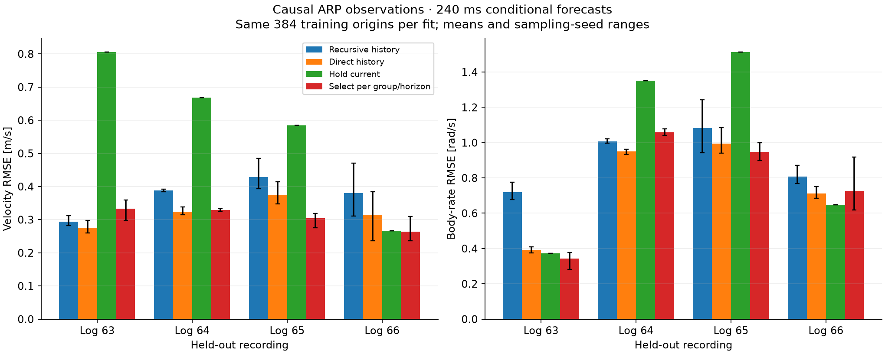

# Direct forecasts, recursive error and observed support

Direct horizon fits improve on the matched recursive affine predictor across
all four ARP held-out-flight splits, averaged over sampling seeds. The same
change worsens X8 prediction. Support distance identifies the difficult ARP
evaluation flight as different from its training flights, but does not by
itself tell us when the learned model is worse than a simple reference.

This continues [sequence transfer](sequence-transfer.md), using the same
prepared observations and generic channel representation. These are **reused
recordings**, with expanded whole-flight evaluation, not newly collected data
or pristine holdouts. No platform-specific force equations are introduced.

## Matched prediction results

Each table entry is the mean of three sampling-seed RMS vector errors. Within
each split, development data select regularization separately for each family.
The three seeds share an evaluation recording and are not independent flights.

| Held-out ARP log | Recursive velocity, m/s | Direct velocity, m/s | Hold velocity, m/s | Recursive body rate, rad/s | Direct body rate, rad/s | Hold body rate, rad/s |
|---|---:|---:|---:|---:|---:|---:|
| 63 | 0.294 | 0.276 | 0.806 | 0.718 | 0.391 | 0.372 |
| 64 | 0.389 | 0.324 | 0.668 | 1.007 | 0.949 | 1.351 |
| 65 | 0.428 | 0.375 | 0.584 | 1.082 | 0.995 | 1.513 |
| 66 | 0.380 | 0.314 | 0.266 | 0.807 | 0.713 | 0.648 |

These are 240 ms forecasts using explicit observed history. Direct fitting
reduces velocity error by **6–17%** and body-rate error by **6–45%**, depending
on the split. It improves each metric in 11 of the 12 individual seed/split
comparisons. It still loses to hold-current on log 66 in both mean metrics,
and narrowly loses on log 63 body rate.



The processed datasets favor different choices at 250 ms:

| Dataset | Recursive velocity / body rate | Direct velocity / body rate |
|---|---:|---:|
| Nano | 0.204 / 0.959 | 0.222 / 0.939 |
| X8 | 0.325 / 0.238 | 0.370 / 0.278 |

Units are m/s and rad/s. X8 direct fitting worsens velocity by 14% and body
rates by 17%. Nano trades worse velocity for a small body-rate improvement;
the earlier nonlinear model's body-rate result remains stronger than either
affine method here.

The recursive log-66 baseline is already better than in the previous study.
This run changes the regularization grid and selects on three explicit
horizons instead of averaging every intermediate step. Consequently, the
entire improvement over the previous 1.38 rad/s result cannot be attributed to
direct forecasting. The relevant matched comparison is **0.807 to 0.713 rad/s**.

Avoiding recursive prediction helps these ARP fits, but this experiment does
not isolate accumulation as the sole cause. A direct head also changes the
training target, number of coefficients and use of observations. The earlier
one-step observation-refresh diagnostic and these matched direct fits provide
complementary evidence; neither decomposes error into unique physical causes.

## Support identifies a shift, not a universal rejection rule

Support uses the current observation and command, relative observation history
and relative input history. Features are standardized from training origins.
Distance is RMS Euclidean distance to the nearest training origin. To set
thresholds without matching adjacent samples from the same flight, each
training origin finds its nearest neighbor **in another training recording**.
The 50th and 90th percentiles define near/middle/far bins.

| Held-out ARP log | Evaluation origins | Fraction beyond training 90th-percentile distance |
|---|---:|---:|
| 63 | 271 | 0.9% |
| 64 | 490 | 12.3% |
| 65 | 488 | 30.9% |
| 66 | 704 | 93.2% |

Fractions are seed means; thresholds differ with training samples and training
flight pair. Log 66 is conspicuously different under this feature metric,
despite relatively small errors for holding its current state.

For log 66, current rotation entries contribute about **59% of total squared
nearest-neighbor distance**, and relative observation history about **31%**.
These are contributions to a standardized feature distance, **not percentages
of prediction error caused by attitude or history**. Small training variation
in a channel can make standardized distance large. This is evidence of a
representation/support mismatch worth investigating, not a physical diagnosis.

For the direct-history model, mean within-flight Spearman correlations between
distance and squared prediction error are 0.48–0.78 for velocity and 0.60–0.75
for body rate across the ARP splits. But subtracting the hold-current squared
error changes the picture: velocity correlations are negative for logs 63–65
and positive for log 66. Farther observations can be harder for both methods,
while the learned model remains much better than hold-current. A blanket
distance cutoff would discard useful predictions in those cases.

Bins and correlations are descriptive. Some bins are tiny: the log-63 seed-60
far bin has only two origins. Overlapping windows, motion intensity, attitude,
command patterns and flight identity can all confound these associations.
There is no conditional coverage or causal attribution claim.

## Timing and model selection

The sample age at the prediction origin has weak association with direct-model
error in this dataset: across ARP splits, seed-mean rank correlations are
between about **−0.04 and +0.06** for velocity/body-rate error. Velocity sample
ages span roughly 0.6–15.8 ms and angular-rate ages 0.04–3.11 ms at these
origins. This does not rule out fixed latency, onboard filtering or other
measurement effects; it only says that the observed age variation is not a
strong error-ranking signal here.

Alongside family comparisons, two development-only selectors were evaluated:

- One chooses the whole candidate with the lowest state-standardized loss
  across the three horizons and all channels. It selects recursive history on
  all Nano/X8 seeds, and direct history on 11 of 12 ARP cases.
- One chooses independently for each horizon and velocity/body-rate/rotation
  group. It can expose different winners, but does not consistently improve
  evaluation error. On log 66 it reaches 0.264 m/s and 0.727 rad/s, versus the
  whole-model selector's 0.314 m/s and 0.713 rad/s. It trades errors rather than
  resolving the remaining gap.

Both selectors include hold-current and a least-squares trend fitted to the
observed history. Availability of a good reference candidate does not ensure
that development data will select it on a different flight. Per-group
selection can also combine incompatible predictions; it is an offline
diagnostic here, not a coherent trajectory model offered to a controller.

## Model and experiment contract

[`DirectForecast`](../src/glassbox/experimental/direct_forecast.py) is a new
experimental conditional predictor. It shares the input window convention of
`SequenceBatch`, but returns only the explicitly fitted horizons:

```python
from glassbox.experimental.direct_forecast import fit_direct_forecast

model = fit_direct_forecast(
    training_windows,
    horizons=(1, 5, 12),
    use_history=True,
    ridge_fraction=0.1,
)
future_mean = model.predict(past_states, past_inputs, future_inputs)
# Shape: [batch, 3, observed_state_channels], in the requested horizon order.
model.save("direct-forecast.npz")
```

For each horizon `h`, the fitted target is `x[h] - x[0]`. Features contain
`x[0]`, `u[0]`, optional history relative to those current values, and command
changes through `u[h-1]`. A head cannot use commands at `h` or later. No future
observation is passed to prediction. JAX derivatives, single/batched calls and
fingerprinted serialization are supported. The sampling interval, channel
meanings and units must match those used in fitting.

The affine solve minimizes `||ZW + b - delta||² / N + lambda ||W||²`, where
`Z` contains standardized training features and the intercept is unpenalized.
Duplicating identical training windows leaves the penalty strength unchanged.
Recursive fits use the same penalty fraction multiplied by their number of
one-step training rows. Candidates use fractions 0.0001, 0.001, 0.01, 0.1, 1
and 10, with or without explicit history. The complete comparison contains
four families × six penalties × 18 cases = **432 fitted models**, plus two
unfitted references per case.

Every case uses 384 matched training origins. Recursive fitting uses every
one-step transition within those windows; each direct head uses one target
per window. Thus the observation budget is matched, but head parameter counts
and target reuse differ. Normalization and support thresholds use training
data; family/candidate selection uses development data only.

Nano and X8 reuse the prior windows and splits. For ARP, each of the four
recordings evaluates once, the previous recording cyclically develops, and
the remaining two train. For example, evaluation on log 66 uses log 65 for
development and logs 63/64 for training, preserving the original split.
Seeds 60/61/62 resample training origins. The recipe was saved before its full
run, but was motivated by previously inspected results and is exploratory.

All data and provenance limitations from [sequence transfer](sequence-transfer.md)
remain: Nano/X8 retain upstream processing; causal ARP sampling uses onboard
estimator publications rather than independent physical truth; every forecast
is conditioned on future **logged inputs**. Rotations remain unconstrained
matrix entries. This pass introduces no platform equations, uncertainty model,
live-flight change or controller integration.

## Implications for Glassbox

The useful abstraction is an explicit **forecast contract**: available history,
input sequence, output channels, sample interval and requested horizons.
A learned one-step transition and a set of direct forecast heads have different
capabilities. Treating both as an interchangeable `step()` model would hide a
material distinction. The experimental API keeps that distinction visible.

Support descriptors, per-horizon residual evidence and candidate comparisons
also serve different purposes. Distance describes where the query lies relative
to observations. Error evidence describes how a frozen predictor performed.
Comparative evidence tells whether it improved on an appropriate reference.
None can stand in for all three.

The next discriminating experiment is to freeze an error-aware selector using
reserved flights and test it on additional, previously unused recordings.
Its decision should use observed comparative residuals alongside support,
rather than assuming that more distance always means the reference is better.
Before doing that, the large rotation/history contribution on log 66 warrants
a generic representation ablation. This pass has not established how to
generalize into unobserved regimes or learned a calibrated error envelope.

## Evidence and reproduction

The [evidence bundle](investigations/forecast-diagnosis/README.md) contains the
plan, executed/final sources, per-case reports, diagnostics, validation and
figure. Large arrays and models remain in the parent workspace's
`artifacts/forecast-diagnosis/comparison-01`; `report-02` is the final report.

With the prior prepared corpora and Nano artifacts available, run from the
repository root:

```sh
JAX_ENABLE_X64=1 ../.venv/bin/python scripts/experiment_forecast_diagnosis.py --output ../artifacts/forecast-diagnosis/new-comparison
JAX_ENABLE_X64=1 MPLCONFIGDIR=/tmp/glassbox-transfer-mpl ../.venv/bin/python scripts/report_forecast_diagnosis.py --source ../artifacts/forecast-diagnosis/new-comparison --output ../artifacts/forecast-diagnosis/new-report
```

An independent NumPy replay checks all **432 saved models**, the normal
equations for **648 direct heads**, window extraction, selection, reference
predictions and support distances. It makes **6,708 numerical comparisons**;
the largest discrepancy is **3.10e-13**. Raw-clock extraction is covered by
the linked previous audit; the current audit verifies source hashes and
reconstructs windows from the prepared records. Neither validates observations
against physical ground truth.

The 118 targeted tests pass on float64 source and an isolated float32 wheel.
New tests cover command-prefix causality, recovery of known affine dynamics,
input derivatives, serialization, penalty normalization, reference predictions
and training-only support thresholds. The full repository suite was not run.
