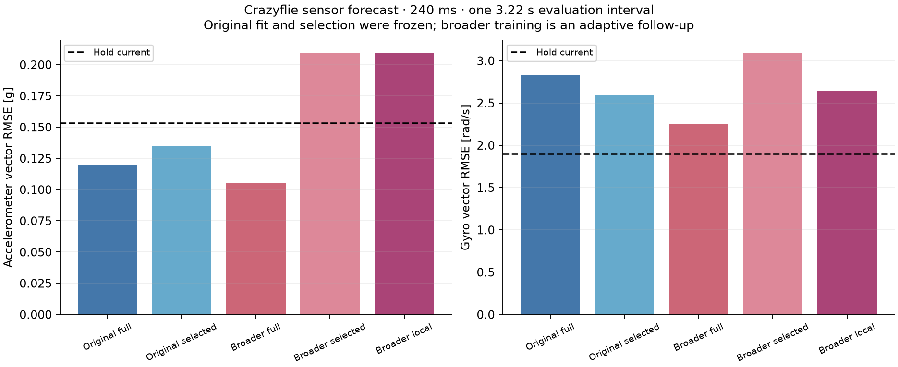

# Forecast representations, reserved sensor logs, and segment coverage

Changing the representation can recover useful generalization without adding
platform equations. It does not yet give us a reliable automatic choice of model.
On the difficult ARP log66 evaluation, relative observation history reduced
240 ms velocity error by 27% and body-rate error by 20% versus the full-history
direct model. Other recordings regressed. A subsequently frozen evaluation on
previously unused Crazyflie sensor logs improved accelerometer prediction over
holding the current value, but worsened gyro prediction.

An adaptive follow-up widened training coverage while keeping the number of
training windows fixed. The full-history family improved, while automatic
selection chose a model with worse evaluation error. This is evidence for
separately tracking representation, observation coverage, and selection quality.
It is not evidence that a general flight model is ready for control.

The [evidence bundle](investigations/forecast-representation/README.md) contains
plans, executed source archives, complete candidate scores, data identities,
audits, and test results. Experiments ran on 2026-09-14 on
`experiment/generic-transition-support`.

## Generic hypotheses implemented

The experimental [direct forecaster](../src/glassbox/experimental/direct_forecast.py)
now accepts six representations. Each predicts an observation change at explicit
horizons, conditional on past observations and the command prefix up to that
horizon. Evaluation supplies the actual recorded future commands. These are
conditional forecasts, not predictions made without knowledge of those commands;
observational fit alone does not establish causal effects of interventions.

| Representation | Information supplied to each affine head |
| --- | --- |
| `full` | Current observation and command, relative observation/input history, future command changes; previous default |
| `relative` | The same features with the absolute current observation omitted |
| `linear_history` | Current observation/command plus anchored degree-one summaries of past relative observations and inputs |
| `quadratic_history` | Anchored degree-two summaries, retaining temporal curvature as well as trend |
| `pca95` / `pca99` | Full standardized features projected onto components retaining 95% / 99% of training variance |

`relative` makes predicted changes invariant to additive offsets in the observed
channels: shifting the entire observation history shifts the predicted level by
the same amount. This is a testable modeling assumption. It need not hold for a
given channel or system, and it is not rotation invariance. Polynomial histories
compress temporal detail; their curvature is the curvature of the observed
history, not an estimate of every unobserved direction of the dynamics surface.
PCA uses training features only and retains variance, which need not retain the
directions most useful for prediction. None introduces quad or fixed-wing force
laws, and weights are fitted separately for each dataset.

```python
from glassbox.experimental.direct_forecast import fit_direct_forecast

# batch is a validated SequenceBatch of observation/input windows.
forecast = fit_direct_forecast(
    batch,
    horizons=(1, 5, 12),
    representation="quadratic_history",
    ridge_fraction=0.01,
)
means = forecast.predict(past_states, past_inputs, future_inputs)
```

Predictions remain differentiable with respect to inputs through JAX. The default
`full` representation preserves v1 serialization and fingerprints; the new
representations use v2 metadata. Independent heads do not enforce a coherent
recursive trajectory, valid attitude matrices, or an uncertainty envelope. These
options remain experimental; the stable model and controller APIs are unchanged.

## Matched ablation on the existing recordings

We reused the exact training/development/evaluation windows from
[forecast diagnosis](forecast-diagnosis.md): four ARP recording folds with three
training seeds each, plus three Nano and three X8 cases. This is an exploratory
comparison on already inspected data. Seeds resample training windows, not
independent evaluation flights.

Each case fits six direct representations and one recursive-history family at
six ridge fractions: `0.0001, 0.001, 0.01, 0.1, 1, 10`. Each family's ridge, and the
global family choice, minimize development MSE over all observation channels and
three horizons, normalized by shared training observation scales. Hold-current
and a linear trend reference also enter global selection. This is 42 fitted
models per case, 756 across the original recordings. The old full and recursive
predictions reproduce the previous experiment numerically.

The table shows mean per-case vector RMSE across the three seeds at 240 ms.
Each cell is **velocity m/s / body rate rad/s**, with lower values better. The
selection objective also includes the attitude channels and earlier horizons;
it is not optimized solely for the two final-horizon metrics shown here.

| ARP evaluation recording | Full direct | Relative direct | Recursive | Hold current | Global selection |
| --- | ---: | ---: | ---: | ---: | ---: |
| log63 | 0.276 / 0.391 | 0.300 / 0.448 | 0.294 / 0.718 | 0.806 / 0.372 | 0.300 / 0.448 |
| log64 | 0.324 / 0.949 | 0.331 / 1.009 | 0.389 / 1.007 | 0.668 / 1.351 | 0.324 / 0.949 |
| log65 | 0.375 / 0.995 | 0.360 / 1.054 | 0.428 / 1.082 | 0.584 / 1.513 | 0.393 / 0.983 |
| log66 | 0.314 / 0.713 | **0.228 / 0.568** | 0.380 / 0.807 | 0.266 / 0.648 | 0.331 / 0.586 |

Relative features beat hold-current on both log66 metrics, but worsen both log63
metrics versus full features. The global selector chooses relative in two log66
seeds and quadratic history in the third; the latter has much worse velocity
error. The family improvement therefore does not translate into a dependable
global selection improvement.

At 250 ms, Nano's linear-history direct family scores 0.204 / 0.872 versus full
direct's 0.222 / 0.939. X8 still favors recursion: 0.325 / 0.238 versus full
direct's 0.370 / 0.278, and all three X8 seeds select recursion. These results do
not establish a universal representation. They also do not supersede the
stronger Nano rate result from the earlier nonlinear experiment.

We additionally tested a local empirical-error selector. It compares the global
choice, hold, and trend using squared errors at the 32 nearest development
origins, measured in training-standardized current/history features. It selects
separately by horizon and output group; evaluation outcomes are not inputs.
On log66 it scores 0.230 / 0.602, while X8 velocity worsens to 0.402. Nearby
development residuals are useful evidence in some cases, but this mechanism is
neither calibrated uncertainty nor a differentiable, coherent dynamics model.
Using development data for both family selection and local residual evidence
also means the latter is not a separate calibration set.

## First reserved Crazyflie sensor evaluation

Three previously unused recordings were found in the
[pinned ARP dataset](https://github.com/arplaboratory/data-driven-system-identification/tree/2d267dd07b4262f579ee223d20b26a6dc9d17147/logs_crazyflie).
Roles were recorded before decoding: log10 for training, log15 for development,
and log16 for evaluation. Log16 was not decoded until all fresh fits, selection,
and reporting arms were frozen. The saved artifact hashes are verified before
evaluation. This process provides a new evaluation recording; it does not make
the earlier exploratory model-design choices disappear.

These logs contain accelerometer, gyro, and motor-command channels. There is no
position, velocity, or attitude ground truth. We retain accelerometer units in g,
convert gyro degrees/s to rad/s, and divide unsigned motor commands by 65536.
We do not infer full flight state or establish that every powered interval is
free flight. An independent uSD decoder is checked against Bitcraze's
[pinned reference decoder](https://github.com/bitcraze/crazyflie-firmware/blob/349555f4dc739eb66fbc64f7d009f9b63f6a2b14/tools/usdlog/cfusdlog.py).

Preparation holds the most recent logger event onto a 50 Hz grid, accepts event
age at most 10 ms, and retains the longest interval with mean normalized motor
command above 0.1. There is no added filtering or interpolation. These files do
not separate sensor sample time from publication time, so event-time alignment
cannot establish physical sensor availability or end-to-end latency. The
power threshold also conditions which intervals are evaluated.

| Role | Recording | Retained time span | Grid observations | Complete windows used |
| --- | --- | ---: | ---: | ---: |
| Training | log10 | 6.72 s | 337 | 320 |
| Development | log15 | 42.88 s | 2,145 | 426 |
| Evaluation | log16 | **3.22 s** | 162 | 29 |

All windows have 100 ms of history and up to 240 ms of future observations.
Development/evaluation origins are 100 ms apart and overlap. The calibration
footprint includes the 42.88 s development interval as well as training. There
is only one short reserved interval, so the 29 windows are not 29 independent
experiments. No confidence interval or broad performance claim follows.

The frozen selector chose `quadratic_history-r0.01`. Its final development
accelerometer/gyro RMSE was 0.091 g / 2.912 rad/s, compared with hold's
0.136 g / 4.899 rad/s. On the reserved recording the ordering changed:

| Fixed reporting arm at 240 ms | Accelerometer vector RMSE [g] | Gyro vector RMSE [rad/s] |
| --- | ---: | ---: |
| Frozen global selection | 0.135 | 2.591 |
| Full direct, ridge chosen on development | 0.120 | 2.826 |
| Recursive, ridge chosen on development | 0.227 | 3.461 |
| Hold current | 0.153 | **1.895** |
| Linear trend | 0.241 | 2.508 |
| Local empirical-error selection | 0.135 | 2.591 |

The selected model improves final accelerometer error over hold, while gyro
error is 37% worse. At 20 and 100 ms it is worse than hold on both output groups.
That is a failed broad improvement claim, even though one final-horizon metric
improves. Better development performance was insufficient evidence for this
recording; the experiment does not identify a unique physical cause.

## Adaptive follow-up: equal windows, broader training coverage

After observing the reserved result, we inspected segmentation and changed only
training-segment coverage. This is an explicitly adaptive follow-up on an already
observed evaluation recording. Ten eligible powered intervals existed in log10;
the longest-only rule discarded nine. None of the grid rows in these three logs
was rejected for excessive event age: motor-threshold crossings caused the
fragmentation here.

We sampled 320 complete windows from 1,623 available origins across all ten log10
intervals, using seed 60 and checking that every window stays within its own
interval. Development and evaluation windows remained identical. The selected
windows cover 1,721 unique state rows instead of 337, so this holds the window
budget fixed, not the raw observation budget. Training-derived output scales are
also recomputed, affecting the weighting of global selection loss.

| Arm at 240 ms | Original accelerometer / gyro | Broader training accelerometer / gyro |
| --- | ---: | ---: |
| Full direct family | 0.120 / 2.826 | **0.105 / 2.253** |
| Global selection | 0.135 / 2.591 | 0.209 / 3.086 |
| Local empirical-error selection | 0.135 / 2.591 | 0.209 / 2.645 |
| Hold current | 0.153 / 1.895 | 0.153 / 1.895 |

Units are g / rad/s. The full family's chosen ridge stays 0.01: broader coverage
improves its two errors by about 12% and 20%, although gyro still loses to hold.
The global selector instead switches to `recursive-r0.0001` and regresses.
Coverage helps one fixed family; automatic model choice remains a separate
problem. The original expanded-run plan inherited a stale longest-interval
budget description; its executed code and usage records show the actual policy.
The [erratum](investigations/forecast-representation/plan-errata.json) preserves
that distinction. The plan writer is corrected for future runs.



## Implications for Glassbox's interfaces

The learner should accept a collection of identified, contiguous segments and
carry segment/origin provenance through window extraction. Reports should expose
unique observed time/rows alongside the number of windows, and distinguish
training, development, error calibration, and untouched evaluation evidence.
The current experiment implements segment-aware sampling in its harness; this
is not yet a stable public collection API.

Representation assumptions belong in serialized model metadata, as implemented
here. Prediction quality needs separate evidence by horizon, output group, and
recording. A single scalar development score conceals tradeoffs and does not
guarantee improvement over a simple reference under a changed data distribution.
Local support distance, empirical errors, and model uncertainty must retain
distinct meanings.

The next bounded experiment should use several independent recordings to select
and validate a model, measure failures against hold/trend per output and horizon,
and preserve a new untouched recording for final evaluation. A fair coverage
comparison should report both fixed-window and fixed-unique-observation budgets.
We should keep the current sensor benchmark separate from full-state forecast
and closed-loop control benchmarks. This result supports those interface and
evaluation changes; it does not justify promoting a new default model yet.

## Verification

An independent NumPy audit replays 840 fitted models, checks 2,160 direct-head
normal equations and PCA training covariance constraints, and verifies old
baseline predictions, frozen artifacts, source clocks, units, all 160,452 decoded
rows, sampled segment boundaries, local selection, and reported scores. Its
16,117 numerical comparisons have maximum absolute difference 3.50e-11.
These are implementation and provenance checks, not independent physical truth.

The focused regression set passes **134 tests from source with float64 and 134
against an isolated built wheel with float32**. It includes serialization,
additive-offset behavior, polynomial reconstruction, PCA, command-prefix
causality, decoder protocol/CRC, and existing experimental/public API tests.
All packaged Python sources match the workspace; lint, formatting, and diff
checks pass. The full repository test suite was not run. Machine-readable
details are in [validation.json](investigations/forecast-representation/validation.json).
