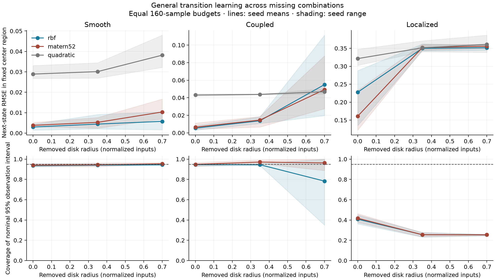
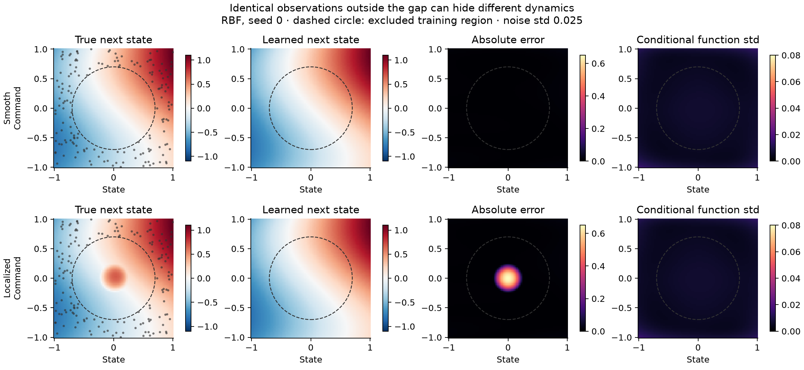

# Generic transition learning and observational support

Glassbox now has an experimental model that learns the complete next-state
response from state/command pairs. It uses no quadrotor or fixed-wing equations,
force decomposition, actuator law, or platform-specific residual base. The first
study tests how observations support predictions across missing combinations of
coordinates, and whether nominal uncertainty describes the resulting errors.

This is an opt-in research implementation on
`experiment/generic-transition-support`. It is not part of the stable
`DynamicsBelief`, `glassbox.fit`, or controller contract. Existing models and
interfaces remain unchanged.

## What was implemented

[`experimental/transition_gp.py`](../src/glassbox/experimental/transition_gp.py)
contains:

- `TransitionSamples`: finite Euclidean states, arbitrary command widths,
  complete next-state observations, a fixed sample interval, and optional
  context. Rows may come from independent resets.
- `fit_transition_gp`: an exact Gaussian-process reference learner, with RBF,
  Matérn-5/2, and a rational-quadratic option added in the
  [shape-learning follow-up](shape-learning.md). The first study below compared
  RBF and Matérn. Scaling and hyperparameter selection use training rows only.
- `GaussianTransition.predict`: differentiable means and separate marginal
  variances for the latent response and a future noisy observation.
- `local_response`: mean Jacobians and Hessians, plus the conditional covariance
  of the Jacobian. These derivatives describe the fitted function; Hessians are
  not independent measurements of curvature.
- `support`: nearby sample distances, principal directions of local sample
  variation, and the query's displacement along those directions. This empirical
  geometry is separate from the model's variance and makes no probability claim.
- `mean_rollout` and NPZ save/load. Rollout composes the learned mean and makes no
  multi-step uncertainty claim. Loading a float64 artifact requires JAX float64
  support, rather than silently lowering its precision.

The GP outputs are independent after standardization, with shared kernel and
normalized noise hyperparameters. There is no modeled cross-output covariance.
Two deterministic optimization starts each run 160 Adam steps in the study; the
lowest finite training marginal negative log likelihood selects the result.
This is a finite optimization budget, not proof of the global optimum.
The implementation needs only Glassbox's existing NumPy and JAX dependencies.

The statistical construction follows the conditioning equations in Rasmussen
and Williams, [chapter 2](https://gaussianprocess.org/gpml/chapters/RW2.pdf), with
the generic covariance functions described in
[chapter 4](https://gaussianprocess.org/gpml/chapters/RW4.pdf). Kernel smoothness,
stationarity, and fitted hyperparameters remain assumptions. In particular,
the intervals do not integrate over hyperparameter uncertainty.

## Experiment design

The [runner](../scripts/experiment_transition_support.py) writes its plan,
environment, and executed source archive before fitting. The recorded run uses
three data/noise seeds, three synthetic scalar transition systems, four sampling
layouts, and two kernels: **72 GP fits**, with affine and quadratic regressions
as generic prediction references.

Every fit receives **160 independent transitions**. These are not a chronological
flight recording, so 160 times the 0.1-second interval is not a calibration-flight
duration. Input measurements are exact; observed next states have independent
Gaussian noise with standard deviation 0.025 in the synthetic output units.

The learner sees state, command, and next state. It receives neither the true
function nor the layout's gap radius. The runner uses truth only to generate
observations and score predictions.

### Systems and withheld combinations

The smooth system combines a linear state response, a sinusoidal command
response, and a state-command interaction. The coupled system has a different
nonlinear interaction. The localized system equals the smooth system plus a
smooth, compact change inside a disk of radius 0.28.

Three layouts sample a square `[-1, 1]^2`, excluding disks of radius 0, 0.35, or
0.70. Each coordinate still spans approximately its full original range.
Queries inside the holes are missing combinations, even though they lie inside
the coordinate ranges and convex hull of the observations. The budgets are
equal; samples across different hole sizes are not nested.

The fourth layout observes a narrow diagonal strip: state and command covary.
It tests whether support captures the direction in which data is missing.

Independent evaluation queries include a fixed center disk of radius 0.28,
the surrounding square, a region outside the square, and queries along and
away from the diagonal. Reported center metrics always use the same center
region across gap sizes. Other region metrics can overlap and are reported
separately; they are not pooled into a global score. `reference_region` denotes
the declared sampling region, not a guarantee of empirical support at each point.

All results are seed means with seed minima/maxima retained. These three seeds
do not establish population-level calibration, and the many queries within a
fit are not treated as independent fits.

## Recorded findings

[Plan](investigations/generic-transition-support/plan.json),
[full summary](investigations/generic-transition-support/summary.json), and
[audit](investigations/generic-transition-support/audit.json).
The table selects `region=center`, `layout=gap-070` from the summary. RMSE is
against the noiseless next-state function; coverage uses independent noisy
observations and the corresponding observation variance.

| System | RBF RMSE | Matérn RMSE | RBF nominal 95% coverage | Matérn nominal 95% coverage |
| --- | ---: | ---: | ---: | ---: |
| Smooth | 0.0057 | 0.0103 | 94.4% | 95.4% |
| Coupled | 0.0550 | 0.0493 | 78.3% | 96.2% |
| Hidden localized change | 0.3516 | 0.3559 | 25.4% | 25.4% |



Generic function fitting can bridge substantial gaps on these smooth systems.
However, the coupled system shows that similar prediction errors can accompany
very different uncertainty coverage under different smoothness assumptions.
Neither kernel earns a general extrapolation guarantee from these results.

For the localized system with either nonzero gap, training inputs **and observed
targets are exactly identical** to those for the smooth system. The fitted
predictions are consequently identical, while the unseen response differs.
The audit checks this equality for every seed and both kernels. This is a
controlled identifiability counterexample: those observations cannot distinguish
the two systems. The GP's confident interpolation is conditional on its prior.



The localized response is difficult even with no deliberately removed region:
only 6–13 training observations fall inside its disk, and center RMSE is 0.228
for RBF and 0.161 for Matérn. That case does not separate insufficient sampling,
stationary-kernel limitations, noise estimation, and finite optimization. It
must not be described as evidence that all error is caused by a missing region.

In the smooth diagonal experiment, RBF RMSE is 0.0049 along the observed strip
and 0.1158 away from it. The saved local support eigensystem reveals the thin
direction; its small eigenvalue is not interpreted as low prediction uncertainty.
The Jacobian covariance also retains substantial uncertainty perpendicular to
the observed variation. This is the sort of directional evidence missing from
a coordinate-wise operating envelope.

Outside the original square, even the smooth system with full sampling has
coverage of 87.5% for RBF and 93.5% for Matérn. Good performance in an interior
hole should not be conflated with reliable extrapolation past the data domain.

### What this says about a physical system

All results above are fully synthetic. They establish a possible failure mode
of the learner and its uncertainty, not its frequency on vehicles. In particular,
the compact bump is a deliberately constructed identifiability counterexample,
not a measured aerodynamic phenomenon.

Mechanisms such as dead zones can change a response's local slope, while backlash
can make it depend on recent motion. See the reference models for
[dead zones](https://www.mathworks.com/help/simulink/slref/deadzone.html) and
[backlash](https://www.mathworks.com/help/simulink/slref/backlash.html). These are
reasons to test localized changes and missing history in system identification;
they do not imply that this particular hidden function occurs in an aircraft.

Testing against such mechanisms does not require teaching their equations to
the learner. An independent simulator can supply the observations while the
learner still receives only the declared signals. To establish practical
relevance, the next study should withhold measured state-command regimes in
that simulator and then in recorded telemetry, scoring both prediction error
and interval coverage. A simulator result would still be distinct from a
hardware result.

## Minimal use

```python
import numpy as np
from glassbox.experimental.transition_gp import TransitionSamples, fit_transition_gp

rng = np.random.default_rng(4)
points = rng.uniform(-1, 1, (160, 2))
states, commands = points[:, :1], points[:, 1:]
next_states = 0.6 * states + 0.3 * np.sin(2 * commands)
next_states += rng.normal(0, 0.025, next_states.shape)

samples = TransitionSamples(states, commands, next_states, dt_s=0.1)
model = fit_transition_gp(samples, kernel="matern52")

prediction = model.predict(np.array([0.1]), np.array([-0.2]))
support = model.support(np.array([0.1]), np.array([-0.2]))
response = model.local_response(np.array([0.1]), np.array([-0.2]))
model.save("transition-model.npz")
```

For telemetry, callers must supply consistently ordered channels with common
units and timing. Optional `context` is an explicit array of causally available
quantities such as previous commands. The caller must supply matching context
at prediction time. This prototype does not build history or learn a hidden
state automatically.

The fixed `dt_s` belongs to the fitted artifact. It cannot be changed by a
prediction call. These Euclidean coordinates do not directly accept the stable
API's quaternion state: a geometry-aware transition adapter is still required.

## Reproduce and inspect

From the Glassbox checkout, using an environment containing Glassbox and
Matplotlib:

```sh
JAX_ENABLE_X64=1 python scripts/experiment_transition_support.py --output /tmp/generic-support-new
```

The output directory must not exist. In the shared dart workspace, use
`../.venv/bin/python`. Optional `--seeds`, `--rows`, and `--steps` change the
recorded plan; defaults reproduce the study above.

Each trial retains training and evaluation arrays, sample identities, fitted
model artifacts, all predictions and variances, neighborhood geometry, optimizer
traces, and metrics. The audit checks disjoint rows, saved-model replay, and the
identical-evidence counterexample. The complete workspace run is in
`artifacts/generic-transition-support/run-02` under the parent dart directory;
the portable plan, summary, figures, and executed sources accompany this document.

[`test_transition_gp.py`](../tests/test_transition_gp.py) checks analytic
conditioning, latent versus observation variance, differentiable prediction and
mean rollout, slope and interaction curvature against a known response,
directional sample support, model round trips, arbitrary channel widths and
context, input copying, and rejection of malformed observations.

## Implications for Glassbox

The useful common interface is a transition predictor with evidence about the
requested prediction. Its uncertainty cannot be restricted to a covariance
over a hand-selected collection of physical coefficients. The stable
`Trajectory` and `ExecutableModel` contracts currently assume rigid-body states
and platform families; this experiment keeps that architectural change explicit
instead of disguising the general learner as a residual model.

Empirical neighborhood geometry, conditional function uncertainty, and observed
forecast errors should remain distinct. A stationary kernel can assign a long
length scale to a direction that was scarcely excited. Distance alone can miss
correlations; GP variance alone can miss a localized regime change. Agreement
between both kernels does not supply missing observations either.

The next useful tests are higher-dimensional coupled systems and controlled
memory/delay, followed by block-held-out ordinary platform telemetry. Locally
adaptive smoothness and independent error calibration are candidates to compare,
not conclusions established by this study. Exact GPs have cubic fit cost and
quadratic storage, so this implementation is a reference baseline rather than
the final model for long telemetry streams.
