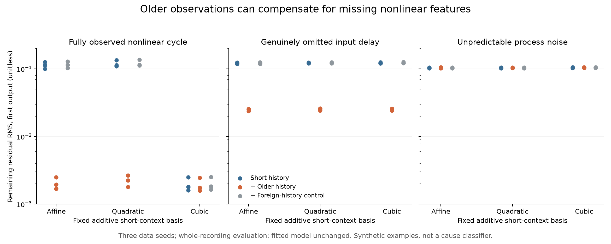
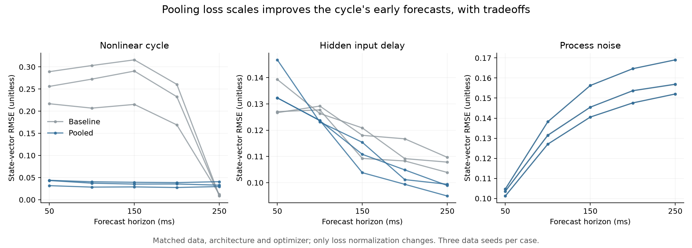

# History confounding and horizon weighting

Two synthetic experiments sharpen the diagnosis of the generic learner. A large
benefit from older history can arise in a **fully observed, first-order Markov
system**. Separately, the current loss normalization can assign enormous weight
to a horizon where its reference happens to be exact. Changing that normalization
materially changes the learned model's errors.

Work ran on 14 September 2026 on `experiment/generic-transition-support`.
The [evidence bundle](investigations/history-confounding/README.md) contains the
plans, results, exact sources, artifact hashes, and independent audits. All
examples are platform-neutral synthetic systems. The public learner and
`model.diagnose(recordings)` remain unchanged; the alternative loss is a
research candidate with measured tradeoffs.

## Older observations can supply nonlinear features

Construct a five-coordinate latent vector, rotate it left each step, and observe
all coordinates while cubing the first. This observation map is invertible.
The complete transition in observed coordinates is:

```text
x_next = [x1³, x2, x3, x4, cube_root(x0)]
```

The present observation determines the next observation. Its first coordinate
is `x1³`. Because the sequence repeats every five steps, that value also appears
as `x0` four steps earlier. The learner's two-step history does not expose that
older cubic feature directly; the diagnostic's four-step history does. A linear
diagnostic can therefore benefit from older observations without missing state.

We fit the unchanged learner using three data seeds. Each has eight calibration
recordings and four diagnostic recordings, each containing eight separate
episodes of 12 intervals at 50 ms. Latent initial values are independent uniform
samples in [-0.9, 0.9]. Episode gaps are preserved. Each fitted model has 288
training and 96 development windows; each diagnostic evaluation has 256 windows.
Repeated cycle phases are not independent observations. This is an analytical
witness, not a realistic data-efficiency benchmark.

The experiment compares the affine residual diagnostic with fixed quadratic
and cubic **coordinatewise** powers of the same short-context channels, without
cross-channel products. Each basis gets three comparisons: short context alone,
short context plus raw older observations, and short context plus foreign-history
donors. The short basis is identical within each comparison. Train-only scaling,
ridge fraction 0.001, whole-recording folds, and donor exclusions follow the
frozen protocol. Every degree and output is reported; none selects a new default.

| Fitted model, first output | Affine short RMS | Cubic short RMS | Affine older-history MSE gain | Cubic older-history MSE gain |
| --- | ---: | ---: | ---: | ---: |
| Fully observed nonlinear cycle | 0.1002–0.1266 | 0.00161–0.00249 | 99.95–99.98% | 2.84–4.93% |
| Genuinely omitted input delay | 0.1187–0.1246 | 0.1211–0.1258 | 95.35–96.10% | 95.43–96.01% |
| Independent process noise | 0.1017–0.1052 | 0.1032–0.1056 | −1.75 to −0.02% | −1.81 to −0.21% |

RMS is the error remaining after the auxiliary residual correction, in unitless
observation coordinates. History gains use the corresponding short basis as
their denominator. Ranges span three seeds, not confidence intervals. Both
controls reuse models and already-inspected recordings from the
[earlier study](sequence-diagnostics.md).



Cubic short features alone remove **99.952–99.980%** of the cycle's affine short
diagnostic MSE. After that, older history removes only 0.00073–0.00192% of the
original affine short MSE. The remaining 2.84–4.93% relative gain concerns a much
smaller error. Foreign-history donors give no first-output improvement. This
establishes the counterexample using the actual fitted learner.

A hold-current witness makes the approximation issue exact: its first-output
residual is `x1³ - x0`, contained in the cubic short basis. Cubic short RMS is
0.00063–0.00079 versus affine short RMS 0.1006–0.1273. Other outputs demonstrate
why absolute errors matter: older features can give roughly 75% relative gains
in already tiny hold-witness residuals. Redundant features affect ridge
regularization; a relative gain alone is not an information measure.

The 12 diagnostic cases comprise three new learned cycle models, those same
three datasets with the hold witness, and six reused learned controls. There
are 5,280 scored windows, including reuse between cycle predictors, and 432
auxiliary fits for the three basis comparisons.

This does not establish a general memory detector. Coordinatewise polynomials
miss interactions and other nonlinear shapes. Finite data, regularization,
distribution shifts, and imperfect correction of the learned predictor also
affect the result. The narrower conclusion is useful: history gain can be
falsified as evidence of *necessary* memory when the same observations admit
a much better nonlinear explanation.

## An exact reference horizon creates an implicit priority

Inspecting the cycle's fitted models exposed a separate objective effect.
The current recipe divides each horizon/channel error by training hold-current
RMS at that horizon, floored at 1% of training state standard deviation. At five
steps the cycle returns exactly to the initial state, so hold-current RMS is
zero and the floor determines the scale.

Fifth-step squared errors receive **18,228–22,215 times** their first-step weight
in the same channel. In the selected models, the fifth step contributes
**83.0–88.8% of normalized development loss**, but only **0.025–0.069% of
unnormalized development squared error** in this unitless encoding. A read-only
replay reproduces these quantities from saved scales and model parameters.
This accuracy priority comes from the reference rather than an explicit
consumer choice.

That finding was post-hoc. Before further fitting, a separate plan froze one
matched ablation: replace per-horizon hold RMS with one per-channel RMS pooled
over training windows and forecast horizons, broadcast across horizons. Retain
the same 1% state-scale floor. Keep the saved training/development windows,
model structure and width, initialization seed, ridge, optimizer settings, and
checkpoint schedule. Development selection uses the corresponding objective,
so this intervention changes optimization and selection together; their effects
are not separately identified.

The ablation makes nine fits: cycle, hidden delay, and process noise, each with
three seeds. Baseline and candidate use identical complete five-step evaluation
windows: 192 per cycle case and 616 per delay/noise case, totaling 4,272. These
origins differ from the one-step diagnostic origins above. All evaluation
recordings were already inspected during method development.

| System | First-step vector RMSE change | Fifth-step vector RMSE change |
| --- | ---: | ---: |
| Nonlinear cycle | **80.0–87.6% lower** | **2.72–4.49 times baseline** |
| Hidden input delay | 4.11–5.37% higher | 7.82–9.78% lower |
| Process noise | unchanged to 0.085% lower | unchanged to 0.063% higher |

Vector RMSE sums squared errors across observed channels before averaging over
examples. Comparisons are within the same system and encoding; absolute values
are not compared across different systems. The bundle retains every horizon
and channel, including regressions.



Cycle first-step vector RMSE falls from 0.217–0.289 to 0.0317–0.0438. Fifth-step
RMSE rises from 0.00836–0.0121 to 0.0297–0.0408. This directly demonstrates that
the objective accounts for a substantial part of the error pattern under this
protocol. It does not establish the only cause, uniform improvement, or the
irrelevance of model capacity. The delay case still lacks information no
objective can supply. Two noise seeds retain initialization checkpoint zero
under both objectives and have identical predictions; the third changes little.

## Consequences for the opinionated interface

Keep consumer calls fixed. These results motivate improving the internal recipe
and its evidence, rather than asking users to choose history lengths, polynomial
orders, or horizon weights. Error explanations should compare history against
nonlinear short-context capacity, retain absolute errors, and expose how the
objective weights horizons and channels.

Do not automatically lengthen history from the current diagnostic. The pooled
loss also needs a wider frozen comparison on untouched generic systems before
promotion: it changes the accuracy tradeoff and worsens a control's first step.
All 82 library Python files remain byte-identical to the start of this work.
No consumer configuration was added.

The subsequent [wider comparison](horizon-generalization.md) rejects pooled
normalization as a general default across eight generic synthetic families.
A narrower first-step weight cap preserves most models exactly, but still has
a fresh-seed confirmation regression and remains a research candidate.

The diagnostic audit independently indexes windows and reconstructs all 432
auxiliary regressions with augmented least squares, with maximum difference
2.37e-12 across 5,964 numerical comparisons. The ablation audit regenerates
evaluation windows, replays both predictors, and checks scores, pooled scales,
checkpoint selection, and development loss: maximum difference 1.78e-15 across
189 comparisons. Both share frozen generators and the artifact loader; neither
repeats optimization or establishes external validity. The focused suite passes
**58 tests**, including the analytical Markov witness and pooled-scale invariance.
