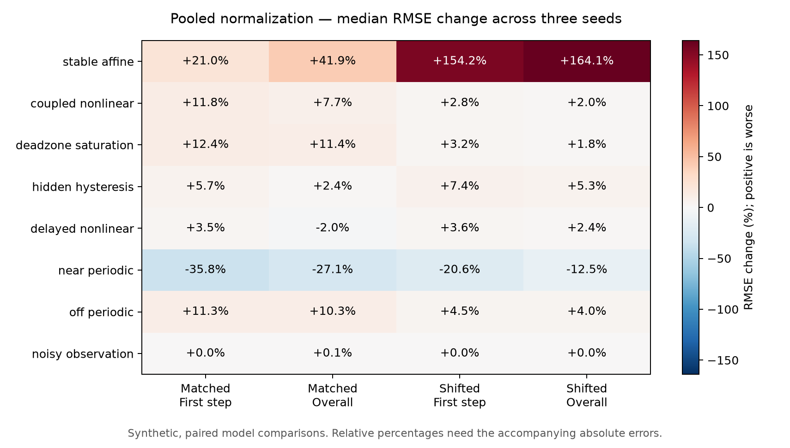
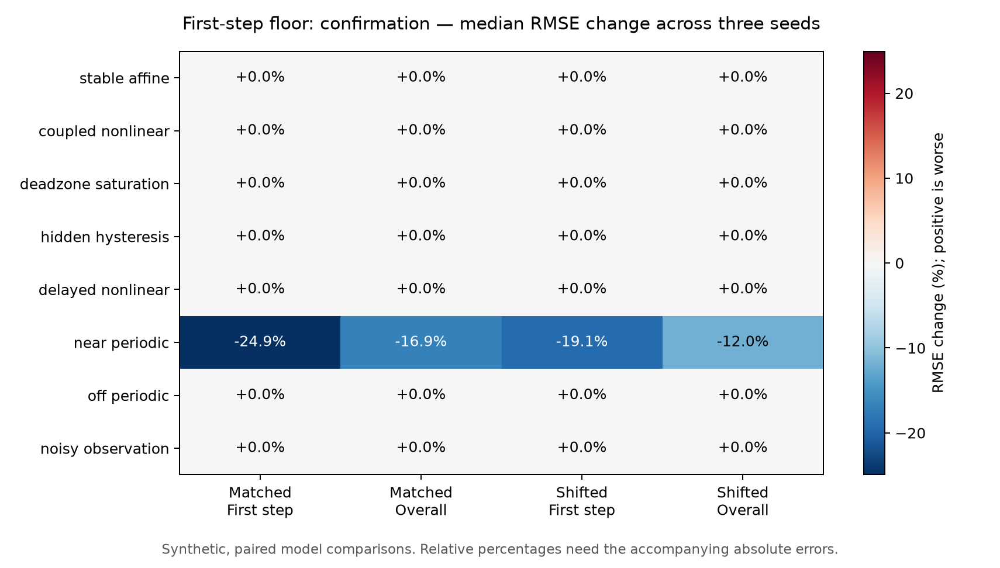

# Horizon normalization across generic systems

The wider comparison rejects pooled horizon normalization as a general default:
first-step error increases in 19 of 24 cases under both evaluation regimes.
A narrower rule, which caps later-horizon loss weights at the first-step weight,
leaves most models exactly unchanged and improves some near-periodic cases.
It still regresses on one fresh-seed case. **Neither candidate is promoted.**

Work ran on 14 September 2026 on `experiment/generic-transition-support`.
The [evidence bundle](investigations/horizon-generalization/README.md) preserves
the frozen plans, all results, sources, and numerical audits. These are
platform-neutral synthetic experiments, following the
[history-confounding study](history-confounding.md). All 82 library Python files
remain unchanged. No consumer options were added.

## What was tested

The baseline is the existing `generic-history-v1-prototype`: an affine model
plus a 32-unit tanh correction, recursively predicting state increments. At
50 ms sampling, it uses two intervals of history and predicts five intervals.
Each fit uses eight calibration recordings of 160 intervals: six recordings
supply 384 training windows, and two supply 256 development windows. Recording
assignment follows the unchanged hashed-identity split. Adam runs for 1,000
steps with the existing initialization, learning rate, batch size, and checkpoint
schedule; development loss selects a checkpoint every 100 steps, including zero.

| Family | Structure exercised |
| --- | --- |
| Stable affine | Three coupled coordinates with different decay rates |
| Coupled nonlinear | Tanh, sine, and state interactions |
| Dead zone and saturation | Flat input regions and clipped response |
| Hidden hysteresis | A latent accumulating coordinate with bounded memory |
| Delayed nonlinear | Input response delayed by four intervals |
| Near-periodic | Damped, forced oscillator with a 5.2-step period and invertible nonlinear observations |
| Off-periodic | The same oscillator construction with an 8-step period |
| Noisy observation | Nonlinear input response with process and observation noise |

Exact equations and random-number construction are in the plans and archived
generator. The hysteresis coordinate is absent from the current observation;
this does not prove it is unidentifiable from history. Noisy-observation scores
compare predicted and recorded observations, not latent truth.

Each case has four new evaluation recordings in each of two regimes. Matched
inputs follow the calibration process, `u = .65*u_previous + .35*Uniform[-1,1]`.
Shifted inputs follow `u = .25*u_previous + .75*Uniform[-1.25,1.25]`, changing
amplitude and temporal correlation together. System parameters and the initial
latent distribution, uniform on [-0.4,0.4], are unchanged. Evaluation uses 124
windows per regime and case; future blocks do not overlap, but their histories
do. Windows are not independent replicates.

Three stages separate the exploratory candidate choice from confirmation:

| Stage | Data seeds | Paired cases | New optimizer runs | Exact candidate reuse |
| --- | --- | ---: | ---: | ---: |
| Pooled normalization | 4101, 4202, 4303 | 24 | 48 | 0 |
| First-step floor, development | Same data and saved baselines | 24 | 3 | 21 |
| First-step floor, confirmation | 5101, 5202, 5303 | 24 | 28 | 20 |

The pooled plan preceded all new fits. After inspecting its results, both
first-step-floor plans were frozen before fitting that candidate. Confirmation
uses fresh recordings on the same chosen equations, not untouched equation
families. There are 79 new optimizer runs in total. The development stage reuses
24 baselines, and 41 candidate comparisons reuse exact baseline parameters
because their objectives are identical. These counts are not independent
systems or independent trials.

## Scores and the pooled result

Every horizon and channel retains physical RMSE. For comparisons, errors are
divided by the common baseline training state standard deviation in each
channel. First-step scaled RMSE averages squared scaled errors across windows
and channels, then takes the square root. Overall scaled RMSE also averages
across all five horizons. These evaluation scores are distinct from the fitted
loss. Per-recording scores, hold-current predictions, and marginal training
input-range overlap are also retained. Marginal overlap is not joint support.

The baseline loss divides each horizon/channel error by training hold-current
RMS at that horizon, floored at 1% of training state standard deviation. The
pooled candidate instead uses one RMS per channel across training windows and
horizons. Both optimization and checkpoint selection use the candidate loss;
their effects are not separately identified.

| Evaluation | First-step improved / worse / unchanged | Overall improved / worse / unchanged |
| --- | --- | --- |
| Matched | 4 / 19 / 1 | 7 / 16 / 1 |
| Shifted | 4 / 19 / 1 | 4 / 19 / 1 |

Near-periodic matched first-step errors fall by 26.6–52.8%, with overall errors
19.4–27.6% lower. The broader tradeoff is unfavorable. For example, delayed
nonlinear seed 4303 has 10.79% higher matched first-step RMSE, an absolute
increase of 0.02879 in scaled RMSE. Several other families worsen by smaller
amounts. Large percentages can also concern very small errors: stable-affine
shifted first-step error has a median increase of 154.2%, but absolute increases
are only 0.000274–0.000648 in scaled RMSE.



The figure shows medians over three seeds; the bundle retains individual seeds
and all horizons. A frozen descriptive screen flags a regression only when it
exceeds **both** 10% relative RMSE and 0.01 absolute scaled RMSE, separately for
first-step and overall scores. Only the delayed case above triggers this screen.
The numerous smaller regressions still count against a general replacement.
These screen constants are research conventions, not task tolerances or model
admission criteria.

## A narrower rule and its failed confirmation case

The follow-up candidate changes only unusually high later-horizon weights:

```text
candidate_scale[h, channel] = max(original_scale[h, channel],
                                  original_scale[first_step, channel])
```

Since squared-error weight is inverse squared scale, this caps each later
weight at its channel's first-step weight. Where first-step scale is already
the minimum, the entire objective is unchanged. The planned procedure reuses
the exact baseline model in those cases instead of rerunning identical
deterministic optimization. This rule adds no tuning parameter, but its
first-step reference is still a modeling choice requiring evidence.

In development, it changes only the three near-periodic models. All three
improve matched first-step and overall RMSE. Under shifted inputs, two improve
each score and one worsens each score; these are not the same seed for the two
metrics. The largest shifted overall increase is 3.19%.

In confirmation, **20 of 24 models remain exactly unchanged**. The three
near-periodic models and one stable-affine model change. Matched first-step
and overall scores improve in three cases and worsen in one; shifted scores
improve in all four changed cases.

| Near-periodic confirmation seed | Matched first-step change | Matched overall change | Shifted first-step change | Shifted overall change |
| --- | ---: | ---: | ---: | ---: |
| 5101 | **+9.64%** | **+18.00%** | −4.53% | −1.37% |
| 5202 | −24.93% | −16.93% | −19.09% | −13.68% |
| 5303 | −34.82% | −30.65% | −22.59% | −11.96% |

For the regressing seed, matched first-step scaled RMSE rises from 0.007016 to
0.007692, and overall scaled RMSE rises from **0.005790 to 0.006832**. The
overall absolute increase, 0.001042, falls below the screen's absolute threshold;
the regression remains real. Every matched horizon worsens in this case.
Its selected checkpoint changes from step 1,000 to step 200, but the experiment
does not establish checkpoint selection as the sole cause.

Fifth-step improvement is also not uniform across the otherwise favorable
comparisons: seed 5202 has a small matched fifth-step regression, and seed 5101
has a small shifted fifth-step regression. Overall gains do not erase these.
The changed stable-affine case improves from 0.000138 to 0.000082 matched
first-step scaled RMSE and from 0.001126 to 0.000289 under shifted inputs.
Those large relative gains concern small absolute errors.



The median figure hides the near-periodic seed 5101 regression; the table above
is essential to interpreting it. Stable-affine medians are zero because only
one of its three models changes. All baseline and candidate models beat the
hold-current reference on overall error in these experiments, which is a weak
reference comparison rather than an accuracy qualification.

## Decision and verification

Keep the public recipe unchanged. Pooled normalization does not generalize
well enough across these cases. The first-step floor is a more targeted research
candidate, with a documented confirmation failure. A useful next question is
whether optimization and checkpoint selection explain its seed sensitivity;
this study changes both together. Any further experiment should freeze that
comparison before fitting, and should retain individual horizons and absolute
errors. No new history, weight, or normalization choices belong in the consumer
interface on the strength of these results.

Three read-only audits regenerate calibration/evaluation windows, verify
whole-recording separation and training-only scales, reconstruct both loss
definitions, and replay saved models with the independent NumPy recurrence.
They check checkpoint traces and every aggregate/per-recording score. Together
they make 9,360 numerical comparisons, with maximum absolute difference
1.33e-15. The 46,080 cached-window and 17,856 evaluation-window checks include
reuse between stages. Audits share the frozen generator and artifact loaders;
they do not rerun optimization or establish external validity.

The focused suite passes **72 tests**, including 14 new benchmark and invariant
tests. Lint, formatting, and documentation links are checked. This work adds
research scripts, tests, and evidence only; no wheel or full repository suite
was rerun. Three data seeds per stage, one optimizer seed, chosen equations,
and synthetic observations limit the claim. This is evidence about an internal
loss tradeoff, not demonstrated real-platform accuracy or calibrated uncertainty.

The subsequent [checkpoint attribution study](checkpoint-attribution.md)
reproduces the failure and separates changes to the optimization path from
changes to the selection criterion. Additional development-recording experiments
resolve that case but retain new confirmation regressions.
