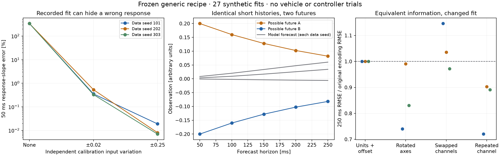

# Falsifying the generic fitting assumptions

The frozen generic recipe can fit recorded behavior almost perfectly while
predicting the **wrong sign of a command response**. In a controlled synthetic
example, its 50 ms response-slope error is approximately 341%; independent input
variation reduces that error below 0.54% without changing the model or optimizer.
This distinguishes inadequate calibration information from an architecture that
cannot express the relationship.

Two further experiments demonstrate a missing-history ambiguity and sensitivity
to equivalent observation encodings. All **27 planned fits** completed. These
are platform-neutral synthetic systems, not new flight data, controller trials,
or an explanation established for the earlier Cascade failure. The
[evidence bundle](investigations/model-qualification/README.md) preserves the
protocol, results, sources, tests, and numerical replay.



The three colors identify data replications, not alternative learner settings.
Response slopes use a finite symmetric command variation, not an infinitesimal
Jacobian. Errors and input amplitudes are in the toy systems' arbitrary units.
The encoding panel scores predictions after conversion back to the same two
original coordinates. Points are observed results, not confidence intervals.

## Fixed protocol

The [plan](investigations/model-qualification/plan.json) was recorded before
fitting. Every case uses the unchanged `generic-history-v1-prototype` through
`fit(recordings)`: 100 ms history, 250 ms recursive forecast, width 32, 1,000 Adam
steps, and the existing automatic normalization, data split, cache limits, and
checkpoint selection. There is no architecture or hyperparameter search.

Three dataset seeds, 101, 202, and 303, each generate eight calibration
recordings of 160 intervals at 50 ms: 64 s of synthetic calibration per case.
Stable recording identities give the same six-training/two-development split
and sampled origins across corresponding cases. Each fit retains 384 training
and 256 development windows. Four separate evaluation recordings give 124
origins, spaced five intervals apart. Dataset seeds change the observations;
the recipe's initialization/optimization seed remains zero.

There are nine command-response fits, three hidden-memory fits, and fifteen
encoding fits. Encoding variants share exactly the same underlying calibration
and evaluation observations. The library code and public interfaces were not
changed for this investigation.

## 1. Prediction on a policy does not qualify command response

The first system is deliberately simple:

```text
x[k+1] = 1.08 x[k] + 0.20 u[k]
u[k]   = -0.50 x[k] + excitation[k]
```

Without excitation, the observed evolution is `x[k+1] = 0.98 x[k]`. Every
parameter pair `a = 0.98 + 0.50 b` gives the same recorded transitions under
that policy. The preserved witnesses use `b = 0.05, 0.20, 0.50`, with recorded
transition differences below 1e-12. This ambiguity is mathematical; it does
not depend on Glassbox's training procedure.

The three calibration conditions add independent uniform command variation
with half-width 0, 0.02, or 0.25. They use the same recording lengths and fixed
learner. Queries use common histories from reserved unexcited recordings. At
each history we change the first proposed command by ±0.05, leave subsequent
commands equal, and compare the two predicted continuations with exact forced
responses of the known synthetic system. The correct first-step slope is +0.20.

| Calibration input variation | 50 ms response-slope relative RMS error, across seeds |
| --- | ---: |
| None | 341.18–341.40% |
| Independent uniform ±0.02 | 0.331–0.534% |
| Independent uniform ±0.25 | 0.0070–0.0190% |

The unexcited fits predict slopes near **-0.482**, opposite the true sign.
Their reserved same-policy one-step forecast RMSE is only **2.3e-8–3.8e-7**.
All three have no constant-input flags and no development errors marked worse
than hold-current. Thus the existing diagnostics miss this particular lack of
information: the input varies, but its variation is tied to the observed state.

The weakly excited models have worse same-policy forecast RMSE than the
unexcited models but much more accurate responses to changed commands. Those
same-policy errors use each calibration condition's corresponding evaluation
distribution and are not a common-distribution ranking. The response probes,
by contrast, use the same histories and command changes for all three fits.

For data seed 202, all perturbed commands lie within every fit's marginal
training input range, including the unexcited fit with the wrong response sign.
An input min/max check therefore does not resolve the state/input correlation.
Other seeds include some probes outside those marginal ranges; all are retained.

This is a positive result for the basic function approximator: it recovers the
simple response accurately when supplied informative variation. It is not a
universal excitation prescription, and the previous Cascade calibration already
included excitation. Its sufficiency there remains a separate question.

## 2. A short history can leave irreducible ambiguity

The second synthetic system depends on an older input:

```text
x[k+1] = 0.8 x[k] + 0.2 u[k-3]
```

Calibration and evaluation use independent uniform inputs in [-1, 1]. The
recipe supplies the last two commands and three observations. The input
`u[k-3]` is outside that history and cannot be recovered from those observations
in this constructed system.

The paired probe starts from zero, applies either -1 or +1 three intervals
before the query, and uses zero inputs thereafter. Both branches have identical
supplied recent observations, recent commands, and future commands. Their next
observations are nevertheless -0.20 and +0.20. At later horizons the two futures
are `±0.20 × 0.8**h`, with h starting at zero for the first forecast.

Any common point prediction has first-step paired RMSE at least **0.20**. The
three fitted models achieve 0.200002–0.200172, close to that unavoidable minimum.
Under the independent-input evaluation distribution, the first-step conditional
RMS floor is `0.2 / sqrt(3) = 0.11547`; measured RMS is 0.121–0.131. The extreme
paired probe and the uniform-input distribution have different error floors.

Passing an additional older observation/command to `predict` does not solve
this: the method deliberately truncates to the recipe's fitted history. The
audit verifies identical outputs for the longer supplied history and the
shortened one. This is current contract behavior, not an indexing error.

The remedy must supply or infer sufficient information, or express the
remaining ambiguity. Increasing network width or optimizing the same point
prediction objective cannot distinguish these identical inputs. This toy is a
counterexample to universal adequacy of the fixed history; it does not prove
that 100 ms is inadequate in every real system or identify the required history
for Cascade.

## 3. Equivalent information can produce different fitted models

The third system is a smooth two-dimensional driven recurrence:

```text
x1_next = 0.90 x1 + 0.10 tanh(1.5 u1) + 0.025 x2
x2_next = 0.86 x2 + 0.08 u2 + 0.04 tanh(x1)
```

Inputs are bounded correlated random sequences; each variant uses identical
underlying trajectories. The five encodings are original coordinates, per-channel
unit changes plus offsets, a 0.73 rad orthogonal change of state coordinates,
swapped state channels, and six extra copies of the first state channel.
All comparisons decode to the original two channels. Duplicated outputs are
not averaged to improve the score.

| Encoding change | 250 ms decoded RMSE / original RMSE, across seeds |
| --- | ---: |
| Units and offsets | 1.0000000000 to reported precision |
| Rotated coordinates | 0.741–0.991 |
| Swapped state channels | 0.972–1.146 |
| Six extra copies of the first channel | 0.720–0.903 |

The unit/offset conversions preserve complete predicted trajectories to
**1.39e-12** maximum absolute difference in float64. This is evidence that the
normalization works for these tested conversions, not proof for arbitrary
scales, low-precision arithmetic, or nearly constant channels.

Simply swapping state channels changes final error by -2.8% to +14.6%.
Rotation and duplication improve errors in these three replications, sometimes
substantially. The issue is dependence on encoding, not uniform degradation.

These experiments do not isolate one mechanism. Rotation changes per-channel
normalization and the loss geometry. Channel permutation changes the random
initial neural function unless weights are permuted correspondingly; finite
optimization can then select different fits. Duplication changes input/output
dimensions, parameter count, loss weighting, and initialization together.
The current candidate is not empirically invariant to all equivalent encodings,
but the result is not evidence that removing duplicates alone fixes the earlier
control failure.

## Consequences for an opinionated interface

The most useful next qualification signals are about **independent command
variation and observation-history sufficiency**, alongside prediction error.
Constant-channel warnings, marginal ranges, and improvement over hold-current
do not establish these properties. A low forecast loss should not implicitly
promise identified command responses.

The product can retain `fit`, `predict`, and `update`. Internal calibration
diagnostics can identify evidence gaps; internal model selection can test memory
adequacy. Neither requires asking the consumer to choose a network architecture
or a regularization menu. This experiment does not yet add an automatic
qualification gate or calibrated uncertainty interface.

The next investigation should test a generic conditional-input-variation
diagnostic against these witnesses, and distinguish missing memory from excess
model error using reserved histories. Encoding stability is a separate
qualification dimension. More model capacity is not justified by the first two
failures alone.

## Verification

All 27 fits and their saved predictions are included. The numerical audit
reconstructs **17,280 cached windows**, replays every model with an independent
NumPy implementation, checks common-coordinate decoding, and evaluates the
linear forced response in closed form. It also verifies the exact paired-error
identity for the hidden-memory probe. **69,450 numerical checks** pass, with a
maximum absolute difference of **2.28e-13**.

The focused source suite passes **37 tests**, including eight checks of the
new experiment's analytic response, history indexing, information-preserving
encodings, and data separation. All 81 preexisting library Python files remain
unchanged. The full repository suite and a new wheel build were not run for
these research-script additions.
