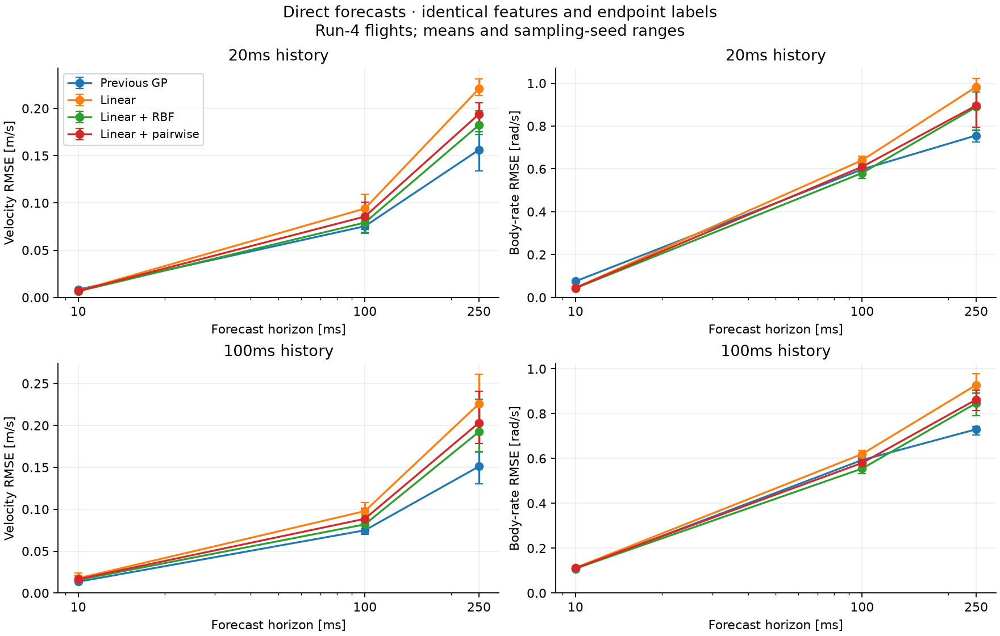
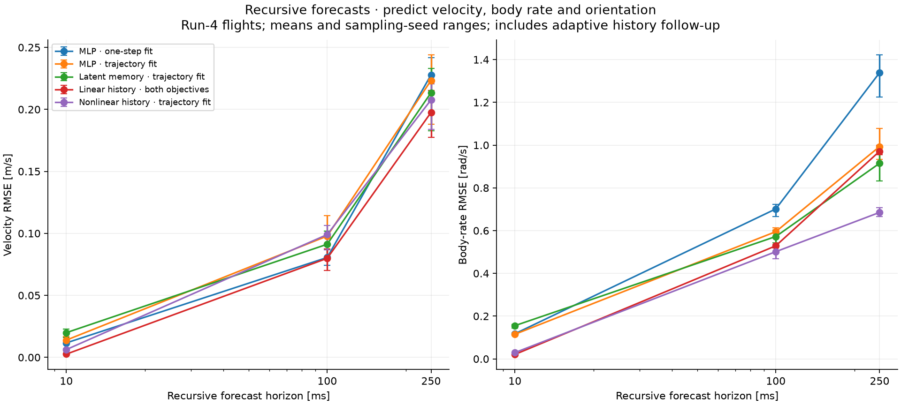

# Generic model structures beyond the original GP

The strongest new evidence favors **learned linear dynamics, explicit history,
and a nonlinear correction trained over trajectories**. It is a useful direction,
but the tested models still trade accuracy between channels and forecast horizons.
No candidate becomes the default on this evidence.

This investigation broadens the [previous GP diagnosis](transition-diagnosis.md).
There are two real-data comparisons and a synthetic mechanism experiment. The
real-data tracks have different information budgets and must be interpreted
separately.

## Direct forecasts with identical information

Eighteen cases reuse the exact saved training windows, features, targets and
evaluation origins from the previous diagnosis: three sampling seeds, 10/100/250
ms forecasts, 20/100 ms history, and 384 training windows. Every new estimator
first fits the same standardized affine ridge model, then fits one of:

- No nonlinear correction.
- A full RBF kernel correction.
- A sum of one-dimensional RBF corrections.
- An equal mixture of first-order and all pairwise RBF interactions.

The last two are inspired by
[additive Gaussian processes](https://proceedings.neurips.cc/paper_files/paper/2011/hash/4c5bde74a8f110656874902f07378009-Abstract.html).
Here they are **kernel ridge mean estimators**, without probabilistic intervals,
learned interaction selection, or learned projections. All features are
standardized using training rows. The affine ridge penalty is one. Each nonlinear
family selects from lengths 0.5/1/2 and regularizers 0.01/0.1/1 using development
MSE, with outputs standardized by training increment variation. Full RBF uses
mean squared feature distance; additive terms use individual feature distances.

The affine and nonlinear fits are sequential. A jointly fitted trend, feature
selection and adaptive interaction weights remain untested. This matters when
correlated observations let the initial affine fit absorb nonlinear effects.

**The full RBF correction improves both velocity and body-rate error over its
linear baseline in all 18 replication cases.** It improves over the old GP in
5/18 velocity and 9/18 body-rate comparisons. These are correlated configurations,
not independent experimental trials. The new families receive development grid
selection; the old GP is the previously frozen training-likelihood fit. Compute
and selection budgets are not matched.

Examples below are means over the three sampling seeds on the run-4 flights.
Velocity and rate errors are RMS vector norms.

| History / forecast | Model | Velocity [m/s] | Body rate [rad/s] |
| --- | --- | ---: | ---: |
| 20 / 10 ms | Previous GP | 0.00833 | 0.07514 |
| 20 / 10 ms | Linear | 0.00694 | 0.04523 |
| 20 / 10 ms | Linear + RBF | 0.00647 | 0.04272 |
| 100 / 100 ms | Previous GP | 0.07486 | 0.59319 |
| 100 / 100 ms | Linear | 0.09778 | 0.62004 |
| 100 / 100 ms | Linear + RBF | 0.08195 | 0.55511 |
| 100 / 250 ms | Previous GP | 0.15103 | 0.73035 |
| 100 / 250 ms | Linear + RBF | 0.19239 | 0.84684 |

The short-horizon body-rate improvement over the GP is about 43%, but most of
that gain was already present in the linear baseline. The nonlinear correction
adds about 6% over linear at that setting. At 100 ms it improves rate error while
worsening velocity versus the GP. At 250 ms the original GP remains stronger.



## Recursive sequence models

These models predict 15 observation channels: world velocity, body rates and the
nine entries of the body-to-world rotation matrix. Each model advances all of its
required observed context without future-state measurements. Position is not
modeled, and rotation entries are treated as Euclidean values rather than
constrained to SO(3). This is not yet a complete vehicle model.

Each training window contains 100 ms of past observations/inputs and 250 ms of
future measured inputs and observation targets. The 384 origins match the
previous h25/100ms cases, but each window supplies 25 vector targets, full input
sequences, and past orientation. Across the six training flights, this uses
10,332–10,422 unique state rows and 10,115–10,206 unique input rows per sampling
seed. It is substantially more information than the direct endpoint study.
Development and replication each contain 1,378 forecast origins from three
whole flights. Overlapping windows are not independent observations.

The initial comparison includes:

- An affine one-step model initialized by ridge regression.
- An affine model using every observation/input delay in the 100 ms history.
- A 32-unit tanh residual network around the affine model.
- The same idea with eight latent memory coordinates, initialized by a learned
  encoder of the past observation/input sequence and advanced recursively.
- One-step teacher-forced versus recursive trajectory training for both neural
  models. Evaluation always runs recursively.

The encoder/trajectory objective is motivated by
[nonlinear state-space identification with deep encoders](https://arxiv.org/abs/2012.07697).
Initializing from a learned linear fit is related to
[linear initialization of subspace encoders](https://arxiv.org/abs/2304.02119).
These are small independent implementations, not reproductions of either paper.

Training uses 1,000 Adam updates, batch size 64, learning rate 0.002 and gradient
norm clipping at 5. Every 100 updates, including initialization, we evaluate the
recursive development loss and save its best checkpoint. Loss weights all 15
channels equally after scaling by training-state standard deviations. The entire
250 ms trajectory contributes. Future truth is used only as a training target
and, in the teacher-forcing ablation, to reset training states.

**Trajectory training helps the tested neural models at longer horizons.** At
250 ms, body-rate error changes from 1.339 to 0.993 rad/s for the memoryless neural
model and from 1.397 to 0.915 rad/s for the latent model. The latent model sacrifices
10 ms accuracy: 0.116 to 0.155 rad/s. Learned latent memory does not uniformly beat
explicit observed history.

### Adaptive follow-up: add corrections to the history model

After inspecting the first comparison, we added trajectory training to the
strong affine history baseline and tested a 32-unit nonlinear correction around
it. This is explicitly an **adaptive follow-up**, not a prospectively untouched
confirmation. Development still selects every checkpoint; replication never
selects one. The nonlinear history model has 10,350 learned scalar parameters.

| Recursive horizon | Linear history velocity [m/s] | Nonlinear history velocity [m/s] | Linear history rate [rad/s] | Nonlinear history rate [rad/s] |
| --- | ---: | ---: | ---: | ---: |
| 10 ms | 0.00260 | 0.00627 | 0.02080 | 0.02943 |
| 100 ms | 0.07987 | 0.09903 | 0.52886 | 0.50148 |
| 250 ms | 0.19754 | 0.20768 | 0.97147 | 0.68522 |

The nonlinear trajectory fit reduces 250 ms body-rate error by **29.5%**, with an
improvement in all three sampling runs. Development shows a similar reduction,
0.853 to 0.590 rad/s. At 250 ms replication velocity worsens by 5.1%; short-horizon
velocity and rate errors also worsen. The scalar selection objective accepts
those tradeoffs. A deployment acceptance profile would need to make them explicit.

Trajectory training of the affine history model alone does not beat its initial
development checkpoint in any seed. Neither does one-step fitting of its neural
correction. Both therefore retain their initialization. This is evidence for
the combination of nonlinear capacity and a trajectory objective under this
training recipe, not proof that an affine history model cannot be optimized
better with a different optimizer or objective.

Rotation predictions improve but remain imperfect. At 250 ms, mean rotation-entry
RMSE is 0.0603 for linear history and 0.0461 for its nonlinear trajectory fit.
The RMS Frobenius error of R-transpose times R versus identity changes from
0.2054 to 0.1243. These are not valid rotation guarantees; a geometry-aware
observation/retraction contract is still needed before control use.



Whiskers in both figures show ranges over sampling seeds on the same evaluation
flights. They are not confidence intervals. The coincident linear-history
objectives appear as a single curve.

## Synthetic test of reusable structure

An eight-input, three-output function combines affine terms, sinusoidal terms,
a dead zone and pairwise interactions. Training has 384 noisy observations.
The region where both the first two inputs are positive is omitted from fitting
and development selection. Additional tests cover familiar combinations, that
withheld region, and values of the second input beyond the training range.
The generator intentionally favors low-order structure; it is a mechanism test.

| Model | Familiar RMSE | Withheld-combination RMSE | Outside-range RMSE |
| --- | ---: | ---: | ---: |
| Linear | 0.722 | 1.122 | 2.118 |
| Linear + full RBF | 0.229 | 0.430 | 1.294 |
| Linear + first-order additive | 0.642 | 1.146 | 2.015 |
| Linear + pairwise | 0.136 | 0.455 | 1.303 |

Pairwise structure helps familiar-region prediction by about 41% versus full
RBF. It does **not** reliably improve extrapolation: withheld-combination RMSE
for pairwise spans 0.358–0.625 across seeds, and its mean is worse than full RBF.
First-order additive structure misses the generator's interactions. None of
these findings establish how a learned projection, sparse interaction selection
or jointly fitted affine/nonlinear model would behave.

## What this changes for Glassbox

The experiments suggest several interface requirements without prescribing a
vehicle equation:

1. A generic regressor should permit independent input/output dimensions.
   `StructuredRegressor` does this; transition assembly remains a separate concern.
2. Sequence learning needs explicit aligned past observations, past inputs,
   future inputs and target trajectories. `SequenceBatch` and `sequence_windows`
   validate these shapes and avoid padding or crossing recording boundaries.
3. A mean estimator and its uncertainty evidence should be separate objects.
   The new predictors return means; they do not fabricate GP-style variances.
4. Model selection must record its channel scales, forecast horizons and
   acceptance tradeoffs. Saving the lowest scalar loss is insufficient evidence
   that every quantity a consumer cares about improved.
5. Recursive context is part of the prediction contract. A learner that requires
   orientation must either predict it or declare its future availability.

The two implementations are experimental modules with JAX-differentiable
prediction, serialization and content fingerprints. Stable fit/control interfaces
are unchanged. They do not implement online fitting, automatic memory updates
from a live sensor stream, calibrated uncertainty or control acceptance.

The experimental sequence interface is deliberately explicit:

```python
from glassbox.experimental.sequence_model import fit_sequence_model, sequence_windows

training = sequence_windows(
    observations, measured_inputs, training_origins,
    history_steps=10, horizon_steps=25, dt_s=0.01,
)
# Build development from separate recordings with the same channel contract.
model, fit_report = fit_sequence_model(
    training, development, kind="delay_mlp", objective="rollout",
)
future_means = model.rollout(past_observations, past_inputs, future_inputs)
model.save("candidate.npz")
```

Channel names, units, preprocessing identity and validation horizons remain the
consumer's responsibility; these experimental arrays are not a replacement for
the stable telemetry/actuation contract.

The most useful next comparison is a frozen nonlinear-history recipe with
explicit per-channel/per-horizon acceptance criteria on a second platform and
causally processed telemetry. Representation learning and joint fitting of the
affine/nonlinear terms remain open experiments. Local mixtures and active data
acquisition were not tested in this pass.

## Evidence limits and reproduction

All real-data results use the twelve non-Melon recordings from the pinned
[Nano-Quadrotor benchmark](https://github.com/idsia-robotics/nanodrone-sysid-benchmark)
at commit `2d921b57d166fe2debe08a5d39bd07297c5abc39`. Runs 1/2 fit, run 3 selects,
and run 4 evaluates. The last two groups were used in earlier work and are not
pristine holdouts. Melon files are not loaded. These are real-flight recordings
with upstream offline filtering/alignment and supplied future **measured motor
speeds**, not a demonstrated causal command-to-state model. No new real-flight
withheld-regime test, fixed-wing result or uncertainty calibration is claimed.

From the repository root, with the existing pinned corpus and prior diagnosis:

```sh
JAX_ENABLE_X64=1 ../.venv/bin/python scripts/experiment_model_structures.py --output ../artifacts/model-structures/new-comparison
JAX_ENABLE_X64=1 ../.venv/bin/python scripts/experiment_model_structures.py --track sequence-followup --output ../artifacts/model-structures/new-followup
JAX_ENABLE_X64=1 MPLCONFIGDIR=/tmp/glassbox-mpl ../.venv/bin/python scripts/report_model_structures.py --run ../artifacts/model-structures/new-comparison --followup ../artifacts/model-structures/new-followup --output ../artifacts/model-structures/new-report
```

The recorded runs are `artifacts/model-structures/comparison-01` and `followup-01`
in the parent workspace; `report-02` is the final report. Both original executed
source archives are preserved, including the version before the adaptive change.
The [portable evidence](investigations/model-structures/README.md) contains plans,
summaries, code snapshots, per-case reports, validation and figures. Large model,
sample and prediction arrays remain in the workspace artifacts.

An independent NumPy replay checked **111 saved estimators**, 1,674 numerical
comparisons, source hashes, raw flight checksums, sequence extraction and
development selection. The largest absolute difference was **1.33e-12**. It
replays fitted artifacts; it does not independently rerun neural optimization.
The 82 targeted tests pass against float64 source and the built wheel with JAX's
default float32 setting. The full repository suite was not run. Independent loop
tests check recurrence, window alignment, serialization and input derivatives.
