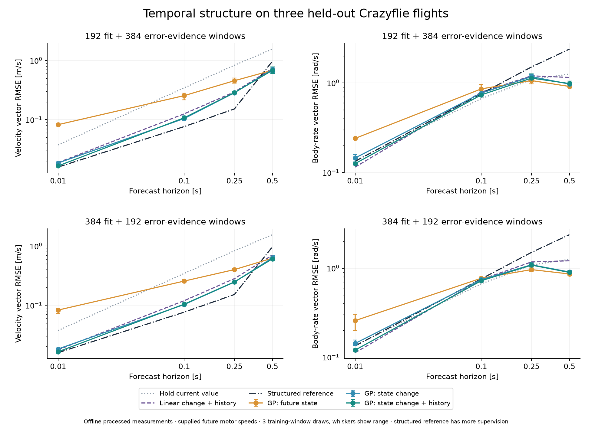
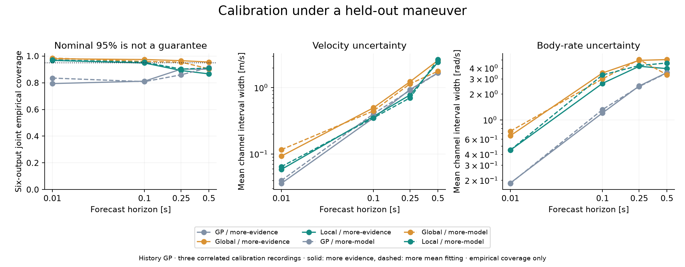

# Temporal structure on real flight recordings

The first real-data experiment supports learning **changes relative to the current
state**, especially over short intervals. Adding recent state and input history
helps at 10 ms, but is not consistently better at longer horizons. Local error
calibration also loses some of its synthetic-data advantage under a new maneuver.
These are offline conditional forecasts, not a newly validated flight controller.

This continues [shape learning](shape-learning.md) and
[separate error calibration](error-calibration.md) on
`experiment/generic-transition-support`. The generic learner receives no thrust
or aerodynamic equations. Stable model families and controller interfaces retain
their existing behavior.

## What temporal structure means here

The experimental GP now supports `mean_mode="increment"`:

`predicted future state = current state + learned change`.

The external prediction still returns a complete future state. Derivatives include
the identity contribution, and serialization/fingerprints distinguish the two
mean modes. An absolute-state GP remains the default for compatibility.

The [forecast-window helper](../src/glassbox/experimental/temporal.py) supplies
current context, a supplied future input sequence, and optionally changes since
50 and 100 ms before the origin. It rejects incomplete windows and duplicate
origins, preserves recording identities, and never uses future states as inputs.
It accepts arbitrary Euclidean channels and does not infer a vehicle family.

```python
from glassbox.experimental.temporal import forecast_windows
from glassbox.experimental.transition_gp import fit_transition_gp

# states: N x S; inputs: (N - 1) x U; context: N x C.
# One uniformly sampled recording. Keep whole recordings in separate data roles.
windows = forecast_windows(
    states, inputs,
    recording_id="flight-01", dt_s=0.01,
    horizon_steps=10, anchors=training_origins,
    context=current_measurements, history_lags=(5, 10),
)
model = fit_transition_gp(windows.samples, kernel="rq", mean_mode="increment")
```

By default the helper uses up to ten sequential input bins, capped by horizon
length. History is explicit context; the GP does not maintain a hidden state or
automatically update history during a rollout.

This is a continuity-oriented inductive preference, **not a hard bound on state
change**. Each horizon has a separately fitted model; they are not constrained to
compose consistently across time. Finite recordings cannot certify maximum
accelerations, actuator slew rates, or all possible outcomes in unseen regimes.
Observed change envelopes, calibrated forecast errors, and externally justified
physical limits should remain distinct interfaces.

## Data and forecast contract

The [Nano-Quadrotor benchmark](https://github.com/idsia-robotics/nanodrone-sysid-benchmark)
contains real Crazyflie 2.1 Brushless recordings. We verified all 15 files against
the pinned commit `2d921b57d166fe2debe08a5d39bd07297c5abc39`: 750.81 seconds
at 100 Hz. Released signals combine motion capture and onboard sensing, with
offline retiming, cross-correlation alignment and zero-phase Butterworth
filtering. These are processed measurements, not causal raw sensor streams;
history benefits can reflect that processing. The
[dataset paper](https://arxiv.org/html/2512.14450v1) describes its acquisition and
preprocessing. Existing alignment also uses platform knowledge, so this is not
an end-to-end demonstration of onboarding without such knowledge.

The six forecast outputs are world velocity and body angular rate. Inputs are
their current values, current orientation as a rotation matrix, measured motor
speeds, supplied future motor-speed bins, and optional history. The adapter's
squared-speed representation is decoded back to measured speeds; the generic
fitter does not receive a prescribed squared-speed thrust feature.

Future measured actuation conditions this **offline** task. It is not a command
sequence known ahead of time during flight. At 10 and 100 ms, the bins retain
every input interval; longer horizons compress the sequence into ten means.
No future attitude or state enters the features. Position and future orientation
are not predicted, so these six-output models are not complete recursively
executable rigid-body models. No trajectory uncertainty is propagated.

## Experiment design and observation cost

Whole recordings have disjoint roles:

| Role | Recordings |
| --- | --- |
| Mean fitting | Chirp, Random, Square runs 1 and 2: six flights |
| Error-scale fitting | Each maneuver's run 3: three flights |
| Score calibration | Each maneuver's run 4: three flights |
| Final test | Melon runs 1–3: three flights |

Development used only non-Melon runs 1 and 2. Confirmation uses sampling seeds
40–42, four horizons (10, 100, 250, 500 ms), three input/mean variants, and two
allocations: **72 mean models and 144 calibration artifacts**. Each model uses an
RQ kernel and two 160-step fits selected by training marginal likelihood. Test
origins are identical across every method and seed: 1,932 windows across three
flights. Seeds change sampled learning/evidence windows, not the test flights.

Both allocations contain 576 selected windows: 192 mean + 192 scale + 192 score,
or 384 mean + 96 scale + 96 score. Smaller role budgets are nested prefixes from
each flight. These are **window counts, not independent samples or flight
seconds**. History and longer input sequences consume additional supporting rows.
Per-flight unique state rows and input-interval unions are retained and audited.
For example, at 500 ms, seed 40's 384/96/96 history allocation uses 2,262 unique
state rows and 218.2 seconds of input-interval union across the twelve available
non-test recordings. Scattered selected windows do not constitute a 218-second
flight-collection protocol.

Baselines include holding the current value, extrapolating the preceding 50 ms
trend, and a linear state-change model with fixed unit ridge regularization.
The linear model uses exactly the same features and mean-fit windows as its GP.

A freshly fitted structured Glassbox model provides additional context. It uses
the same six mean-fit flights, the run-3 flights for validation, **6,705 full-state
training windows**, platform priors and the complete future actuator sequence.
This is not a matched-supervision comparison or an optimized expert-model ceiling.
The [reference fit record](investigations/real-transition/reference-fit.json)
preserves its configuration and data provenance.

## Where prediction improves

Values below are means over the three sampling seeds for the 384/96/96 allocation.
Each error is the square root of the mean squared vector norm, not the mean of
three channel RMSEs. Full results for both allocations, including seed ranges,
are in the [summary](investigations/real-transition/summary.json).

| Horizon | Absolute GP velocity | Change GP velocity | Change + history velocity | Absolute GP body rate | Change GP body rate | Change + history body rate |
| --- | ---: | ---: | ---: | ---: | ---: | ---: |
| 10 ms | 0.0826 | 0.0182 | 0.0163 | 0.2572 | 0.1424 | 0.1198 |
| 100 ms | 0.2560 | 0.1027 | 0.1041 | 0.7713 | 0.7442 | 0.7233 |
| 250 ms | 0.4004 | 0.2462 | 0.2476 | 0.9649 | 1.0925 | 1.0846 |
| 500 ms | 0.6250 | 0.6317 | 0.6083 | 0.8619 | 0.9073 | 0.8970 |

Velocity is in m/s; body rate is in rad/s. At 10 ms, learning changes reduces
velocity RMSE by 78% versus learning absolute states; history adds another 10%.
The history model improves on holding the current value by 56% for velocity and
11% for body rate. However, a simple linear change model with history gets body
rate RMSE **0.1121**, better than the GP's **0.1198**. Nonlinearity is not an
automatic advantage.

At 100 ms, the history GP's velocity error is much lower than persistence
(0.1041 versus 0.3451), while its body-rate error is worse (0.7233 versus 0.6683).
At 250 ms, the absolute-state GP predicts body rates better than either change
variant. At 500 ms, the history model improves velocity over the smaller
mean-fit allocation (0.6083 versus 0.6819), but there is no single winning
representation across outputs and horizons.



Whiskers show the range across three sampling seeds, not confidence intervals
over independent flights. The structured reference is stronger on velocity at
10–250 ms and weaker at 500 ms; its different supervision and model objectives
prevent interpreting this as a general comparison of modeling approaches.

## Support and uncertainty expose different problems

Support is nearest training distance after training-only feature standardization.
The cutoff is the 90th percentile among error-scale inputs, without test labels.
For the 100 ms history model with 384 mean windows, approximately 9.5% of test
origins lie beyond that cutoff. Their velocity RMSE is **0.2513 versus 0.0756**
in the nearer region; body-rate RMSE is **1.7473 versus 0.5271**. Distance is useful
as an error indicator here. It does not isolate a cause, and thresholds cannot be
compared directly across models with different feature dimensions.

The following table uses the same frozen history-GP means. Coverage requires
all six observed outputs to lie inside their intervals. Widths average channel
widths separately within velocity and body rate.

| Horizon | GP coverage | Global coverage | Local coverage | Global velocity / rate width | Local velocity / rate width |
| --- | ---: | ---: | ---: | ---: | ---: |
| 10 ms | 83.5% | 98.5% | 97.1% | 0.116 / 0.741 | 0.064 / 0.447 |
| 100 ms | 80.8% | 95.9% | 95.4% | 0.446 / 2.991 | 0.350 / 3.325 |
| 250 ms | 86.0% | 95.5% | 90.3% | 1.146 / 5.013 | 0.704 / 4.276 |
| 500 ms | 91.4% | 90.5% | 91.0% | 1.769 / 3.347 | 2.652 / 4.576 |

Local calibration gives narrower useful intervals at 10 ms. At 250 ms it
under-covers; at 500 ms it is wider than global calibration and still below 95%.
With the 192/192/192 allocation, 500 ms global coverage reaches 95.5%, versus
86.7% locally. Spending more on the mean is not uniformly better for calibrated
forecasts, and local scaling is not uniformly better than global scaling.



The conditional GP uses a Bonferroni-adjusted Gaussian box for six outputs.
Global/local residual calibration uses separate scale and score recordings and
a maximum-over-output score. **All coverage here is empirical**: correlated
windows and a different held-out maneuver do not satisfy the IID/exchangeability
claim from the synthetic experiment. There are only three calibration flights.
A separate diagnostic treating each flight maximum as one score cannot produce
a finite 95% multiplier from three groups. It is recorded as insufficient
evidence, not silently turned into a coverage certificate.

## What this changes about Glassbox

The experimental interface now makes relative state changes and recording-aware
history available without adding airframe equations. Revision-bound calibration
continues to distinguish the learned mean from evidence about its error.

The structured comparison exposed a useful contract distinction: a model fitted
to measured actuator inputs correctly rejects command-space rollout. The runner
uses existing logged-input replay and compares prediction contracts after
removing observation-only channels. Those guards were preserved. A future public
logged-input replay method could make this distinction easier to discover.

The remaining causes of error are not identified by these results. Plausible
contributors include the shared GP kernel across outputs, limited training
coverage, processed/noisy measurements, omitted context, optimization and input
compression. History ablations and matched linear baselines narrow the question;
they do not yield a causal error decomposition on real telemetry.

The next bounded study should select representations and history on separate
development flights, compare output-specific fits and causal processing, and
then freeze that protocol before evaluating another platform. X8 real-data
evaluation remains subsequent work. Complete-state recursion, consistency across
horizons and uncertainty over a trajectory are still missing.

The [subsequent diagnosis](transition-diagnosis.md) compares separate output
kernels, more optimization, shorter history and additional observations on the
non-Melon recordings. It finds useful short-history gains and mixed effects
from removing parameter sharing, without changing the shared-model default.

## Reproduce and validate

Run from this checkout with its parent environment, or an equivalent environment
with Glassbox installed. Matplotlib is only required for figures.

```sh
glassbox corpus prepare nanodrone /tmp/real-corpus
JAX_ENABLE_X64=1 python scripts/fit_real_reference.py \
  --corpus /tmp/real-corpus --output /tmp/real-reference-new
JAX_ENABLE_X64=1 python scripts/experiment_real_transition.py \
  --corpus /tmp/real-corpus --output /tmp/real-confirmation-new \
  --phase confirmation --seeds 40 41 42 \
  --structured /tmp/real-reference-new/belief.json
MPLCONFIGDIR=/tmp/real-plot-cache python scripts/report_real_transition.py \
  --run /tmp/real-confirmation-new --corpus /tmp/real-corpus \
  --output /tmp/real-report-new
```

Use fresh output directories. The recorded run is
`artifacts/real-transition/confirmation-03` in the parent workspace; final audit
and figures are in `artifacts/real-transition/report-04`. Models, samples,
predictions and calibrations are retained there. Portable records include the
[plan](investigations/real-transition/plan.json),
[data audit](investigations/real-transition/data-audit.json),
[executed sources](investigations/real-transition/executed-sources.zip),
[run status](investigations/real-transition/run-status.json), and
[independent audit](investigations/real-transition/audit.json).

The audit reconstructs every input/target from the pinned recordings, checks
whole-flight roles and supporting-row budgets, and independently replays GP,
linear-model and calibration calculations in NumPy. Maximum GP prediction
discrepancy is **1.32e-11**. Structured integration itself uses the existing
evaluator; it was not independently reimplemented in the audit.

A subsequent helper-only ergonomic change caps omitted input-bin counts at the
horizon length. Confirmation supplied that count explicitly. All saved windows
are replayed with the final helper, and both executed and final source hashes
are retained. The [validation record](investigations/real-transition/validation.json)
records targeted float64 source and float32 wheel tests, compatibility checks,
packaging, formatting, and evidence replay. The full test suite was not rerun.
