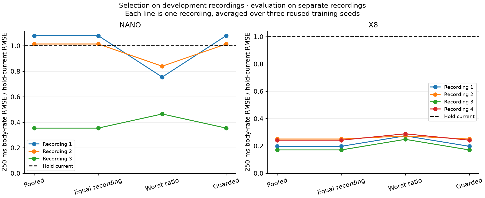

# Recording-level model selection and observation budgets

This iteration adds reusable experimental interfaces for segment-aware window
extraction and recording-level forecast evidence. It also narrows two explanations
from the [representation study](forecast-representation.md): long recordings
dominating selection was not the main problem in the Nano/X8 cases tested, and
the earlier coverage gain cannot be attributed to segment diversity alone.

Equal recording weights and a development guard chose exactly the same models as
pooled scoring. Minimizing the worst relative error improved some Nano gyro
failures, at a velocity cost, and worsened both X8 metrics. Spreading an equal
number of Crazyflie observation rows across ten segments produced another
accelerometer/gyro tradeoff. There is no new general performance winner.

The [evidence bundle](investigations/recording-selection/README.md) records the
plan written before this iteration's results, all decisions and scores, sampled
rows, source snapshots, and independent replay. Work ran on 2026-09-14 on
`experiment/generic-transition-support`.

## Interfaces implemented

The new experimental
[sequence collection](../src/glassbox/experimental/sequence_collection.py) accepts
contiguous segments with a recording identity, segment identity, and starting
row in the source recording. A collection requires a common sample interval and
channel layout. It rejects overlapping segments within one recording and
extracts complete windows without joining observations across a gap.

```python
from glassbox.experimental.sequence_collection import (
    SequenceCollection,
    segments_from_mask,
)

collection = SequenceCollection(
    segments_from_mask("recording-a", states, inputs, valid, dt_s=0.02)
)
keys = collection.window_keys(history_steps=5, horizon_steps=12, stride=5)
windows = collection.extract(keys, history_steps=5, horizon_steps=12)
batch = windows.batch
coverage = windows.coverage()
```

`windows.keys` and `windows.source_origins` preserve provenance through sampling.
Coverage reports windows, segments, unique state rows, unique input rows, and
observed transition time per recording. Overlapping windows count each source
grid row once. These are uniformly sampled observation rows, not necessarily
distinct raw sensor events. Caller-supplied masks and adapters retain
responsibility for clocks, validity, units, and channel meaning. Discarded
nonfinite rows can remain in the original input; retained segments must be finite.

[Forecast evidence](../src/glassbox/experimental/forecast_selection.py) separately
accepts named candidate predictions, designated development targets, recording
identities, training scales, and an explicit output-group partition. It retains
error by candidate, recording, horizon, and group. Its immutable arrays and
decision details make weighting and exclusions inspectable.

```python
from glassbox.experimental.forecast_selection import ForecastEvidence

evidence = ForecastEvidence.from_predictions(
    predictions,              # includes the named reference "hold"
    development_targets,
    development_recording_ids,
    scale=training_scale,
    groups=output_groups,
)
decision = evidence.choose("equal_record")
chosen_name = decision["selected"]

# Excluded recording outcomes do not enter this choice.
without_one = evidence.choose("equal_record", recordings=remaining_recording_ids)
```

This chooses a whole forecast model, preserving that model's own prediction
behavior. It does not mix different models' output channels or horizons. These
interfaces remain experimental and do not change the stable controller API.
The harness checks that training, development, and evaluation recording sets
are disjoint; the evidence object cannot infer a recording's role or establish
statistical independence from its name.

## Selection across recordings

We reused the exact candidate forecasts from the representation experiment.
Each seed supplies 42 fitted candidates plus hold-current and linear-trend
references. No model was refitted for this selection comparison. Nano supplies
three development and three evaluation recordings; X8 supplies four of each.
As before, forecasts condition on future logged commands; these comparisons do
not establish prediction without known inputs or causal effects of control.
All these recordings were inspected in earlier work. X8 files are maneuver
segments from one campaign, not evidence of independent platforms or necessarily
independent sorties. Data provenance and preprocessing remain as documented in
[sequence transfer](sequence-transfer.md).

Four decision rules were fixed in the plan:

| Rule | Development objective |
| --- | --- |
| `pooled` | Mean standardized channel squared error, weighting each observed window equally |
| `equal_record` | The same objective with equal weight per recording |
| `minimax_hold` | Minimize the worst ratio to hold-current across every recording, horizon, and output group |
| `guarded_hold` | Minimize equal-record error among candidates whose standardized group RMSE is at most 1.05 times hold's in every development cell |

Ratios use mean squared standardized group error divided by the larger of hold's
error and 1e-12. The guard threshold is therefore 1.05 squared in MSE terms. It
checks standardized group error, not unweighted physical vector error. Hold is
itself a candidate and satisfies the empirical guard. These are development
criteria, not bounds on unseen error or calibrated uncertainty.

We selected using all development recordings, evaluated the chosen model on the
separate evaluation recordings, and also repeated selection with each development
recording excluded in turn, scoring that excluded recording. That gives 108
whole-model decisions across the four rules and three training seeds. Seeds
reuse evaluation observations and are not independent flights.

### Evaluation results

Cells below are **velocity m/s / body rate rad/s at 250 ms**. We first compute
vector RMSE for each recording, then average those RMSEs equally over recordings
and seeds. This differs from earlier pooled-window RMSE tables. The pooled
rule's model choices reproduce the old choices exactly; different table values
here reflect aggregation, not changed forecasts.

| Dataset | Pooled | Equal record | Worst ratio | Guarded | Hold current |
| --- | ---: | ---: | ---: | ---: | ---: |
| Nano | 0.226 / 1.025 | 0.226 / 1.025 | 0.275 / 1.017 | 0.226 / 1.025 | 0.782 / 1.793 |
| X8 | 0.323 / 0.238 | 0.323 / 0.238 | 0.389 / 0.301 | 0.323 / 0.238 | 0.915 / 1.115 |

Equal recording weights do not change any full-development choice in these six
cases. The guard also leaves every choice unchanged. This does not prove
recording weights never matter; the unit tests include a constructed example
where they change the choice. It does reject that explanation for these cases.

Worst-ratio selection reduces Nano's final gyro failures relative to hold: the
number of evaluation recording/seed pairs exceeding hold's physical gyro RMSE
by more than 5% falls from 2 of 9 to 0 of 9. But velocity RMSE worsens by about
22%. On X8, velocity worsens by about 20% and rate by 27%, with no such failures
to remove. This is a tradeoff, not a universal robustness improvement. The
physical-error counts here are distinct from the standardized development guard.



The figure shows each recording's final body-rate RMSE relative to hold,
averaged over three seeds. Recording labels are mapped to source identities in
[figure-recordings.json](investigations/recording-selection/figure-recordings.json).
The full per-horizon/output results are included in the evidence bundle.

### Choice stability

Removing one development recording changes the pooled choice in **3 of 9 Nano
cases and 3 of 12 X8 cases**. Equal weighting and the guard have the same counts;
worst-ratio selection changes in 4 of 9 and 4 of 12. These counts measure
sensitivity to the available evidence, not a probability that a model is wrong.
The excluded-record scores are preserved separately from the original evaluation
scores. A model can be better on average and still depend strongly on which
recordings were used to select it.

## Fixed observation rows versus fixed windows

The previous Crazyflie comparison held 320 training windows fixed while changing
coverage from 337 to 1,721 unique state rows. This iteration adds a separate
fixed-row comparison: exactly **337 state rows**, distributed as evenly as
segment lengths permit across all ten eligible powered log10 intervals. Each
interval contributes one contiguous crop with a seeded random start. Every
complete window in those crops is used, giving 167 windows. Three crop seeds
produce 126 newly fitted models. The same log15 development and log16 evaluation
windows are retained throughout.

With five history steps and twelve future steps, a contiguous crop of N state
rows supplies N - 17 complete windows. Ten eligible crops with 337 rows therefore
supply 337 - 10 × 17 = 167 windows, compared with 320 from one 337-row crop. They
also contain 327 observed transitions rather than 336. Matching window count
and unique-row count simultaneously is impossible for these complete-window
constructions. The new coverage interface exposes both quantities.

Results at 240 ms, in **accelerometer g / gyro rad/s**:

| Training coverage | Unique state rows | Windows | Full direct family | Global selection |
| --- | ---: | ---: | ---: | ---: |
| Original longest interval | 337 | 320 | 0.120 / 2.826 | 0.135 / 2.591 |
| Prior broad coverage, fixed windows | 1,721 | 320 | 0.105 / 2.253 | 0.209 / 3.086 |
| New broad coverage, fixed rows; mean of three crop seeds | 337 | 167 | 0.294 / 2.543 | 0.211 / 1.829 |
| Hold current, same evaluation observations | — | — | 0.153 / 1.895 | 0.153 / 1.895 |

All three new selections choose strongly regularized `recursive-r10`. Gyro
error ranges from 1.769 to 1.912 rad/s; accelerometer error ranges from 0.201 to
0.229 g. The mean gyro error is slightly better than hold, while accelerometer
error is worse. The full direct family improves gyro relative to the original
337-row fit but substantially worsens accelerometer prediction. Its earlier
improvement on both outputs does not repeat at the equal-row budget.

The comparison changes temporal coverage, crop locations, and the number of
windows. Training-derived scales and the weighting of repeated transitions also
change. It cannot assign a unique causal contribution to diversity versus data
quantity. The original 337-row interval and the previous 1,721-row sample each
have one sampling realization; the three new seeds are not matched repetitions
of all arms. All results remain adaptive and use one already inspected 3.22 s
evaluation interval with 29 overlapping origins. These sensor observations do
not supply independent pose/velocity truth or establish full-flight dynamics.

## What this changes about Glassbox

We can now distinguish the number of requested windows from the observations
they actually reuse, carry recording/segment provenance into learning, and ask
how much a model choice depends on one recording. Those are useful generic
contracts for onboarding and subsequent telemetry refinement. They require no
quad or fixed-wing equations.

The performance results argue for retaining explicit output/horizon tradeoffs
and a simple reference in every evaluation. Changing a scalar selection rule
did not remove those tradeoffs. A candidate's support, empirical forecast error,
selection stability, and suitability for control remain separate claims. New
selection mechanisms should be judged using new recording evidence, not promoted
because they explain an already observed failure.

## Verification

The independent audit replays all **108 selection decisions**, **126 new models**,
and **324 direct-head normal equations**, checks PCA training covariance and
retained variance, independently reconstructs the 501 new windows from the
pinned official decoder, and verifies unchanged development/evaluation arrays.
Its 4,872 numerical checks have maximum absolute difference 5.46e-12. Existing
prediction arrays retain the previous model audit; their source hashes and new
per-record metrics are checked again here.

**155 tests pass from source with float64 and 155 against an isolated built wheel
with float32.** New tests cover gaps, overlap rejection, provenance, unique-row
coverage, recording weights, excluded-record invariance, and empirical guards.
Package/source byte checks, lint, formatting, and diff checks pass. The full
repository test suite was not run. See
[validation.json](investigations/recording-selection/validation.json).
