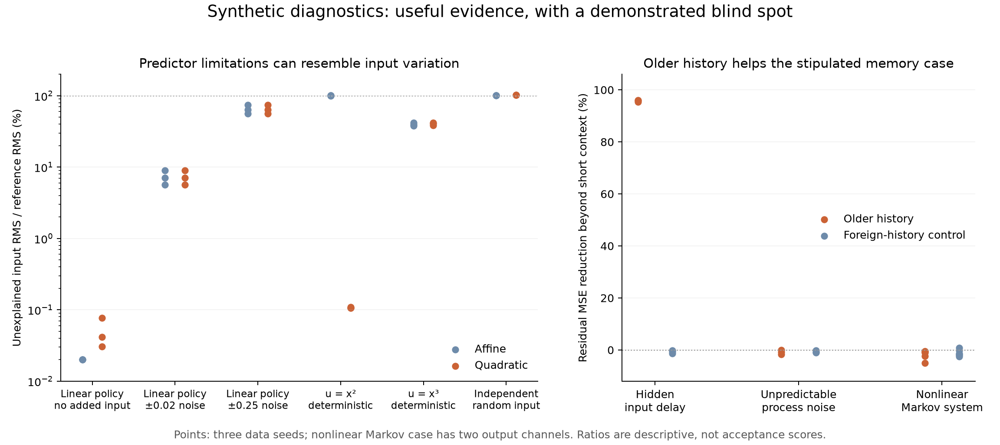

# Observational diagnostics for the generic learner

> **Note, 16 September 2026.** The extended diagnostic history is twice the
> fitted model's consumed context. The figures below use the retained
> `generic-history-v1-prototype` (two steps, four extended); the maintained
> `generic-memory-v2-prototype` consumes ten steps and is diagnosed with twenty.

The experimental learner now offers `model.diagnose(recordings)`: a fixed,
read-only report of input predictability and whether older observations explain
forecast errors. It adds no model-selection or tuning arguments. The fitted
model, its prediction contract, and the existing fitting recipe stay unchanged.

Across 24 synthetic cases, older history explains **95.35–96.10% of residual
MSE beyond a short-context correction** in the stipulated hidden-delay system,
while adding no improvement in the independent process-noise system. A negative
control also exposes a clear limitation: the diagnostic leaves **38.7–42.1% of
input RMS unexplained for a fully deterministic cubic policy**. Unexplained
variation cannot be interpreted as independent excitation.

A [follow-up counterexample and matched objective experiment](history-confounding.md)
now demonstrate the other major ambiguity: older history can remove nearly all
of a diagnostic's error in a fully observed Markov system by supplying nonlinear
features. A richer short-context explanation largely removes that apparent
memory benefit. The follow-up also quantifies a separate horizon-weighting
effect in the learner; the API and diagnostic recipe remain unchanged.

These are method-development results on small synthetic systems, not measured
platform performance or calibrated uncertainty. The experiment ran on 14
September 2026 on `experiment/generic-transition-support`. The
[evidence bundle](investigations/sequence-diagnostics/README.md) preserves the
frozen plan, executed sources, results, independent audit, and final API tests.

## Consumer workflow

```python
from glassbox.experimental.default_model import fit

model = fit(calibration_recordings)
evidence = model.diagnose(diagnostic_recordings)

input_evidence = evidence["aggregate"]["input_predictability"]
error_evidence = evidence["aggregate"]["forecast_error"]
per_recording = evidence["recordings"]
```

Supply a `SequenceCollection` containing at least three distinct diagnostic
recordings with the model's configuration, ordered channels, and sample interval.
They must be outside its fit/development data. Reused identities or exact full
content are rejected; renamed partial overlaps are not generally detectable.
Every recording needs a contiguous segment long enough for twice the fitted
history and one future observation. Windows cannot cross segment gaps.

The result is a JSON-compatible dictionary. Its recipe, model fingerprint,
recording content hashes, sample counts, per-channel metrics, per-recording
metrics, and interpretation limits travel together. Physical RMS values keep
their declared channel units. Ratios can exceed one; MSE reductions can be
negative. `None` denotes a zero reference denominator. There is no readiness
flag, automatic update, or confidence probability.

## What the measurements mean

**Input predictability.** Two fixed auxiliary regressions predict the current
input from the model's supplied state/input history, including the current
observed state but excluding the current input. One uses affine features; the
other adds all quadratic feature products. `remaining_rms_fraction` is prediction
error RMS divided by the RMS error of a training-fold mean-input reference.
A small value shows that these regressors can explain most observed input
variation. A large value can reflect unpredictable inputs, an inadequate
predictor, or distribution change between recordings. It proves none of these
individually and does not measure directional coverage or causal identifiability.

**Older-history error evidence.** First compute the existing model's one-step
residual. A short-context affine regression attempts to explain that residual
from the same observations and current input supplied to the model. A second
regression also receives older observations/inputs, extending history to twice
its original length. `extra_history_mse_reduction.extended` compares the second
regression's remaining MSE against the first's. This isolates additional evidence
from older history beyond what that short-context correction explains; it is
not the result of refitting the dynamics model with longer history.

A third regression receives replacement older features from other training
recordings. Each training row's donor belongs to a different recording; held-out
rows receive donors only from training recordings. This gives a negative control
with the same feature count. It is an offline experiment, not a deployable stream
or a calibrated statistical significance test. Proxy features, regularization,
finite samples, and imperfect short-context correction can still affect the
comparison. A gain does not uniquely establish hidden memory.

All auxiliary fits leave one whole diagnostic recording out at a time. Scaling
and ridge fitting use the remaining recordings only. The fixed diagnostic recipe
uses ridge fraction 0.001, seed 713 for donor selection, and at most 256 evenly
spaced valid origins per recording. It has no data-dependent checkpoint or
predictor selection. Aggregate metrics pool the retained windows; recordings
with fewer available windows contribute less. Overlapping windows are not
independent replications.

## Positive and negative controls

Each case uses three data seeds, eight calibration recordings, and four
diagnostic recordings. Each recording contains 160 intervals at 50 ms. The
unchanged learner uses two past steps (100 ms) and a five-step training forecast
(250 ms). These diagnostics compare two versus four past steps (100 versus
200 ms), evaluating only the next observation (50 ms). Each case contributes
624 diagnostic windows. Fifteen models and their already-inspected diagnostic
recordings come from the [earlier qualification experiment](model-qualification.md);
nine fresh fits add the three negative-control families below. These results
do not constitute an untouched benchmark.

| Synthetic case | Quadratic predictor's remaining input RMS | Extra-history residual MSE reduction |
| --- | ---: | ---: |
| Linear feedback, no added input variation | 0.031–0.077% | approximately 0% |
| Linear feedback, uniform input noise ±0.02 | 5.63–8.96% | −0.61 to −0.09% |
| Linear feedback, uniform input noise ±0.25 | 56.4–74.4% | −0.19 to −0.13% |
| Hidden delayed input | 100.8–105.9% | **95.35–96.10%** |
| Nonlinear Markov system, two state channels | 73.1–78.6% | −4.99 to −0.46% |
| Deterministic quadratic policy | 0.106–0.109% | −1.87 to +0.55% |
| Deterministic cubic policy | **38.7–42.1%** | −1.88 to −0.09% |
| Independent process noise | 102.2–102.7% | −1.75 to −0.02% |

Ranges span the three seeds and, for the two-channel system, both channels.
They are descriptive ranges, not confidence intervals. Remaining input RMS is
relative to each case's reference RMS, so it cannot compare absolute input
amplitudes between cases. The report also retains the physical RMS values.



The linear feedback system has `x_next = 1.08*x + 0.2*u` and
`u = -0.5*x + independent uniform noise`. With no added noise, the affine
diagnostic explains all but about 0.020% of reference RMS; its small remaining
error includes ridge shrinkage. Earlier work showed that the same unexcited
data permits excellent observed-policy forecasts and a wrong response to a
changed input. The new measurement helps expose input predictability, but does
not by itself identify that response.

The hidden-delay system has `x_next = 0.8*x + 0.2*u[k-3]`, with independent
random inputs. Its causally relevant older input lies outside the model's
two-step history. Extending the diagnostic history substantially improves the
residual prediction; foreign-history replacement gives no improvement
(−1.28 to −0.21%). This is consistent with the deliberately omitted input.

The process-noise control has `x_next = 0.8*x + 0.2*u + 0.1*normal(0,1)`, with
independent random inputs. Raw model RMS is 0.101–0.105, near the stipulated
noise standard deviation of 0.1. Older history adds no improvement. That checks
one way large error can persist without recoverable omitted history.

For the two policy controls, observations are independent uniform samples and
inputs are exactly `u=x²` or `u=x³`. There is no independent input variation
conditional on the observed state. The affine predictor misses the quadratic
relationship; the quadratic predictor largely captures it. Both miss part of
the cubic relationship. This falsifies an interpretation of the remaining
fraction as an excitation score. Expanding the predictor family could reduce
that particular blind spot, but would not turn finite observational evidence
into proof of independence.

## Interface decision and verification

Keep `diagnose(recordings)` as optional observational evidence within the
experimental workflow. It helps describe two possible failure mechanisms while
explicitly preserving ambiguity. Do not turn these example ranges into pass/fail
thresholds, select a new history automatically, or promote the fitted model on
the basis of this report. No uncertainty estimate or extrapolation guarantee is
introduced. Validation on more diverse, untouched systems remains outstanding.

The independent audit regenerated and indexed all 14,976 windows, replayed
model predictions in NumPy, and refit all 480 auxiliary regressions using
augmented least squares instead of the implementation's normal equations.
It checked train-only scaling, recording folds, foreign donors, saved parameters,
and aggregate/per-recording scores. The 6,216 numerical comparisons had maximum
absolute difference 6.69e-12. The replay shares data generators and the model
artifact loader, so it validates arithmetic and separation rather than external
validity.

The focused source suite passes 50 tests. The same 50 pass using the built wheel
outside the checkout with JAX float32; research fits/replay and the source suite
use float64. All 82 packaged Python files match the source tree. Tests cover
causal indexing, gaps, duplicate evidence rejection, no mutation, zero
denominators, unit conversion, both ridge solve branches, and the existing fit,
prediction, persistence, collection, and public API contracts.
