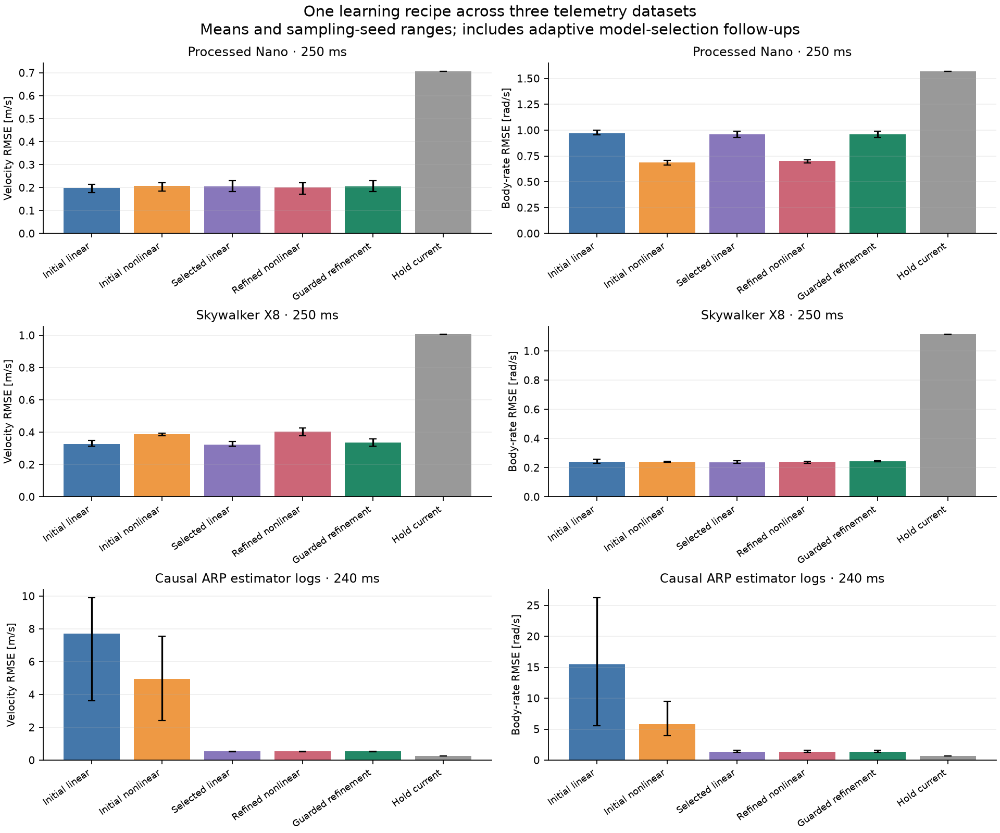

# Generic sequence learning across three telemetry datasets

The generic recipe produces useful short-horizon forecasts on the processed
Nano quad and Skywalker X8 fixed-wing datasets. It does **not** yet produce a
useful recursive predictor on the causally sampled ARP evaluation flight:
stronger affine regularization removes most of the initial failure, but holding
the current state still wins. Adding nonlinear capacity does not consistently
help across datasets.

This continues the [model-structure experiments](model-structure-experiments.md).
The question is whether one learning procedure, fitted separately to each
platform's observations, generalizes beyond the earlier processed quad data.
No aerodynamic coefficients, rotor equations or platform-specific force laws
enter these fits. Coordinate conventions and telemetry channel meanings are
still supplied by the adapters. These are offline prediction experiments;
they do not establish controller performance or unsupported-regime accuracy.

## Results

Errors below are RMS **vector** errors, averaged over three sampling seeds.
Each seed reuses the same evaluation recordings. Values are not independent
flight replications or confidence intervals. The forecast horizon is 250 ms
for Nano and X8, and 240 ms for ARP.

| Dataset | Model | Velocity error, m/s | Body-rate error, rad/s |
|---|---|---:|---:|
| Nano | Initial linear history | 0.198 | 0.971 |
| Nano | Initial nonlinear history | 0.208 | 0.685 |
| Nano | Development-selected linear | 0.204 | 0.959 |
| Nano | Nonlinear refinement of selected linear | 0.201 | 0.701 |
| Nano | Guarded refinement | 0.204 | 0.959 |
| Nano | Hold current state | 0.707 | 1.571 |
| X8 | Initial linear history | 0.325 | 0.241 |
| X8 | Initial nonlinear history | 0.386 | 0.241 |
| X8 | Development-selected linear | 0.325 | 0.238 |
| X8 | Nonlinear refinement of selected linear | 0.404 | 0.239 |
| X8 | Guarded refinement | 0.337 | 0.243 |
| X8 | Hold current state | 1.005 | 1.113 |
| ARP | Initial linear history | 7.722 | 15.429 |
| ARP | Initial nonlinear history | 4.962 | 5.795 |
| ARP | Development-selected linear | 0.529 | 1.377 |
| ARP | Nonlinear refinement of selected linear | 0.529 | 1.377 |
| ARP | Guarded refinement | 0.529 | 1.377 |
| ARP | Hold current state | 0.266 | 0.648 |



The fixed-wing result is encouraging: the selected affine history predictor
reduces error relative to hold-current by about **68% in velocity and 79% in
body rate**, without an aerodynamic model. The initial nonlinear model worsens
velocity error, and the adaptive nonlinear refinement worsens it further. This
is evidence for useful generic fitting on this dataset, not evidence that
neural refinement should be the default.

On Nano, the original nonlinear result reproduces the previous saved
predictions. It improves body rates at the cost of some velocity and short-step
accuracy. Balancing the loss by horizon and channel selects the initial linear
model in all three seeds, with or without a guard. It removes the tradeoff by
declining the update; it does not discover a better predictor.

The initial balanced and guarded arms, omitted from the figure for space, are:

| Dataset | Balanced velocity / body rate | Guarded velocity / body rate |
|---|---:|---:|
| Nano | 0.198 / 0.971 | 0.198 / 0.971 |
| X8 | 0.334 / 0.241 | 0.325 / 0.234 |
| ARP | 3.742 / 8.267 | 4.674 / 8.563 |

The initial X8 guard improves body-rate error by about 3% with nearly unchanged
velocity. That small gain does not repeat after changing the initialization.
A development guard is not an unseen-flight guarantee, and guarding relative
to a poor initial model can still admit poor models.

## What explains the raw-log failure so far?

An adaptive sweep compared current-only and delayed affine models with ridge
penalties 1, 10, 100, 1,000 and 10,000. The selector used development recursive
loss only. It chose delayed models for all nine cases: Nano penalties 1/10/10,
X8 100/10/1, and ARP 1,000/1,000/1,000 for seeds 60/61/62.

On ARP, regularization reduces mean evaluation velocity error by **93%** and
body-rate error by **91%** relative to the original ridge-one initialization.
This establishes that the initial fitting choice was a major avoidable source
of error. It does not establish which data directions are unsupported, or
separate sensor error from state representation and coverage problems.

Refreshing the true observed history at each step provides another diagnostic:

| ARP evaluation diagnostic | Velocity error, m/s | Body-rate error, rad/s |
|---|---:|---:|
| Original model, observations refreshed every 20 ms | 0.331 | 0.992 |
| Selected model, observations refreshed every 20 ms | 0.037 | 0.168 |
| Selected model, recursive 240 ms prediction | 0.529 | 1.377 |

The refreshed rows are one-step predictions evaluated at the final target
time; they are **not** 240 ms open-loop forecasts. The original fit is already
poor under refresh, and substantial accumulation remains after regularization.
The recorded homogeneous history operators also show reduced finite-horizon
perturbation amplification after regularization. Their worst-case directions
can violate observed trajectory structure and the rotation manifold, so these
operator norms are diagnostics, not physical stability guarantees or a way to
rank platforms.

Both nonlinear refinement objectives select **step zero for every ARP seed**
after the improved initialization. Extra capacity under this recipe is not the
remaining fix. ARP's hold-current errors are also lower on evaluation than
development: velocity 0.266 versus 0.584 m/s, and body rate 0.648 versus 1.513
rad/s. The evaluation flight is less dynamic by this measure. We have not yet
tested whether support-aware selection can recognize that difference reliably
on additional flights.

## Data and timing contracts

All learners observe 15 channels: world velocity, body angular velocity and
nine rotation-matrix entries. Positions are omitted. Rotation entries are
predicted as unconstrained Euclidean channels; rotation error is a matrix-entry
error, not an angular error. Models are fitted separately, with platform-specific
input widths. Learned weights do not transfer between datasets.

| Dataset | Train / development / evaluation records | Rate | History / forecast steps | Unique training state rows across seeds | Evaluation origins |
|---|---:|---:|---:|---:|---:|
| Processed Nano | 6 / 3 / 3 | 100 Hz | 10 / 25 | 10,332–10,422 | 1,378 |
| Skywalker X8 | 9 / 4 / 4 | 40 Hz | 4 / 10 | 2,967–3,047 | 394 |
| ARP estimator logs | 2 / 1 / 1 | 50 Hz | 5 / 12 | 3,154–3,193 | 704 |

Every dataset uses 384 training origins. This is a matched window count, not a
matched number of independent observations or equal calibration duration.
Windows overlap, and development/evaluation origins are spaced 100 ms apart.
Histories and targets stay within a recording. State normalizers and loss
balancing scales use training data only.

**Nano:** the twelve non-Melon recordings from the pinned
[Nano-Quadrotor benchmark](https://github.com/idsia-robotics/nanodrone-sysid-benchmark/tree/2d921b57d166fe2debe08a5d39bd07297c5abc39)
retain upstream offline filtering and alignment. Runs 1/2 fit, run 3 selects,
and run 4 evaluates. Inputs are measured motor speeds. The exact earlier
windows are reused, as are evaluation recordings already inspected in previous
research.

**X8:** the CC0 [Skywalker X8 reference dataset, version 1.0](https://doi.org/10.18710/U4TLYV)
contains 17 manually aligned maneuver segments from one campaign. The upstream
data combine different-rate sources into 40 Hz rows. Inputs are normalized
throttle and aileron/elevator commands; outputs here use the logged EKF velocity
and angular-rate estimates. Derived wind columns are excluded. The upstream
four validation segments evaluate; replicate three of each training profile
selects; the other nine segments fit. This corpus also appeared in earlier
repository validation, so it is not a pristine project-wide holdout.

**ARP:** four public ULogs from the MIT-licensed
[ARP dataset at commit 2d267dd](https://github.com/arplaboratory/data-driven-system-identification/tree/2d267dd07b4262f579ee223d20b26a6dc9d17147)
are sampled directly. Logs 63/64 fit, 65 selects, and 66 evaluates. At each 50 Hz
query, each stream uses the last valid row whose topic `timestamp` is at or
before that query. `timestamp_sample` is retained for age reporting, not used
to backdate availability. The experiment adds no interpolation or filtering.
It uses the first four `actuator_motors` controls, with the original channel
order; it does not infer rotor speeds.

Rows must be fresh within 50 ms. The longest complete powered interval in each
log is retained, split at estimator resets. Those intervals last 27.38, 49.24,
49.08 and 70.68 seconds respectively. Across retained rows the largest
publication age is 15.033 ms and measurement age is 17.109 ms. An independent
check confirms all **39,292 selected stream rows** were already published on
the supplied onboard clock. Offline interval selection itself is not a live
segmentation policy. These streams still contain onboard filtered/estimated
values, and the check does not establish external transport latency or physical
sensor truth.

All forecasts receive the actual future logged input sequence. They are
conditional predictions; future measured motor speeds in particular are not
established as available at forecast time. Causal feature construction does
not resolve that separate input-planning contract.

## Experiment and interface changes

The initial plan was saved before fitting the three datasets: affine history
initialization with ridge one, optionally followed by a width-32 nonlinear
residual; 1,000 Adam updates, batch 64, learning rate 0.002, gradient clip 5;
development checkpoint selection every 100 steps. Seeds are 60/61/62. The
four arms are linear history, standard nonlinear trajectory loss, balanced
nonlinear loss, and balanced loss with a development guard.

The balanced scale is training-reference recursive RMS error for each horizon
and output, floored at 0.001 times the training channel standard deviation.
The guard permits at most a 5% development RMS regression relative to
initialization for each velocity/rate/rotation group at one step, 100 ms and
the final horizon. It checks nine aggregate errors, not every sample or every
individual channel.

The regularization sweep and subsequent nonlinear refinement were designed
after viewing the initial results. Candidate and checkpoint selection still
exclude evaluation targets, but these are explicitly **adaptive follow-ups**,
not an untouched confirmatory comparison. Hold-current is reported separately
and was not a candidate in the affine selector.

The additions remain under `glassbox.experimental`:

- [`causal_hold`](../src/glassbox/experimental/causal_sampling.py) returns held
  values, validity, source-row indices and age. It makes availability and
  freshness reviewable independently of model fitting.
- [`relative_error_scale` and `SequenceGuard`](../src/glassbox/experimental/sequence_objective.py)
  expose horizon/output loss normalization and development regression criteria.
  A loss scale is not an uncertainty estimate.
- [`fit_sequence_model`](../src/glassbox/experimental/sequence_model.py) accepts
  optional `error_scale` and `selection_guard`, and records the scale,
  per-checkpoint errors and rejection decisions. Existing defaults and model
  serialization remain compatible. Stable exports and live controllers are
  unchanged.

The wheel check exposed a numerical boundary: float32 compiled and eager
reductions can disagree enough to reject an unchanged initialization under a
zero-regression guard. Comparison now includes a small, recorded allowance of
64 machine epsilons of the least precise supplied error dtype, plus 1e-12
absolute. Malformed or nonfinite error matrices are rejected. Replaying the
recorded float64 traces confirms the change leaves every saved guard decision
unchanged; the executed-source archives preserve the original comparison.

```python
from glassbox.experimental.sequence_model import fit_sequence_model, initialize_sequence_model
from glassbox.experimental.sequence_objective import SequenceGuard, relative_error_scale

reference = initialize_sequence_model(train, kind="delay", ridge=10)
scale = relative_error_scale(
    reference.rollout(train.past_states, train.past_inputs, train.future_inputs),
    train.future_states,
    reference.norms["state_scale"],
)
model, evidence = fit_sequence_model(
    train, development, kind="delay_mlp", ridge=10,
    error_scale=scale,
    selection_guard=SequenceGuard(horizons, output_groups, maximum_ratio=1.05),
)
```

Here `horizons` is a tuple of one-based forecast steps and `output_groups`
contains zero-based, comparable-unit channel indices. Consumers still provide
channel metadata, timing conventions and acceptable errors. The example is an
interface illustration, not a recommendation to use ridge ten universally.

The next interface experiment should make reference predictors and per-flight
error matrices first-class selection evidence. The next empirical test should
freeze that selector, compare direct-horizon and recursive predictions on
additional causal flights, and stratify errors by observed support and signal
age. That can test whether the remaining gap is recurrence, representation or
coverage. This pass does not yet quantify those causes, calibrate uncertainty,
or establish extrapolation into missing regimes.

## Evidence and reproduction

The [portable evidence bundle](investigations/sequence-transfer/README.md)
contains plans, summaries, timing metadata, code snapshots, per-case reports,
validation and figures. Raw logs and large sample/model/prediction arrays stay
under `artifacts/sequence-transfer` in the parent workspace. The successful runs
are `prepared-02`, `comparison-01`, `regularization-01`, `refinement-01` and
`report-03`. The earlier preparation directory is an incomplete serialization
attempt and is not used.

With pinned corpora and prior Nano artifacts available, from the repository root:

```sh
JAX_ENABLE_X64=1 ../.venv/bin/python scripts/sequence_transfer_data.py --corpora ../artifacts/sequence-transfer/corpora --output ../artifacts/sequence-transfer/new-prepared
JAX_ENABLE_X64=1 ../.venv/bin/python scripts/experiment_sequence_transfer.py --prepared ../artifacts/sequence-transfer/new-prepared --output ../artifacts/sequence-transfer/new-comparison
JAX_ENABLE_X64=1 ../.venv/bin/python scripts/diagnose_sequence_regularization.py --source ../artifacts/sequence-transfer/new-comparison --output ../artifacts/sequence-transfer/new-regularization
JAX_ENABLE_X64=1 ../.venv/bin/python scripts/refine_selected_sequence.py --source ../artifacts/sequence-transfer/new-comparison --selection ../artifacts/sequence-transfer/new-regularization --output ../artifacts/sequence-transfer/new-refinement
JAX_ENABLE_X64=1 MPLCONFIGDIR=/tmp/glassbox-transfer-mpl ../.venv/bin/python scripts/report_sequence_transfer.py --source ../artifacts/sequence-transfer/new-comparison --selection ../artifacts/sequence-transfer/new-regularization --refinement ../artifacts/sequence-transfer/new-refinement --prepared ../artifacts/sequence-transfer/new-prepared --output ../artifacts/sequence-transfer/new-report
```

The independent NumPy audit replays **144 saved models** and makes **2,633
numerical comparisons**, including refreshed one-step predictions and affine
operators reconstructed from prediction perturbations. Maximum absolute
discrepancy is **9.53e-10** across these checks. It checks source hashes,
publication-time sampling, sequence extraction, reported metrics, training-only
normalization and development selection. It does not independently rerun
optimization or validate the observations against physical truth.

The 105 targeted tests pass against float64 source and the isolated built wheel
with float32 JAX. This includes previous model-structure, sampling, calibration,
public-API and adapter checks, plus the new causal sampling and guard contracts.
The full repository suite was not run. See the bundle's validation record for
the exact modules, wheel hash and environment.
