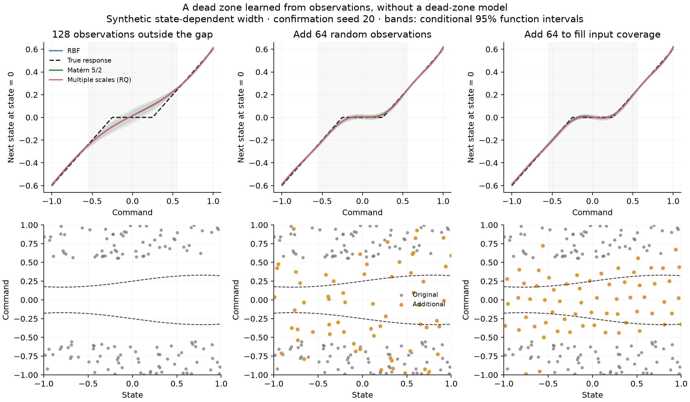
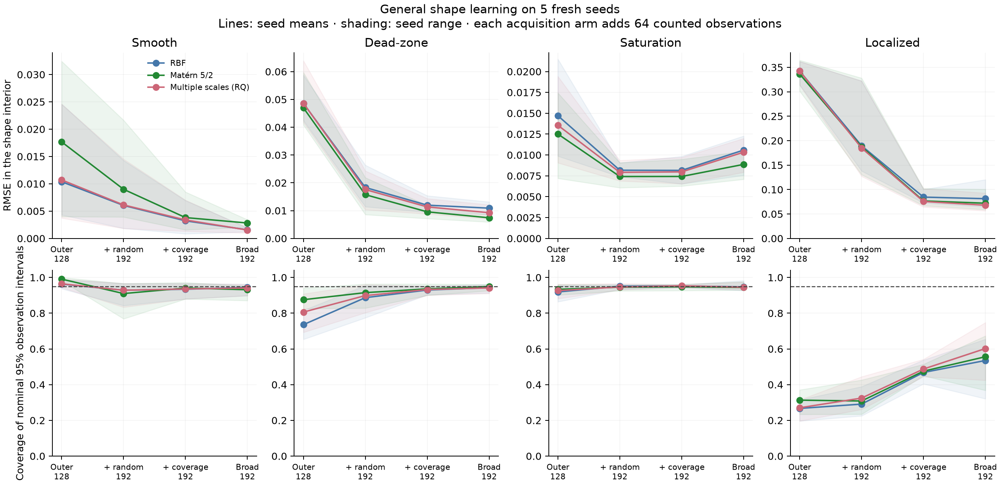

# Learning dead zones and other shapes from observations

**A dead zone can be learned as part of a general response surface.** In this
follow-up, adding observations of previously missing conditions recovers its
approximately flat command response without supplying a dead-zone equation to
the learner. The width varies with state, so this also requires learning an
interaction between coordinates.

This continues the [generic transition experiment](generic-transition-support.md)
on `experiment/generic-transition-support`. All systems here are still synthetic
independent-reset mechanisms. These are not hardware results or a demonstration
of platform onboarding. The model predicts the complete next state from its
declared inputs; no vehicle family or physical base model is used.

## What changed in Glassbox

The experimental [`fit_transition_gp`](../src/glassbox/experimental/transition_gp.py)
now accepts `kernel="rq"`, a rational-quadratic covariance with a fitted scale
mixture parameter. This is a generic way to accommodate variation at different
scales. It contains no dead-zone boundary, saturation limit, or mechanism-specific
basis function. RBF and Matérn-5/2 remain available; the default remains Matérn.
The covariance construction is described in Rasmussen and Williams,
[chapter 4](https://gaussianprocess.org/gpml/chapters/RW4.pdf).

The new variant uses the same prediction, derivative, support, mean-rollout,
and save/load interfaces. RQ artifacts use experimental format v2; the loader
retains v1 compatibility and rejects unsupported kernel/version combinations.

Testing uncovered a numerical problem in the original experimental fitter:
for a low-noise float32 fit, fused optimization produced a finite Cholesky
factorization while recomputing the same covariance outside that compiled
operation failed. Kernel roundoff was larger than the fixed numerical diagonal.
Numerical jitter now accounts for dtype precision, signal magnitude and matrix
size. `fit_report["numerical_jitter_standardized"]` records it separately from
`noise_std_output_units`. It is numerical regularization, not measured sensor
noise. The change preserves the original float64 floor in the recorded studies.
Low-noise fitting, derivatives and serialization now pass in both precisions.

## Experiment and data budgets

The [runner](../scripts/experiment_shape_learning.py) compares four complete
transition surfaces: a smooth reference, a state-dependent dead zone, saturation,
and the earlier compact localized feature. The mechanism definitions are used
to generate observations and evaluate predictions. They are never passed to
the fitter. The dead-zone construction follows the usual piecewise input/output
meaning of a [dead zone](https://www.mathworks.com/help/simulink/slref/deadzone.html),
with an additional synthetic state dependence to exercise joint learning.

Each system has one state and one command. Initial conditions and commands are
sampled independently; the next-state observation noise has standard deviation
0.02. The transition interval is 0.1 seconds, but sample count times that interval
is not a flight-calibration duration because these are independent resets.

| Arm | Observations | Collection rule |
| --- | ---: | --- |
| Outer | 128 | Commands outside `[-0.55, 0.55]`; the central region is unobserved |
| Random fill | 192 | Retain those 128 and add 64 independent uniform candidates |
| Coverage fill | 192 | Retain those 128 and greedily add 64 farthest inputs in training-standardized coordinates |
| Broad | 192 | Uniform coverage from the outset, as a separate reference |

Both acquisition arms use an independent candidate pool. Choosing samples uses
input geometry only; candidate target values, mechanism boundaries and evaluation
labels are unavailable to selection. All requested labels count toward the
training budget. Known candidate states can be reset in this synthetic test;
the cost or feasibility of reaching them on a physical platform is not modeled.

Development used seeds 0 and 1. The final comparison uses fresh seeds 20–24,
three kernels, four systems and four sampling arms: **240 fitted models**.
Each model uses two deterministic optimization starts, 200 steps per start,
and training marginal likelihood for selection. No evaluation labels select
hyperparameters. The seed means and ranges are descriptive, not population
confidence intervals.

A preliminary comparison with seeds 10–14 was superseded: taking the earliest
unused rows from the conditioned initial pool biased its nominal random arm
toward the missing region. That run is retained in the workspace with its
sources. The corrected sampler draws from a separate candidate pool, has
regression tests, and was rerun on the fresh seeds above. All results below use
the corrected run.

## Results

[Plan](investigations/shape-learning/plan.json),
[complete summary](investigations/shape-learning/summary.json),
[independent audit](investigations/shape-learning/audit.json).

For Matérn-5/2, next-state RMSE inside the dead zone changes as follows. This
region is defined across varying states, away from the true boundaries, rather
than only at a single easy slice. Error is against the noiseless response.

| Collection | Dead-zone interior RMSE | Coverage of nominal 95% observation intervals |
| --- | ---: | ---: |
| Outer, 128 samples | 0.0470 | 87.6% |
| Add 64 random samples | 0.0157 | 91.5% |
| Add 64 to fill input coverage | 0.0096 | 93.6% |
| Broad coverage, 192 samples | 0.0074 | 94.9% |

Filling input coverage reduces dead-zone error by about **80%** relative to the
initial model and **39%** relative to random additions at the same budget. The
model learns the flat region approximately; it does not acquire an exact
zero-response rule. At state zero, the mean absolute command slope inside the
plateau falls from 0.334 to 0.086 after coverage filling, versus a true slope of
zero and an active-region slope of 0.8. Those slice slopes are finite differences
of the predicted curve and are not additional training observations.



The figure uses the first final-confirmation seed, 20. The top row is a slice
at state zero; its bands are GP-conditional function intervals. The bottom row
shows the full two-dimensional observation locations. Dashed boundaries there
are benchmark truth, displayed for interpretation and withheld from learning.

The localized feature remains more difficult, but it becomes learnable once
observations cover it. With RQ, its interior error falls from **0.3424 to 0.0756**
after coverage filling. Random additions reach 0.1849 at the same budget.
With broad sampling, RQ improves on RBF from **0.0813 to 0.0679**, about 16%, and
on Matérn from 0.0720 to 0.0679, about 6%. The new covariance is useful here,
while Matérn remains better on the dead-zone and saturation cases. No universal
kernel winner or automatic model-selection policy is established.



## What remains unresolved

Improved function fitting does not automatically calibrate uncertainty. For
the localized feature with RQ, observation coverage is only **48.8%** after
coverage filling and **60.2%** with broad sampling, despite nominal 95% intervals.
All three models can agree and still underestimate error in that region.
The uncertainty remains conditional on the fitted kernel, noise model and
hyperparameters; no distribution-free coverage guarantee is claimed.

This separates several issues that should not be conflated:

- The observed dead zone is representable well enough for low prediction error;
  it does not require an explicit dead-zone model.
- Withheld combinations create an evidence problem. Additional observations
  improve all three learners, and their placement matters.
- Accommodating multiple variation scales helps the localized shape, but its
  conditional uncertainty still understates residual model error.
- Numerical regularization is another source of behavior and must remain
  visible separately from observation noise.

The [next iteration](error-calibration.md) tests local error calibration on
separately reserved observations, together with causal history. The present scalar,
memoryless tests do not establish performance with actuator hysteresis, latent
state, noisy inputs, streaming drift, or physical trajectories.

## Reproduce

From the Glassbox checkout with Glassbox, JAX, NumPy and Matplotlib available:

```sh
JAX_ENABLE_X64=1 python scripts/experiment_shape_learning.py \
  --output /tmp/shape-confirmation-new --phase confirmation \
  --seeds 20 21 22 23 24 --kernels rbf matern52 rq \
  --layouts outer broad random-fill coverage-fill
python scripts/report_shape_learning.py \
  --run /tmp/shape-confirmation-new --output /tmp/shape-report-new
```

Both output directories must be new. In the parent dart workspace, use its
`.venv/bin/python`. The complete recorded run is in
`artifacts/generic-shape-learning/confirmation-02`, with rendering and independent
audit in `artifacts/generic-shape-learning/report-02`. Sources, optimizer traces,
model files, observations, identities, predictions and variances are retained.

The audit independently recomputes all 240 models' means and variances in NumPy,
checks the declared budgets and acquisition-pool separation, retained base
labels, training/test separation, training-only normalization, and reported
errors/coverage against the saved arrays. The figure/report renderer has its own
source snapshot. No platform model was adopted and no controller behavior changed.
