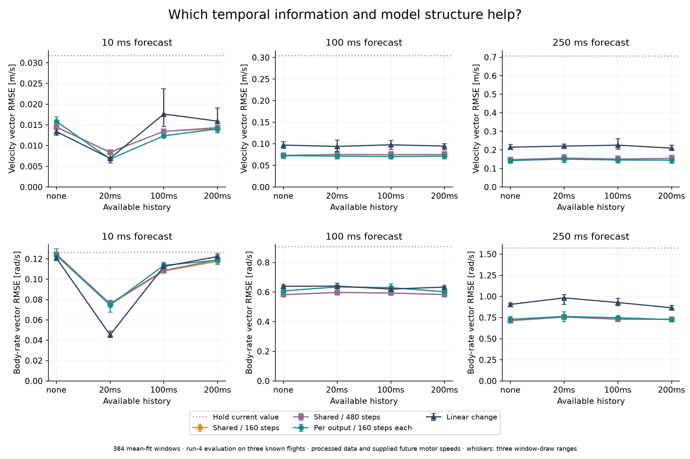
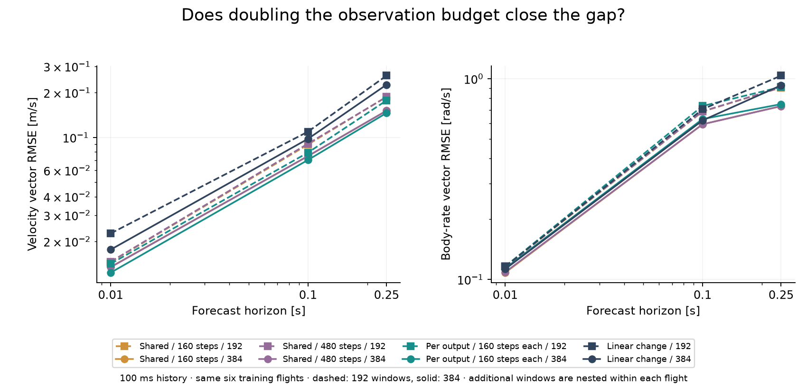

# Diagnosing output sharing and temporal context

This study follows the [first generic real-flight experiment](real-transition-learning.md).
It asks whether poor predictions come from sharing kernel parameters across
outputs, insufficient optimization, the choice of recent history, or the number
of observed transitions. These are controlled comparisons, not a decomposition
of every possible cause of error.

**More flexible output kernels improve training likelihood but are not a reliable
fix for body-rate prediction.** Recent history has a much larger effect on the
10 ms forecast, and increasing the observation budget helps at longer horizons.
The shared GP remains the default; the per-output option stays experimental.

## Fixed comparisons

Every GP learns changes relative to the current state using an RQ kernel and two
deterministic optimization starts. Inputs are current velocity, body rate,
orientation and measured motor speeds, supplied future motor-speed bins, and
optional earlier state/input changes. All six original input state coordinates
remain available to every predicted output. No airframe equation is added.

| Method | What changes | Optimization per start |
| --- | --- | ---: |
| Shared GP | One kernel and noise scale across standardized outputs | 160 steps |
| Shared GP, longer fit | Same model family, more fitting effort | 480 steps |
| Per-output GP | Six separately fitted kernels and noise scales | 160 steps per output |
| Linear change | Fixed unit ridge penalty, identical features and labels | Closed-form solve |

The original GP already treats output functions as conditionally independent;
the new option removes shared hyperparameters. It does not learn cross-output
error covariance. Independence between output models also does not remove
dynamic coupling: every scalar prediction still depends on the whole current
state, all controls and all context.

No-history models are compared with three pairs of earlier observations:
10/20 ms, 50/100 ms and 100/200 ms. Each nonempty history has the same number
of features. The labels in the figures name the oldest available observation.
The comparison changes history spacing, not just the number of past samples.
It does not include past orientation, a learned latent state or an automatic
history-selection procedure.

Horizon lengths are 10, 100 and 250 ms. All history/method arms at a given seed
use identical forecast origins and future-state labels. The main budget is
384 six-output training windows. A nested 192-window arm uses the 100 ms history
at every horizon. History consumes additional supporting measurements, so
matched target counts do not mean identical measurement cost. Per-flight state
row counts and input-interval unions are retained.

Sharing and per-output fitting have identical feature information and training
labels, but different parameter counts and computation. At 100 ms with history,
the shared GP has 82 kernel/noise parameters; the separate models have 492.
The longer-fit control uses three times the shared model's updates. It is not a
precisely equalized compute comparison. Recorded wall times include compilation
and concurrent validation activity and should not be read as deployment latency.

## Recording roles and limits

Only the twelve non-Melon Nano-Quadrotor recordings are loaded. Their checksum
pins and provenance are inherited from the first experiment.

| Role | Flights |
| --- | --- |
| Mean fitting | Chirp, Random, Square runs 1 and 2: six flights |
| Development evaluation | Each maneuver's run 3: three flights |
| Secondary evaluation, named `replication` in artifacts | Each maneuver's run 4: three flights |

The full factorial plan has 45 cases across sampling seeds 60–62: 36 at the main
budget and nine at the smaller budget. It fits 90 shared GP artifacts, 45
per-output composites containing 270 scalar GPs, and 45 linear models.
Sampling seeds change training origins within the same flights. They do not
provide three independent new flight datasets. Every evaluation uses the same
origins, spaced 100 ms apart, with whole flights kept out of mean fitting.

Both evaluation groups appeared in earlier work as error evidence. They are
useful diagnostic comparisons, not pristine holdouts for a final performance
claim. Melon is not loaded or evaluated here. All cases and settings were frozen
before the full run; the smoke run only checked execution and artifact replay.

These signals were filtered and aligned offline, and forecasts are conditional
on supplied future measured motor speeds. A preceding sample index is available
within the released recording, but this does not establish causal availability
of that processed signal during flight. In particular, gains from short history
do not prove actuator memory or transfer to raw telemetry. No error calibration
or trajectory uncertainty is fitted in this diagnosis.

## What the comparisons show

Results below are means over the three sampling seeds on the run-4 evaluation
flights. Each role has 1,378 evaluation origins. Error is the square root of the
mean squared vector norm. The [complete summary](investigations/transition-diagnosis/summary.json)
also contains run-3 results, per-flight errors, channel errors, seed ranges and
training objectives.

**Removing parameter sharing produces a tradeoff.** With 384 training windows
and the 100 ms history, body-rate RMSE in rad/s is:

| Horizon | Shared, 160 steps | Shared, 480 steps | Per-output, 160 steps each | Linear change |
| --- | ---: | ---: | ---: | ---: |
| 10 ms | 0.1080 | 0.1086 | 0.1136 | 0.1126 |
| 100 ms | 0.5932 | 0.5934 | 0.6300 | 0.6200 |
| 250 ms | 0.7304 | 0.7309 | 0.7478 | 0.9281 |

At 100 ms, separate kernels improve velocity RMSE from **0.07486 to 0.07054 m/s**
(5.8%), while body-rate RMSE worsens by 6.2%. Across all 45 configurations,
separate kernels improve training likelihood over both shared fits in every
case, but worsen body-rate prediction in **36/45** run-4 comparisons and **35/45**
run-3 comparisons. Those counts describe correlated configurations, not 45
independent statistical trials.

This is consistent with parameter sharing providing useful regularization for
these observations. It does not establish that separate kernels are universally
worse, or that the current model family is sufficient in unseen regimes.
The result argues against shared hyperparameters being the main missing fix for
the observed body-rate errors.

**Longer optimization does not reliably improve prediction.** In the table
above, tripling optimization changes run-4 errors by less than 0.6% for velocity
and body rate across all three horizons. Other configurations sometimes change
more, but the full paired comparisons show no consistent accuracy improvement.
This tests the existing optimizer with the same two starts; it does not certify
a global optimum or rule out every optimization method. See the
[paired comparisons](investigations/transition-diagnosis/comparisons.json).

**Very recent history is useful at the shortest horizon.** For the 10 ms forecast
with 384 training windows:

| Oldest history sample | Shared GP body-rate RMSE | Per-output GP body-rate RMSE | Linear body-rate RMSE |
| --- | ---: | ---: | ---: |
| None | 0.1249 | 0.1235 | 0.1208 |
| 20 ms | 0.0751 | 0.0747 | 0.0452 |
| 100 ms | 0.1080 | 0.1136 | 0.1126 |
| 200 ms | 0.1176 | 0.1188 | 0.1223 |

Short history reduces the shared GP's body-rate RMSE by **40%** and velocity
RMSE by **43%** relative to no history. The linear model with that same short
history beats the shared GP's body-rate result by another 40%. Relative to its
own no-history baseline, linear body-rate error drops by 63%.

The large short-horizon gain is compatible with learning local trends in smooth,
processed measurements. It is not evidence by itself that a long-lived physical
memory state has been discovered. Benefits do not persist uniformly at 100 or
250 ms, and adding more distant history is not automatically beneficial.



Whiskers are sampling-seed ranges. Holding the current value provides a common
reference; the recorded 50 ms backward-trend baseline is also included in the
machine-readable reports.

**Additional observations help more at longer horizons.** For the shared GP
with 100 ms history, doubling the window budget within the same six flights gives:

| Horizon | Velocity RMSE, 192 → 384 windows [m/s] | Body-rate RMSE, 192 → 384 windows [rad/s] |
| --- | ---: | ---: |
| 10 ms | 0.01455 → 0.01348 | 0.1157 → 0.1080 |
| 100 ms | 0.08952 → 0.07486 | 0.6864 → 0.5932 |
| 250 ms | 0.18740 → 0.15103 | 0.9046 → 0.7304 |

The 250 ms improvement is about **19%** for both velocity and body rate. This
shows reducible error under the tested sampling policy; it does not distinguish
coverage of new conditions from denser sampling of familiar ones. It also does
not establish an optimum calibration duration or independent-sample count.



## Experimental interface

The [outputwise transition module](../src/glassbox/experimental/outputwise_transition.py)
adds a vector prediction interface over scalar GPs:

```python
from glassbox.experimental.outputwise_transition import fit_outputwise_transition_gp

model = fit_outputwise_transition_gp(
    samples, kernel="rq", mean_mode="increment", steps=160, restarts=2,
)
prediction = model.predict(states, commands, context=context)
model.save("separate-output-model")
```

`predict` preserves output order and supports JAX differentiation and arbitrary
batch dimensions. `mean_rollout` advances outputs simultaneously, using caller-
supplied context; it does not construct or update a causal history buffer.
The two predicted variance arrays remain conditional marginal GP quantities.
They are not calibrated intervals or uncertainty propagated through a rollout.

Each scalar fit places its own current-state coordinate first and moves other
state coordinates into context. This is a lossless permutation of the original
features, independently audited against source observations. Serialization uses
a new artifact directory containing a manifest and existing scalar NPZ files.
Its fingerprint includes every ordered member's content identity. Swapped or
changed members invalidate that identity and any residual calibration bound to it.

The implementation remains outside stable exports on
`experiment/generic-transition-support`. Existing shared-GP behavior and stable
model/control interfaces are unchanged. A more general regression interface
with separate input/output dimensions may eventually remove the need for scalar
coordinate rearrangement, particularly when adding local orientation increments.
This experiment does not settle that abstraction.

## Implications for the next step

Model selection should use reserved forecast performance and observation cost,
not training likelihood alone. Retain simple linear changes and the shared GP
as serious candidates; keep history choice explicit. The per-output alternative
is useful to measure tradeoffs, especially where velocity improves while body
rates worsen, but these diagnostics do not select a new default for all outputs.

The next milestone is a complete-state rollout with an automatically advanced
history buffer: initialize once, predict every subsequent state, and compare
composed predictions with direct forecasts at the same horizons. That work must
preserve orientation geometry and distinguish measured actuator inputs from
commands. No such full-state real-data rollout or X8 evaluation was performed
in this diagnosis.

A read-only check of the existing X8 adapter also confirms that its observations
carry manual alignment/resampling provenance and that its controls mix throttle
commands with generalized surface angles. Those are explicit channel semantics,
not interchangeable raw actuator commands. Before claiming causal online
prediction, the feature contract must identify processing and availability as
well as units and timing. The current processed Nano-Quadrotor results cannot
answer that question.

## Reproduction

Reuse the prepared corpus from the previous study, or obtain the pinned files
with `glassbox corpus prepare nanodrone /tmp/real-corpus`. Run from this checkout
using its parent `.venv/bin/python` or an equivalent installed environment.

```sh
JAX_ENABLE_X64=1 python scripts/experiment_transition_diagnosis.py \
  --corpus /tmp/real-corpus --output /tmp/diagnosis-new --seeds 60 61 62
MPLCONFIGDIR=/tmp/diagnosis-plot-cache python scripts/report_transition_diagnosis.py \
  --run /tmp/diagnosis-new --corpus /tmp/real-corpus --output /tmp/diagnosis-report-new
```

Use fresh output directories. The runner's `--smoke --seeds 0` option uses two
small cases solely to verify integration. The full recorded run is
`artifacts/transition-diagnosis/diagnosis-01` in the parent workspace. It retains
all models, observations, predictions, source hashes, per-flight results and
training objectives. No new core dependency is introduced; Matplotlib is used
only for scientific figures.

Final figures and the [independent audit](investigations/transition-diagnosis/audit.json)
are recorded in `artifacts/transition-diagnosis/report-01`. The audit checks all
360 GP components and 45 linear fits, reconstructs every feature/target and
supporting-row count from twelve checksum-verified source files, and replays
means, variances, marginal likelihoods and reported errors in NumPy. The maximum
replay discrepancy is **3.59e-12**. This does not independently replay optimizer
gradients or identify a physical cause of the observed memory effect.

The [validation record](investigations/transition-diagnosis/validation.json)
records **68 passing targeted tests** in float64 from source and **68 passing
tests** in float32 against the built wheel. Tests include coupled-state
prediction, simultaneous updates, differentiation, scalar feature preservation,
artifact tampering, matched origins and nested budgets. Wheel and source
distributions build; the full test suite was not rerun.

Portable evidence includes the [plan](investigations/transition-diagnosis/plan.json),
[source checksums](investigations/transition-diagnosis/sources.json),
[executed sources](investigations/transition-diagnosis/executed-sources.zip), and
[run status](investigations/transition-diagnosis/run-status.json).
